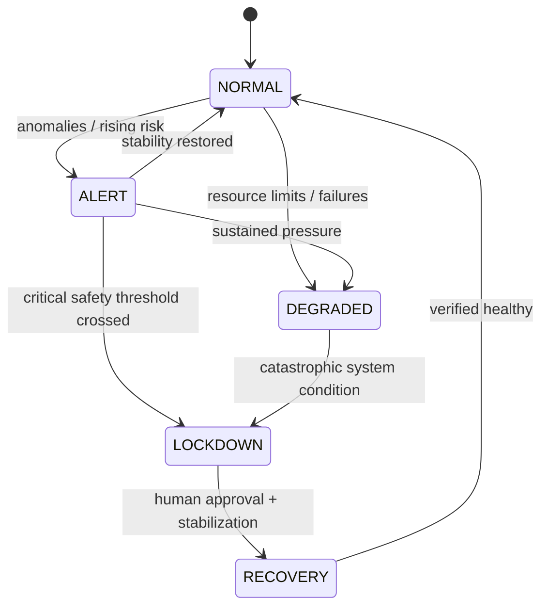

# Brainstem Service — v0.1
*A continuous, safety-focused, autonomic control process for the Personal Agent*

The **Brainstem Service** is the always-on regulatory core of the agent.
It is explicitly inspired by the human brainstem: continuously monitoring vital signals, maintaining base stability, and triggering reflexive protective responses without requiring full cognitive deliberation.

It is NOT:
- the full orchestrator,
- the reasoning engine,
- the creative collaborator.

It IS:
- the **guardian of system stability**,
- the **enforcer of operational modes**,
- the **executor of emergency reflexes**,
- the **keeper of homeostasis logic at runtime**.

If everything else in the system crashed, hung, or misbehaved, the Brainstem Service should ideally still be alive.

---

## 1. Purpose & Responsibilities

### 1.1 Core Mission

The Brainstem Service exists to:

1. Continuously observe key sensors and metrics
2. Maintain and transition global operational mode
3. Trigger automatic stabilizing responses when thresholds are crossed
4. Provide a single, authoritative truth about current agent health
5. Log decisions, rationale, and state over time

This is the embodiment of:

> "Do not let the system drift into unhealthy, unsafe, or incoherent states."

---

## 2. Relationship to Other Architectural Components

The Brainstem Service:

- **reads sensors** defined in `CONTROL_LOOPS_SENSORS_v0.1.md`
- **implements control logic** defined conceptually in `HOMEOSTASIS_MODEL.md`
- **reports decisions** to:
  - Orchestrator
  - UI / status dashboard
  - Metrics / logging

It does not:
- plan complex workflows,
- reason deeply,
- build knowledge,
- access tools directly (except emergency cutoff calls).

Think of it as:

- Nervous system lower brainstem
- Endocrine regulator of mode and thresholds
- Overseer of vital signs

---

## 3. Inputs & Outputs

### 3.1 Inputs — What the Brainstem Observes

It consumes a subset of sensors from the Control Loops spec:

- Performance & Load metrics
- Safety & Risk indicators
- Knowledge health indicators
- Resource consumption metrics
- Learning velocity metrics

Practically:

- Interval metrics are polled
- Event metrics are subscribed to / streamed

### 3.2 Outputs — What the Brainstem Controls

**Primary Outputs:**

- Current Operational Mode:
  - NORMAL
  - ALERT
  - DEGRADED
  - LOCKDOWN
  - RECOVERY

- Control Signals:
  - throttle concurrency
  - pause specific feature categories
  - enable stricter safety gating
  - freeze tool execution entirely
  - trigger recovery workflows

- Logging & Telemetry:
  - mode transitions
  - reasons / metrics that triggered the change
  - stabilization actions performed

---

## 4. Execution Model

### 4.1 Runtime Behavior

The Brainstem runs as a **persistent background loop**, conceptually:

```text
while alive:
    read interval metrics
    process pending event metrics
    evaluate control rules
    update mode if required
    trigger reflex actions if required
    sleep small interval
```

This is deliberate:
- simple
- deterministic
- robust

No fancy AI here. This is control engineering.

### 4.2 Frequency / Cadence

Suggested initial baseline:

- Poll interval metrics: every 5 seconds
- Evaluate control logic: every 5 seconds
- Reflex actions: immediate upon critical event signal

These are configurable.

---

## 5. Mode Management

The Brainstem is the **sole authority** over operational mode.

It decides when to:

- escalate from NORMAL → ALERT
- degrade performance mode
- lock the system down
- move into recovery
- return to normal stability

### 5.1 State Machine

Mode transitions should follow the structure defined in `HOMEOSTASIS_MODEL.md`.



The Brainstem maintains this state machine at runtime.

---

## 6. Reflexive Protective Behaviors

The key feature of the Brainstem is **reflexes**.

Reflexes are:
- fast
- decisive
- automatically triggered
- not dependent on reasoning LLMs

Examples (initial baseline):

### 6.1 Performance Reflexes

- CPU > threshold for sustained period → reduce concurrency
- Memory pressure high → stop launching new heavy workloads
- Model latency skyrockets → switch to smaller model or slow usage

### 6.2 Safety Reflexes

- Too many blocked dangerous actions → escalate to ALERT or LOCKDOWN
- High-risk operation attempted repeatedly → freeze tools temporarily
- Possible data exfiltration → LOCKDOWN immediately

### 6.3 Resource Reflexes

- Disk consumption near critical → halt logs / KB writes except essentials
- KB size too large → flag cleanup mode required

### 6.4 Self-Modification Reflexes

- Too many config proposals too fast → slow learning rate
- Evaluation scores declining → require human review for changes

Each reflex should:
- log the reason
- log the triggering metrics
- log the resulting action

---

## 7. Interaction with the Orchestrator

The Orchestrator is smart.
The Brainstem is steady and authoritative.

Relationship:

- Orchestrator handles **What should I do?**
- Brainstem determines **What am I allowed to do right now?**

Communication roles:

- Brainstem publishes:
  - current mode
  - constraints and limits
- Orchestrator subscribes and respects constraints

If conflict occurs:
> Brainstem wins.

---

## 8. Minimal Initial Implementation Strategy

Version 0.1 should:

1. Exist as a persistent process / loop
2. Read a minimal subset of sensors:
   - CPU
   - Memory
   - Tool high-risk call rate
   - Disk usage
3. Maintain mode state
4. Log transitions
5. Provide read access to current mode

Everything else can evolve.

---

## 9. Observability & Explainability

The Brainstem must not be a black box.

It should:

- log every mode transition
- log reflex events
- expose recent history in UI / logs

A future addition may include:
- a narrative explanation generator:

> "Switched to ALERT because CPU sustained above 90% for 20s, 3 tool calls blocked, and latency rising."

This will help you understand your agent’s “physiology”.

---

## 10. Future Evolution

Later versions may:

- learn thresholds dynamically
- experiment safely with control strategies
- coordinate with evaluation systems
- develop richer multi-tier brainstem hierarchy

But rule one remains:

> Keep the system alive, stable, safe, and honest about its state.

That is the Brainstem’s purpose.
