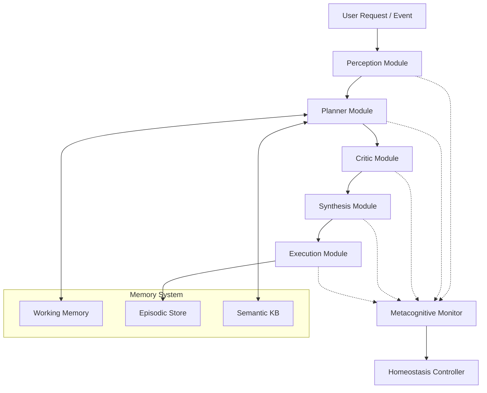
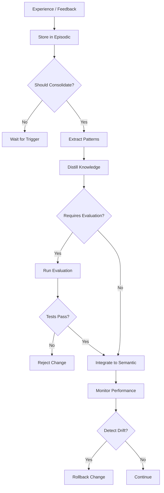

# Cognitive Agent Architecture — v0.1

*Brain-inspired cognitive architecture for the Personal Agent's main orchestrator*

**Status:** Draft / Design Phase
**Date:** 2025-12-29
**Supersedes:** N/A
**Complements:** HOMEOSTASIS_MODEL.md, ORCHESTRATOR_CORE_SPEC_v0.1.md

---

## 1. Purpose & Scope

This document specifies the **internal cognitive architecture** of the Personal Agent's main orchestrator. It translates neuroscience-inspired principles into concrete software design.

### What This Document Covers

- Internal structure of the orchestrator's "thinking" process
- Cognitive modules and their specializations
- Metacognitive monitoring layer
- Memory system architecture (working, episodic, semantic)
- Neuroplasticity and learning mechanisms

### What This Document Does NOT Cover

- System-level coordination → see `HOMEOSTASIS_MODEL.md`
- External interfaces and protocols → see `ORCHESTRATOR_CORE_SPEC_v0.1.md`
- Specific tool implementations → see `TOOL_EXECUTION_VALIDATION_SPEC_v0.1.md`

### Relationship to Other Architecture

```
HOMEOSTASIS_MODEL.md (system stability)
        ↓ governs mode and constraints
COGNITIVE_AGENT_ARCHITECTURE.md (this doc - agent cognition)
        ↓ specifies internal design
ORCHESTRATOR_CORE_SPEC.md (implementation interfaces)
```

---

## 2. Design Principles (From Neuroscience)

### 2.1 Modular Specialization with Canonical Interfaces

**Brain principle**: Cortical regions use similar computational patterns but specialize through inputs, connections, and learning.

**Our implementation**:
- All cognitive modules implement a canonical `CognitiveModule` protocol
- Specialization emerges from configuration, not code duplication
- Modules can be composed, replaced, or enhanced independently

### 2.2 Metacognitive Monitoring

**Brain principle**: Prefrontal metacognitive networks monitor confidence, error, and uncertainty about ongoing decisions.

**Our implementation**:
- Separate metacognitive layer evaluates primary cognition
- Generates confidence estimates, uncertainty measures, error detection
- Feeds signals into homeostatic mode management

### 2.3 Multi-Store Memory with Consolidation

**Brain principle**: Working memory (prefrontal) ↔ Episodic memory (hippocampus) ↔ Semantic memory (cortex) with active consolidation.

**Our implementation**:
- Three distinct memory stores with different characteristics
- Consolidation process transfers episodic → semantic during low-activity periods
- Protects against catastrophic forgetting

### 2.4 Regulated Neuroplasticity

**Brain principle**: Learning occurs at multiple timescales with stability-plasticity balance.

**Our implementation**:
- Mode-dependent learning rates (LOCKDOWN=0, NORMAL=baseline, EXPLORATORY=high)
- Multi-timescale updates: context (immediate), episodic (short-term), semantic (long-term)
- Evaluation gates before deploying learned changes

---

## 3. High-Level Cognitive Architecture

### 3.1 Cognitive Module Layer

```python
# Canonical interface
class CognitiveModule(Protocol):
    """Base protocol for all cognitive modules"""

    def process(self, input: State, context: Context) -> Output:
        """Primary processing function"""
        ...

    def get_confidence(self) -> float:
        """Self-reported confidence in output (0.0 to 1.0)"""
        ...

    def get_uncertainty(self) -> Dict[str, float]:
        """Uncertainty breakdown by dimension"""
        ...

    def update(self, feedback: Feedback) -> None:
        """Learn from feedback (respects plasticity controller)"""
        ...
```

### 3.2 Specialized Cognitive Modules



#### Module Roles

| Module | Role | Brain Analogue | Specialization |
|--------|------|----------------|----------------|
| **Perception** | Parse and understand input | Sensory cortex | Input type, domain context |
| **Planner** | Generate goal-directed plans | Prefrontal cortex | Task decomposition, sequencing |
| **Critic** | Evaluate proposals, detect issues | Anterior cingulate | Error detection, conflict monitoring |
| **Synthesis** | Integrate and decide | Dorsolateral PFC | Decision-making, integration |
| **Executor** | Coordinate tool execution | Motor cortex | Tool selection, parameter binding |

---

## 4. Metacognitive Monitoring Layer

### 4.1 Purpose

The metacognitive layer is a "thinking about thinking" system that:
- Monitors confidence and uncertainty across all cognitive modules
- Detects errors and performance degradation
- Triggers appropriate responses (human escalation, mode changes, re-planning)

### 4.2 Metacognitive Signals

```python
@dataclass
class MetacognitiveState:
    """Current metacognitive assessment"""

    # Confidence
    overall_confidence: float  # 0.0 to 1.0
    module_confidence: Dict[str, float]  # per-module

    # Uncertainty
    epistemic_uncertainty: float  # knowledge gaps
    aleatoric_uncertainty: float  # inherent randomness

    # Error detection
    detected_errors: List[Error]
    conflict_signals: List[Conflict]  # when modules disagree

    # Performance
    performance_trend: Trend  # improving, degrading, stable
    resource_pressure: float  # cognitive load indicator
```

### 4.3 Integration with Homeostasis

```python
class MetacognitiveMonitor:
    def __init__(self, brainstem: BrainstemService):
        self.brainstem = brainstem

    def evaluate(self, cognitive_state: CognitiveState) -> MetacognitiveState:
        """Assess cognitive state and generate metacognitive signals"""
        meta_state = self._assess_confidence(cognitive_state)
        meta_state = self._detect_errors(cognitive_state)
        meta_state = self._estimate_uncertainty(cognitive_state)

        # Feed into homeostasis
        if meta_state.overall_confidence < 0.3:
            self.brainstem.trigger_event("low_confidence", meta_state)

        if meta_state.detected_errors:
            self.brainstem.trigger_event("errors_detected", meta_state)

        return meta_state
```

**Homeostasis Mode Triggers**:
- `overall_confidence < 0.3` → consider ALERT mode
- `detected_errors > threshold` → ALERT or DEGRADED
- `conflict_signals persistent` → request human clarification
- `epistemic_uncertainty > 0.8` → need more information (research, ask user)

---

## 5. Memory System Architecture

### 5.1 Three-Store Design

```python
class CognitiveMemory:
    """Brain-inspired three-store memory system"""

    def __init__(self):
        self.working = WorkingMemory()
        self.episodic = EpisodicMemory()
        self.semantic = SemanticMemory()
        self.consolidator = MemoryConsolidator()
```

### 5.2 Working Memory

**Brain analogue**: Prefrontal cortex working memory

**Characteristics**:
- **Capacity**: Limited (4-7 items, configurable)
- **Duration**: Current task/conversation only
- **Function**: Hold active information for immediate reasoning
- **Implementation**: In-memory context buffer

```python
class WorkingMemory:
    """Limited-capacity active context"""

    def __init__(self, capacity: int = 7):
        self.capacity = capacity  # Miller's Law
        self.items: Deque[MemoryItem] = deque(maxlen=capacity)

    def add(self, item: MemoryItem):
        """Add to working memory (may evict oldest)"""
        if len(self.items) >= self.capacity:
            # Capacity exceeded - what to do?
            # Option 1: Evict oldest (FIFO)
            # Option 2: Evict least important (priority)
            # Option 3: Trigger "cognitive overload" signal
            self._handle_overflow(item)
        self.items.append(item)

    def get_active_context(self) -> List[MemoryItem]:
        """Retrieve current working memory contents"""
        return list(self.items)
```

**Design question**: What happens on overflow?
- Trigger metacognitive "overload" signal?
- Force consolidation to episodic?
- Hierarchical chunking (combine related items)?

### 5.3 Episodic Memory

**Brain analogue**: Hippocampus and medial temporal lobe

**Characteristics**:
- **Capacity**: Large but finite (configurable, e.g., 10K episodes)
- **Duration**: Session to weeks (configurable retention policy)
- **Function**: Rapid encoding of experiences with temporal context
- **Implementation**: Structured event log with embeddings

```python
@dataclass
class Episode:
    """A single interaction episode"""
    timestamp: datetime
    task_id: str
    context: Dict[str, Any]
    actions: List[Action]
    outcomes: List[Outcome]
    feedback: Optional[Feedback]
    value_score: float  # How valuable/important was this?
    embedding: np.ndarray  # For similarity search

class EpisodicMemory:
    """Rapid encoding, pattern completion, retrieval"""

    def store_episode(self, episode: Episode):
        """Rapidly encode new experience"""
        self.episodes.append(episode)
        self._update_embeddings(episode)

    def retrieve_similar(self, query: str, k: int = 5) -> List[Episode]:
        """Pattern completion - find similar past experiences"""
        query_embedding = self._embed(query)
        return self._vector_search(query_embedding, k)

    def filter_by_value(self, threshold: float = 0.5) -> List[Episode]:
        """Get valuable episodes for consolidation"""
        return [e for e in self.episodes if e.value_score >= threshold]
```

**Retention policy options**:
- Time-based: Delete after N days
- Value-based: Keep high-value, prune low-value
- Capacity-based: FIFO when full
- Hybrid: Combine multiple criteria

### 5.4 Semantic Memory

**Brain analogue**: Cortical semantic memory

**Characteristics**:
- **Capacity**: Very large (persistent storage)
- **Duration**: Long-term (months to years)
- **Function**: Consolidated patterns, skills, facts, tool strategies
- **Implementation**: Vector database + structured knowledge base

```python
class SemanticMemory:
    """Consolidated, generalized knowledge"""

    def __init__(self):
        self.patterns = PatternDatabase()  # Reusable patterns
        self.skills = SkillRegistry()      # Learned procedures
        self.facts = FactStore()           # Declarative knowledge
        self.tool_strategies = StrategyDB()  # Which tools work when

    def integrate(self, distilled_knowledge: Knowledge, learning_rate: float):
        """Slowly integrate new knowledge (stability-plasticity balance)"""
        if learning_rate == 0.0:
            return  # Plasticity disabled

        # Gradual integration protects against catastrophic forgetting
        self._merge_patterns(distilled_knowledge, learning_rate)

    def retrieve(self, query: Query) -> List[Knowledge]:
        """Retrieve relevant consolidated knowledge"""
        return self._semantic_search(query)
```

### 5.5 Memory Consolidation

**Brain analogue**: Sleep-dependent memory consolidation (hippocampus → cortex)

**Process**:
1. Identify valuable episodic memories
2. Extract patterns, skills, generalizations
3. Integrate into semantic memory (slowly, to prevent forgetting)
4. Optionally archive or delete consolidated episodes

```python
class MemoryConsolidator:
    """Transfers episodic → semantic during low-activity periods"""

    def __init__(self, plasticity_controller: PlasticityController):
        self.plasticity = plasticity_controller

    def should_consolidate(self, context: Context) -> bool:
        """Decide if now is a good time to consolidate"""
        return (
            context.mode == Mode.NORMAL and
            context.system_load < 0.3 and
            context.episodic_buffer_size > 100 and
            context.time_since_last_consolidation > timedelta(hours=6)
        )

    def consolidate(self,
                    episodic: EpisodicMemory,
                    semantic: SemanticMemory):
        """Execute consolidation process"""

        # 1. Select valuable episodes
        valuable = episodic.filter_by_value(threshold=0.6)

        # 2. Extract patterns
        patterns = self._extract_patterns(valuable)
        skills = self._extract_skills(valuable)
        tool_strategies = self._analyze_tool_usage(valuable)

        # 3. Distill knowledge
        distilled = self._distill(patterns, skills, tool_strategies)

        # 4. Integrate into semantic (slowly)
        learning_rate = self.plasticity.compute_learning_rate(context)
        semantic.integrate(distilled, learning_rate)

        # 5. Optionally archive episodes
        if self.config.archive_after_consolidation:
            self._archive_episodes(valuable)
```

**Trigger strategies**:
- **Time-based**: Every N hours of operation
- **Event-based**: After significant experiences
- **Idle-based**: During low system activity ("sleep mode")
- **Threshold-based**: When episodic buffer reaches size limit

---

## 6. Neuroplasticity & Learning

### 6.1 Multi-Timescale Learning

| Timescale | Mechanism | What Changes | Brain Analogue |
|-----------|-----------|--------------|----------------|
| **Immediate** | Context updates | Attention, working memory | Synaptic activation |
| **Short-term** | Episodic encoding | Experience traces | Early-phase LTP |
| **Long-term** | Semantic integration | Consolidated knowledge | Structural plasticity |

### 6.2 Plasticity Controller

```python
class PlasticityController:
    """Regulates when and how the agent learns"""

    def __init__(self, brainstem: BrainstemService):
        self.brainstem = brainstem
        self.base_learning_rate = 0.01

    def compute_learning_rate(self, context: Context) -> float:
        """Mode-dependent learning rate"""
        mode = self.brainstem.current_mode

        if mode == Mode.LOCKDOWN:
            return 0.0  # No learning during crisis
        elif mode == Mode.ALERT:
            return self.base_learning_rate * 0.1  # Very conservative
        elif mode == Mode.DEGRADED:
            return self.base_learning_rate * 0.3  # Limited learning
        elif mode == Mode.NORMAL:
            return self.base_learning_rate
        elif mode == Mode.EXPLORATORY:
            return self.base_learning_rate * 3.0  # Rapid adaptation
        else:
            return 0.0  # Unknown mode - safe default

    def allow_consolidation(self, context: Context) -> bool:
        """Decide if consolidation is safe right now"""
        return (
            context.mode in [Mode.NORMAL, Mode.RECOVERY] and
            context.recent_errors == 0 and
            context.system_load < 0.5
        )

    def requires_evaluation(self, change: ProposedChange) -> bool:
        """Does this change need evaluation before deployment?"""
        # Critical changes always require evaluation
        if change.category in ["safety", "core_reasoning", "tool_execution"]:
            return True

        # Large changes require evaluation
        if change.magnitude > 0.3:
            return True

        return False
```

### 6.3 Learning Workflow



### 6.4 Safety Guardrails for Plasticity

1. **Bounded learning rates**: Mode-dependent, never uncontrolled
2. **Evaluation gates**: Test changes before deployment
3. **Rollback capability**: Track versions, revert if harmful
4. **Drift detection**: Monitor for performance degradation
5. **Human oversight**: Critical changes require approval

---

## 7. Implementation Phases

### Phase 1: Metacognitive Foundation (MVP)

**Goal**: Add self-monitoring to existing orchestrator

**Components**:
- Confidence estimation for LLM outputs
- Uncertainty tracking
- Basic error detection
- Integration with Brainstem mode triggers

**Success criteria**: H-005 in HYPOTHESIS_LOG.md

### Phase 2: Memory System (Foundation)

**Goal**: Implement three-store memory architecture

**Components**:
- Working memory with capacity limits
- Episodic store with rich episode encoding
- Semantic knowledge base (basic)
- Manual consolidation trigger (no automation yet)

**Success criteria**: Agent can remember and reuse past experiences

### Phase 3: Consolidation & Plasticity

**Goal**: Automated learning from experience

**Components**:
- Automatic consolidation triggers
- Pattern extraction from episodes
- Plasticity controller
- Evaluation harness for learned changes

**Success criteria**: Performance improves on repeated tasks

### Phase 4: Full Cognitive Architecture

**Goal**: Complete modular cognitive system

**Components**:
- All specialized cognitive modules (Planner, Critic, Synthesis, etc.)
- Full metacognitive monitoring
- Advanced consolidation strategies
- Multi-timescale learning

**Success criteria**: System demonstrates sophisticated reasoning with self-awareness

---

## 8. Integration Points

### 8.1 With HOMEOSTASIS_MODEL.md

| Homeostasis Loop | Cognitive Architecture Integration |
|------------------|-----------------------------------|
| **Performance & Load** | Metacognitive "cognitive load" signal |
| **Safety & Risk** | Confidence < threshold → escalate |
| **Knowledge Integrity** | Semantic memory quality metrics |
| **Resource Usage** | Working memory pressure, episodic buffer size |
| **Learning Pace** | Plasticity controller respects mode constraints |

### 8.2 With ORCHESTRATOR_CORE_SPEC.md

The cognitive architecture defines the **internal structure** of the orchestrator.

`ORCHESTRATOR_CORE_SPEC.md` should be updated to:
- Reference this architecture
- Specify how cognitive modules are invoked
- Define interfaces between orchestrator and cognitive layer

### 8.3 With Tool Execution Layer

```python
class ExecutionModule(CognitiveModule):
    """Coordinates tool execution with metacognitive awareness"""

    def process(self, plan: Plan, context: Context) -> Execution:
        # Select tools based on semantic memory (learned strategies)
        tools = self.semantic_memory.tool_strategies.recommend(plan)

        # Execute with monitoring
        execution = self.executor.run(tools, plan)

        # Store episode for learning
        self.episodic_memory.store_episode(Episode(
            context=context,
            plan=plan,
            tools=tools,
            outcome=execution.outcome,
            value_score=self._assess_value(execution)
        ))

        return execution
```

---

## 9. Open Design Questions

### 9.1 Working Memory Overflow Strategy

**Question**: What happens when working memory capacity is exceeded?

**Options**:
1. FIFO eviction (oldest items dropped)
2. Priority-based eviction (least important dropped)
3. Trigger metacognitive "overload" signal
4. Hierarchical chunking (combine related items)
5. Force consolidation to episodic

**Decision needed**: Before Phase 2 implementation

### 9.2 Consolidation Frequency

**Question**: How often should consolidation occur?

**Options**:
1. Fixed schedule (e.g., every 6 hours)
2. Event-triggered (after N valuable episodes)
3. Idle-triggered (during low activity)
4. Hybrid (combine multiple triggers)

**Decision needed**: Phase 3, informed by experiments

### 9.3 Module Granularity

**Question**: How fine-grained should cognitive modules be?

**Options**:
1. Coarse (5-6 major modules)
2. Fine (10-15 specialized modules)
3. Adaptive (start coarse, refine based on need)

**Decision needed**: Phase 1, can evolve

### 9.4 Plasticity Aggressiveness

**Question**: How fast should the agent learn?

**Trade-offs**:
- Fast learning → quick adaptation, but risk of instability
- Slow learning → stable, but slow improvement
- Mode-dependent → context-appropriate, but complex

**Decision needed**: Phase 3, tune empirically

---

## 10. Evaluation & Success Metrics

### 10.1 Phase 1 (Metacognition) Metrics

- Task success rate with vs without metacognition
- Confidence calibration accuracy
- Number of harmful actions prevented by low-confidence escalation
- Mode transition appropriateness

### 10.2 Phase 2 (Memory) Metrics

- Recall accuracy for past episodes
- Working memory overflow frequency
- Semantic knowledge growth over time
- Query response relevance (using memory)

### 10.3 Phase 3 (Plasticity) Metrics

- Performance improvement on repeated tasks
- Stability (no degradation on previously-mastered tasks)
- Learning rate vs accuracy trade-off
- Consolidation quality (episodic → semantic)

### 10.4 Phase 4 (Full System) Metrics

- End-to-end task success rate
- Reasoning quality (human evaluation)
- Self-awareness accuracy (metacognitive calibration)
- Graceful degradation under load/failure

---

## 11. References & Related Documents

- **Research**: `../research/cognitive_architecture_principles.md`
- **System Control**: `./HOMEOSTASIS_MODEL.md`
- **Orchestrator Spec**: `./ORCHESTRATOR_CORE_SPEC_v0.1.md`
- **Hypotheses**: `../architecture_decisions/HYPOTHESIS_LOG.md` (H-005)
- **Integration Notes**: `../architecture_decisions/cognitive_architecture_integration_notes.md`

---

**Document Status**: Draft specification, ready for review and refinement
**Next Steps**:
1. Review and validate design decisions
2. Update ORCHESTRATOR_CORE_SPEC.md for consistency
3. Begin Phase 1 implementation planning
