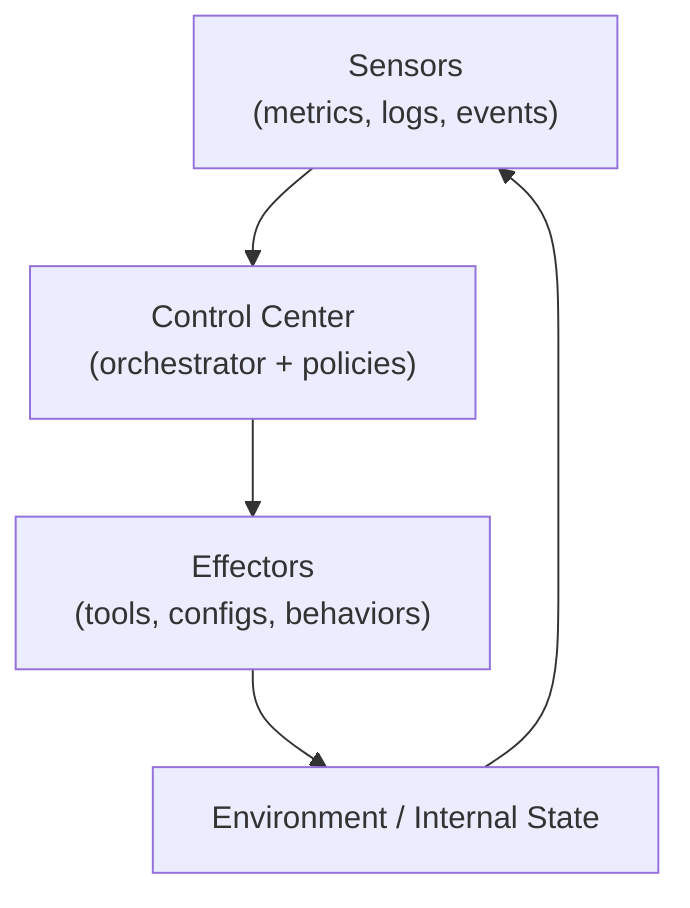
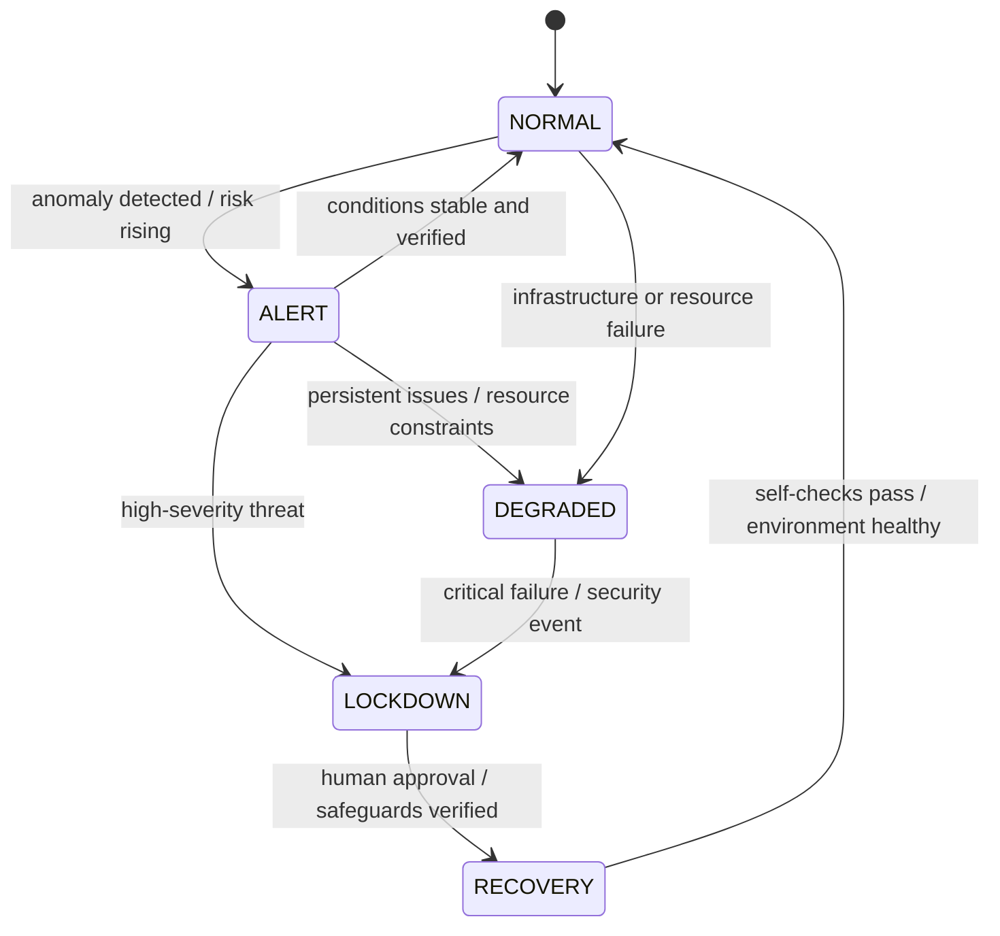
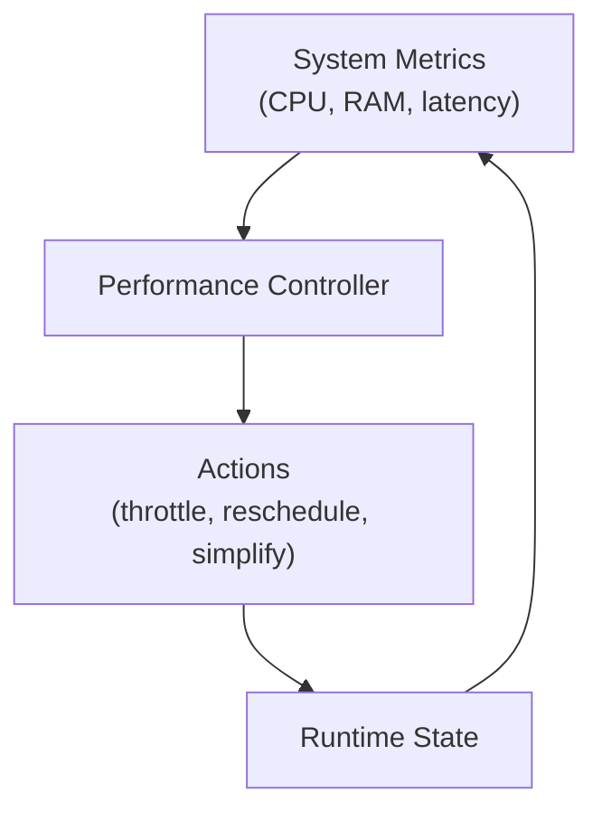
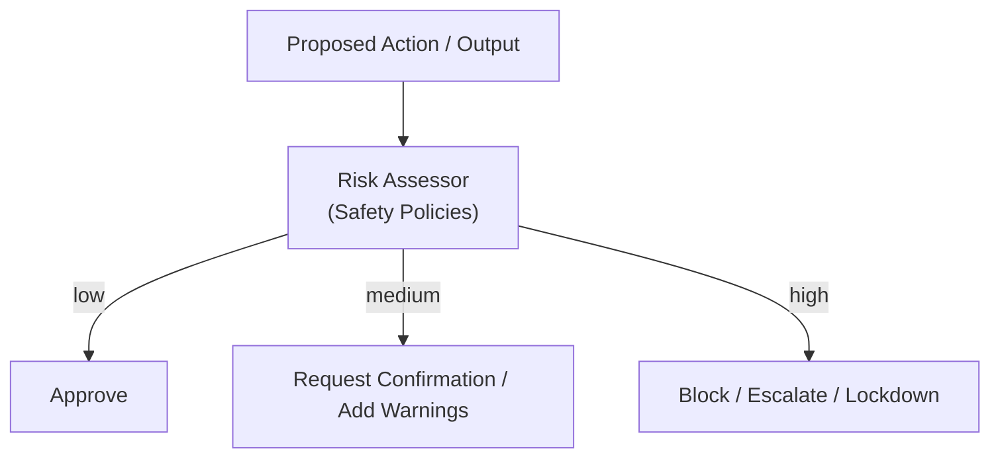
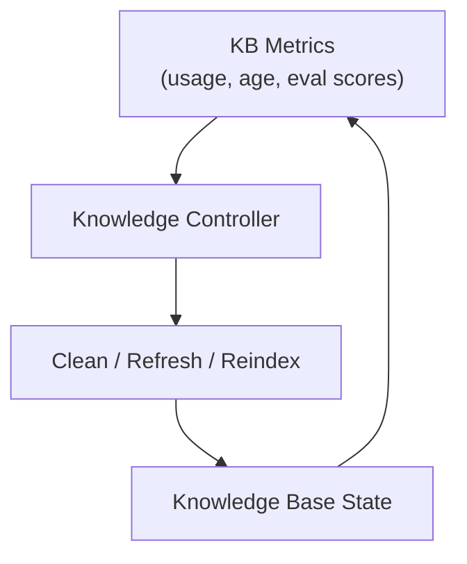
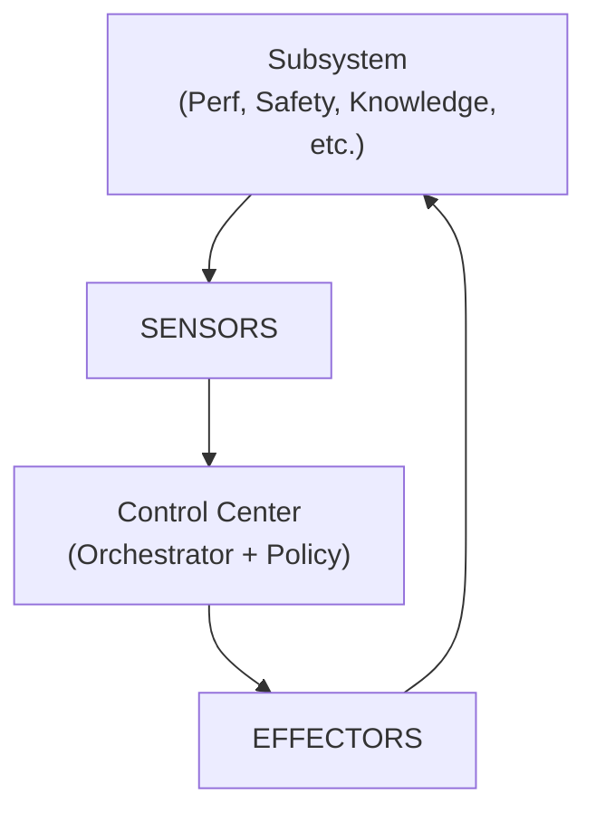

# Homeostasis Model for the Personal Agent

*A biologically-inspired control model for stability, safety, and continuous adaptation.*

This document defines how the agent maintains a **stable internal state** (homeostasis) while:

- sensing the environment and the Mac,
- reasoning and exploring multiple options,
- acting through tools and automation,
- learning and evolving over time.

It is both:

- a **design document** for the control and governance model, and
- a **pedagogic guide** to think about feedback loops, modes, and safety.

If you ever feel lost about "what the agent should do next" at a systems level, come back here.

---

## 1. Core Homeostasis Principle

Biological homeostasis is:

> The ability of an organism to maintain **internal stability** in the face of external change.

Nearly all physiological control loops share the same structure:

1. **Sensor** — measures some variable (temperature, blood pressure, CO₂, etc.)
2. **Control Center** — compares measurement to target range, decides what to do
3. **Effector** — takes action to push the variable back toward the target range
4. **Feedback** — the new state is sensed again; the loop continues

We adopt this as a **hard architectural law**:

> No important behavior should operate without an explicit **Sensor → Control Center → Effector** loop.

The agent should never just "act and hope." It should **observe, regulate, and re-evaluate**.

---

## 2. High-Level Homeostasis Loop

This diagram shows the generic control loop we will reuse in many subsystems (performance, safety, knowledge, etc.):

- **Sensors**: collectors for telemetry, errors, performance, risk indicators, knowledge quality.
- **Control Center**: orchestrator + governance logic that decides what adjustment is needed.
- **Effectors**: actual changes: throttling, blocking, re-routing, summarizing, retraining, re-planning.
- **Environment / Internal State**: the Mac, the agent’s processes, knowledge base, and metrics.

Pedagogic memory hook:
> Every important variable gets a **thermostat**, not just a print statement.

---

## 3. Global Modes of Operation

Like a body has rest, alert, fight-or-flight, and recovery states, the agent has **operational modes**.

These modes define **how aggressive, autonomous, and risk-tolerant** the system is allowed to be.

### 3.1 Mode Definitions

- **NORMAL**
  Default mode. Full capabilities available, but under regular safety and resource constraints.

- **ALERT**
  Something looks off (e.g., unusual error rate, confidence drop, suspicious behavior). The system:
  - tightens certain policies,
  - increases logging and scrutiny,
  - may ask for more user confirmation.

- **DEGRADED**
  System is under heavy load or partial failure (e.g., a model server is down, telemetry store is unavailable). The agent:
  - prefers simpler plans,
  - limits parallel work,
  - may temporarily disable non-essential features.

- **LOCKDOWN**
  Severe anomaly or security concern. The agent:
  - halts tool-based actions,
  - restricts itself to analysis and reporting,
  - requires explicit human approval for anything impactful.

- **RECOVERY**
  System is stabilizing after an incident. The agent:
  - runs self-checks,
  - reconciles metrics and logs,
  - may run experiments to validate system health,
  - gradually returns to NORMAL.

### 3.2 Mode Transition Diagram

The homeostasis layer decides **when to switch modes** based on sensors and policies.

Pedagogic view:
> The agent has a **nervous system** *and* an **endocrine system** that jointly decide how alert or relaxed it should be.

---

## 4. Key Homeostatic Loops

We define a few **primary variables** the agent must regulate:

1. **Operational Performance & Load**
2. **Safety & Risk**
3. **Knowledge Integrity & Staleness**
4. **Resource Usage (compute, memory, disk)**
5. **Learning & Self-Modification Pace**

Each becomes a concrete control loop.

### 4.1 Performance & Load Loop

Goal: prevent the agent from overloading the Mac or itself.

- **Sensors**:
  - CPU, memory, disk I/O, GPU utilization
  - queue lengths, pending tasks
  - latency distributions of LLM calls and tools

- **Control Center**:
  - compares current load to target ranges,
  - evaluates trend (getting better or worse?).

- **Effectors**:
  - reduce concurrency,
  - defer non-urgent jobs,
  - switch to smaller/faster models,
  - move to DEGRADED mode if necessary.

Pedagogic hook:
> This is the agent’s **cardiovascular + respiratory fitness** loop.

---

### 4.2 Safety & Risk Loop

Goal: prevent dangerous actions or unacceptable outputs.

- **Sensors**:
  - tool call types and arguments
  - outbound text (to web, to user)
  - security policy violations
  - anomaly signals from the “immune system”

- **Control Center**:
  - risk scoring of each action,
  - pattern matching against disallowed behaviors,
  - mode-aware decisions (NORMAL vs ALERT vs LOCKDOWN).

- **Effectors**:
  - block or modify tool calls,
  - redact or adjust responses,
  - escalate to human approval,
  - trigger LOCKDOWN or RECOVERY workflows.

This loop is where **renal (filtering)** + **immune (defense)** + **integumentary (boundary)** systems come together in software form.

---

### 4.3 Knowledge Integrity & Staleness Loop

Goal: keep the knowledge base **useful, current enough, and not full of junk**.

- **Sensors**:
  - document age and last usage time
  - query success metrics (did retrieved docs help?)
  - user thumbs-up/down feedback
  - evaluation harness results

- **Control Center**:
  - identifies hot vs cold documents,
  - flags stale or low-quality sources,
  - prioritizes ingestion or refresh jobs.

- **Effectors**:
  - schedule re-ingestion or re-embedding,
  - archive or delete unused/low-value items,
  - promote high-quality docs for more frequent use.

Pedagogic insight:
> This is the **digestive and hepatic (liver) system** of the agent.
> Bad digestion = bad thinking.

---

### 4.4 Resource Usage Loop (Disk, Models, Logs)

Goal: prevent the agent from consuming excessive disk or model resources.

- **Sensors**: disk usage, log volume, DB size, model cache usage
- **Control Center**: compares against thresholds & budgets
- **Effectors**: rotate logs, compact databases, prune caches, warn the user

This is part **renal system** (filtering) and part **skeletal support** (resource limits as structural constraints).

---

### 4.5 Learning & Self-Modification Pace

Goal: evolve **safely and intelligibly**, not chaotically.

- **Sensors**:
  - rate of new hypotheses in Captain’s Log
  - frequency of configuration change proposals
  - evaluation scores before/after changes

- **Control Center**:
  - enforces a maximum rate of change,
  - requires evaluation evidence before adopting new behaviors,
  - might require explicit human approval for certain classes of changes.

- **Effectors**:
  - gate configuration merges,
  - schedule experiments instead of direct changes,
  - record justifications in Captain’s Log and HYPOTHESIS_LOG.

Pedagogic framing:
> This is the agent’s **reproductive and developmental system**: it decides *when and how to evolve*.

---

## 5. Integration with the Rest of the Architecture

Homeostasis does not replace the main architecture; it **wraps and permeates it**:

- The **Nervous System** (orchestrator) is the primary **Control Center** for many loops.
- The **Endocrine System** (policy layer) adjusts thresholds and mode transitions.
- The **Cardiovascular System** (telemetry) provides the raw data for Sensors.
- The **Immune System** surfaces anomalies and threats to the Control Center.
- The **Muscular System** (tools) and **Digestive System** (KB ops) act as Effectors.

Conceptually:

Every major subsystem should be documented with:

- its sensors,
- its control logic,
- its effectors,
- its mode interactions.

---

## 6. Next Steps (Design & Implementation Guidance)

1. **Define concrete sensors** for each loop in code (metrics, logs, derived indicators).
2. **Specify thresholds and target ranges** as configuration (the "endocrine layer").
3. **Implement simple controllers first** (e.g., threshold-based, not ML-based control loops).
4. **Wire controllers into the orchestrator**, so mode changes and throttling become real behavior.
5. **Log all control decisions** to make the agent’s self-regulation explainable.
6. **Iterate** using evaluation:
   - capture when loops helped prevent issues,
   - refine thresholds and policies based on evidence.

Pedagogic closing thought:
> A powerful agent is impressive.
> A powerful agent that can **keep itself healthy, safe, and understandable over time** is a research achievement.

This document is the blueprint for that second goal.
