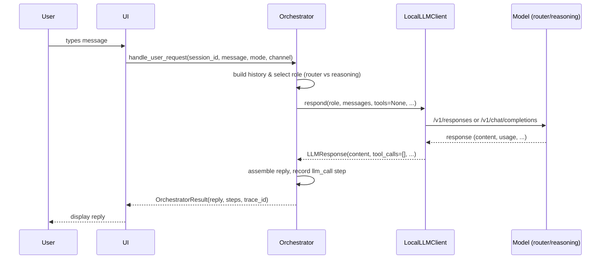
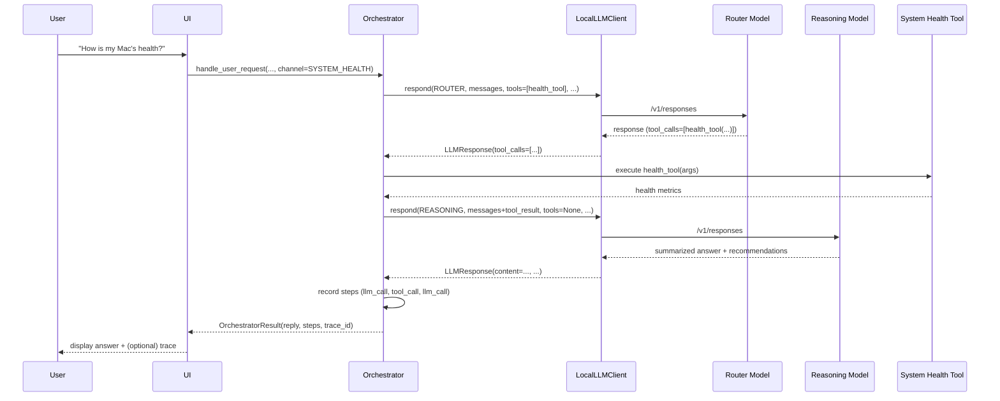

# Orchestrator Core – MVP Specification (v0.1)

## 1. Purpose & Responsibilities

The **Orchestrator Core** is the "cortex" of the personal agent. It coordinates end-to-end flows between:

- the UI / CLI,
- the **Local LLM Client**,
- tools (filesystem, system health, web search, etc.),
- the Brainstem / control loops,
- memory and telemetry components.

Its main responsibilities:

- Implement **deterministic control logic** for each request:
  - choose which model **role** to use (`router`, `reasoning`, `coding`),
  - decide when and how to invoke tools,
  - decide when to ask for clarification, self-check, or escalate.
- Maintain **short-lived conversation and task state**:
  - chat history,
  - current task/plan (when applicable),
  - intermediate tool results.
- Emit **structured events** (steps) for observability and evaluation.

The Orchestrator never talks to model endpoints directly; it only uses the `LocalLLMClient` interface defined in `LOCAL_LLM_CLIENT_SPEC_v0.1.md`.

---

## 2. External Interface (to UI & Brainstem)

### 2.1 High-level API

Conceptual Python-style interface:

```python
class Orchestrator(Protocol):
    def handle_user_request(
        self,
        session_id: str,
        user_message: str,
        mode: "Mode",                 # e.g. CONSERVATIVE | MODERATE | EXPLORATORY
        channel: "Channel",           # e.g. CHAT | CODE_TASK | SYSTEM_HEALTH
    ) -> "OrchestratorResult":
        """Top-level entrypoint for a single user turn."""
        ...
```

`Mode` and `Channel` are logical enums defined by governance/Brainstem and UI respectively.

### 2.2 Result type

```python
class OrchestratorStep(TypedDict):
    type: str               # "llm_call" | "tool_call" | "plan" | "summary" | "warning"
    description: str
    metadata: dict          # spans, model_role, tool_name, etc.


class OrchestratorResult(TypedDict):
    reply: str              # final user-facing text
    steps: list[OrchestratorStep]
    trace_id: str | None
```

The **UI** uses `reply` for display and can optionally render `steps` for transparency. `trace_id` ties the request to telemetry.

---

## 3. Interaction with Local LLM Client

The Orchestrator delegates all model calls to the **Local LLM Client**. It chooses a `ModelRole` and constructs messages/tools; the client handles endpoints.

### 3.1 Basic Q&A (no tools)

1. Build message history for `session_id` (previous `user`/`assistant` messages plus new `user` message).
2. Decide **model role**:
   - simple factual or short question → `router`,
   - complex, open-ended, or planning task → `reasoning`.
3. Call `LocalLLMClient.respond()` with:
   - `role`,
   - `messages`,
   - `tools=None`,
   - `trace_ctx` carrying a parent span.
   - **Note**: Use `respond()` (non-streaming) for internal agent communication; use `stream_respond()` only for final user-facing output (see ADR-0009 and LOCAL_LLM_CLIENT_SPEC_v0.1.md Section 2.2.1).
4. Receive `LLMResponse`, extract `content`, record a `llm_call` step, and return an `OrchestratorResult`.

#### Basic Q&A sequence



### 3.2 Tool-using flow (bounded agentic pattern)

When tools are enabled, the Orchestrator follows a structured loop:

1. **Tool decision:**
   - Either a small `router` call determines whether tools should be used (and which), or
   - Channel-specific rules enforce tool use (e.g. `SYSTEM_HEALTH` always uses health tools first).

2. **Tool-aware LLM call:**
   - Call `LocalLLMClient.respond()` with a `tools` list,
   - If `tool_calls` are returned, validate and execute them,
   - Append `tool` messages with results,
   - Call `LocalLLMClient.respond()` again (usually with `reasoning` role) to synthesize a final answer.

3. **Loop governance:**
   - Limit the number of tool-LLM iterations per user turn (e.g. max 2–3),
   - Enforce overall time limit per request.

#### Tool-using sequence (system health example)



---

## 4. Modes & Governance

The Orchestrator respects governance decisions provided by the **Brainstem**:

- **Mode** (e.g. `CONSERVATIVE`, `MODERATE`, `EXPLORATORY`) influences:
  - allowed tools,
  - which `ModelRole` can be used,
  - max tokens / temperature,
  - maximum agentic iterations.
- **Channel** (e.g. `CHAT`, `CODE_TASK`, `SYSTEM_HEALTH`) influences:
  - default role (e.g. `coding` for `CODE_TASK`),
  - which tools are even considered.

Conceptual hook:

```python
decision = brainstem.evaluate_request(
    session_id=session_id,
    channel=channel,
    mode=mode,
    user_message=user_message,
)
# decision may include: allowed_roles, allowed_tools, max_iterations, max_tokens, etc.
```

The Orchestrator uses this decision to:

- filter tools before passing them to the LLM,
- restrict `ModelRole` selection,
- configure `max_tokens`, temperature, and iteration limits.

---

## 5. Internal State (v0.1)

The Orchestrator maintains minimal per-session state:

- `messages`: list of chat messages following the OpenAI schema (`system`, `user`, `assistant`, `tool`).
- `last_plan`: optional simple representation of a current task plan (for future planning features).
- `session_metrics`: counters (number of LLM calls, tools, tokens, errors).

MVP persistence strategy:

- In-memory per process for simplicity, plus optional append-only log for later analysis.
- Future: small local store (e.g. SQLite) for richer session recall and evaluation.

---

## 6. Error Handling

The Orchestrator handles error classes from the Local LLM Client while preserving user experience and observability.

### 6.1 LLM errors

- `LLMTimeout`:
  - record a `warning` step (timeout),
  - return a friendly message,
  - optionally mark the model as temporarily degraded in Brainstem.

- `LLMInvalidResponse`:
  - record an error span and a `warning` step,
  - optionally retry once with a simplified prompt or smaller model.

- `LLMConnectionError` / `LLMServerError`:
  - perform a short, bounded retry,
  - if persistent, downgrade role (e.g. use `router` instead of `reasoning`) or fail gracefully.

### 6.2 Tool errors

- Tool execution failures are converted into `tool_call` steps with `error` metadata.
- The Orchestrator can:
  - decide to retry the tool once,
  - or ask the user to adjust the request,
  - or continue without tool data and explain limitations.

The Orchestrator should **never** crash on these errors; it always returns a structured `OrchestratorResult`.

---

## 7. MVP Scenarios

The following scenarios define what v0.1 must support end-to-end.

### 7.1 Personal Q&A / Research (no tools or web search tool)

- Input: natural language, `channel=CHAT`.
- Path:
  - `router` or `reasoning` role, depending on complexity,
  - 0–1 LLM calls, no tools or a single web-search tool if configured.
- Output:
  - answer text + 1–2 steps (`llm_call`, optional `tool_call`).

### 7.2 Coding Assistant

- Input: coding question or task, `channel=CODE_TASK`.
- Default role: `coding`.
- Path (MVP):
  - Single `coding` call via Local LLM Client, no tools,
  - Future: add read-only filesystem/project index tools.

### 7.3 Mac System Health Check

- Input: questions about Mac metrics/logs, `channel=SYSTEM_HEALTH`.
- Path:
  - Router decides whether to use health tools,
  - Tools gather metrics (CPU, memory, disk, etc.),
  - Reasoning model summarizes state + recommendations.

---

## 8. Telemetry & Observability

The Orchestrator is responsible for emitting **high-level events** that tie together:

- user request,
- LLM calls (via spans from Local LLM Client),
- tool invocations,
- final decision and reply.

Each `OrchestratorResult` contains:

- `trace_id` (for correlation),
- `steps` with:
  - step type,
  - description,
  - metadata (model role, tool name, span IDs, error flags).

These will be consumed by the observability pipeline and by future evaluation agents.

---

## 9. Out of Scope (for v0.1)

- Full multi-agent debate or inner dialogue between multiple LLMs.
- Long-running workflows across many user sessions.
- Automatic self-replanning and multi-step decomposition (beyond simple patterns).
- Dynamic model auto-selection based on estimated difficulty or context length (beyond basic router vs reasoning choice).

These can be added incrementally in later versions once the MVP spine is stable and observable.

---

This specification defines how the Orchestrator Core sits between the UI, the Local LLM Client, tools, and the Brainstem, with clear responsibilities, interfaces, and flows. It is intentionally conservative and deterministic to support safe experimentation and evaluation.
