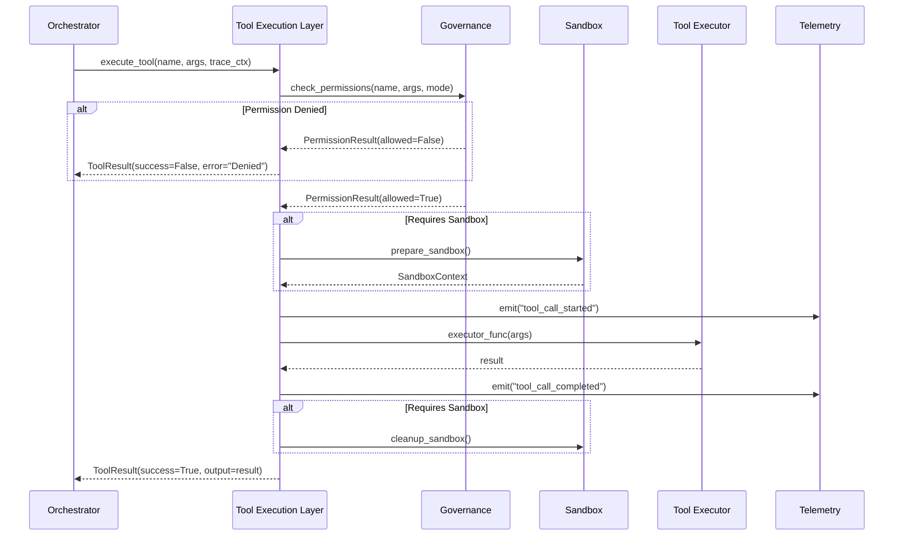

# Tool Execution & Validation Specification (v0.1)

## 1. Purpose & Scope

This specification defines how the Personal Local AI Collaborator **discovers, validates, executes, and monitors tools**. Tools are the "muscular system" of the agent—the mechanisms through which it interacts with:

- The filesystem (read, write, analyze)
- The macOS system (metrics, logs, processes)
- The web (search, retrieval)
- The codebase (linting, testing, git operations)
- Its own internals (configuration, self-checks)

Tools must be:

- **Safe**: Governed by permissions, sandboxing, and approval workflows
- **Observable**: Every invocation logged with trace correlation
- **Validated**: Arguments checked before execution, results verified after
- **Typed**: Clear input/output schemas for reliability
- **Modular**: Easy to add new tools without modifying core orchestrator

This spec covers:

1. Tool interface and discovery
2. Permission model and governance integration
3. Execution lifecycle (request → validation → execution → result)
4. Sandboxing and isolation strategy
5. Error handling and failure modes
6. MVP tool catalog

---

## 2. Tool Interface & Discovery

### 2.1 Tool Definition Schema

Every tool is defined by a **typed specification** (Pydantic model):

```python
from pydantic import BaseModel, Field
from typing import Literal, Any

class ToolParameter(BaseModel):
    name: str
    type: Literal["string", "number", "boolean", "object", "array"]
    description: str
    required: bool = True
    default: Any | None = None

class ToolDefinition(BaseModel):
    """OpenAI-style tool definition for LLM function calling."""
    name: str  # e.g., "read_file", "system_health_check"
    description: str  # Clear description for LLM
    category: str  # From governance (e.g., "read_only", "system_write", "network")
    parameters: list[ToolParameter]

    # Governance metadata
    risk_level: Literal["low", "medium", "high"]
    allowed_modes: list[str]  # Which operational modes allow this tool
    requires_approval: bool = False
    requires_sandbox: bool = False

    # Execution metadata
    timeout_seconds: int = 30
    rate_limit_per_hour: int | None = None

class ToolResult(BaseModel):
    """Result from tool execution."""
    tool_name: str
    success: bool
    output: str | dict  # Tool-specific output
    error: str | None = None
    latency_ms: float
    metadata: dict = Field(default_factory=dict)  # Extra context (e.g., files touched)
```

### 2.2 Tool Discovery & Registry

Tools are **registered at startup** into a `ToolRegistry`:

```python
class ToolRegistry:
    """Central registry of available tools."""

    def register(self, tool_def: ToolDefinition, executor: Callable) -> None:
        """Register a tool with its definition and executor function."""
        ...

    def get_tool(self, name: str) -> tuple[ToolDefinition, Callable] | None:
        """Retrieve tool definition and executor."""
        ...

    def list_tools(self, mode: Mode) -> list[ToolDefinition]:
        """List tools available in the given mode."""
        ...

    def filter_by_category(self, category: str) -> list[ToolDefinition]:
        """Filter tools by governance category."""
        ...
```

**Registration Example:**

```python
# In src/personal_agent/tools/filesystem.py

def read_file_executor(path: str, max_size_mb: int = 10) -> dict:
    """Execute read_file tool."""
    # Validation, execution, result formatting
    ...

read_file_tool = ToolDefinition(
    name="read_file",
    description="Read contents of a file at the given path",
    category="read_only",
    parameters=[
        ToolParameter(name="path", type="string", description="Absolute or relative file path"),
        ToolParameter(name="max_size_mb", type="number", description="Max file size in MB", default=10),
    ],
    risk_level="low",
    allowed_modes=["NORMAL", "ALERT", "DEGRADED", "LOCKDOWN", "RECOVERY"],
    requires_approval=False,
    requires_sandbox=False,
)

# At startup:
registry.register(read_file_tool, read_file_executor)
```

---

## 3. Permission Model & Governance Integration

### 3.1 Permission Checks (Before Execution)

Before executing any tool, the **Tool Execution Layer** performs:

1. **Mode check**: Is tool allowed in current mode?
   - Query `brainstem.get_current_mode()`
   - Check `tool_def.allowed_modes`

2. **Approval check**: Does tool require human approval?
   - Check `tool_def.requires_approval` OR mode-specific approval rules (from `config/governance/tools.yaml`)
   - If yes, pause and request approval via UI

3. **Rate limit check**: Has tool exceeded rate limit?
   - Query recent invocations from telemetry
   - Check `tool_def.rate_limit_per_hour`

4. **Argument validation**: Are arguments within allowed bounds?
   - Path allowlists/denylists (e.g., no access to `/System/`)
   - Command allowlists (e.g., only whitelisted shell commands)
   - Size limits (e.g., max file size)

**Permission Check Flow:**

```python
def check_permissions(
    tool_name: str,
    arguments: dict,
    mode: Mode,
    governance_config: GovernanceConfig,
) -> PermissionResult:
    """Check if tool execution is permitted."""

    tool_def, _ = registry.get_tool(tool_name)

    # 1. Mode check
    if mode not in tool_def.allowed_modes:
        return PermissionResult(allowed=False, reason=f"Tool not allowed in {mode} mode")

    # 2. Approval check
    if requires_approval(tool_def, mode, governance_config):
        approval = request_human_approval(tool_name, arguments)
        if not approval.granted:
            return PermissionResult(allowed=False, reason="Approval denied by user")

    # 3. Rate limit check
    if tool_def.rate_limit_per_hour:
        recent_calls = count_recent_calls(tool_name, window_hours=1)
        if recent_calls >= tool_def.rate_limit_per_hour:
            return PermissionResult(allowed=False, reason="Rate limit exceeded")

    # 4. Argument validation
    validation_result = validate_arguments(tool_name, arguments, governance_config)
    if not validation_result.valid:
        return PermissionResult(allowed=False, reason=validation_result.error)

    return PermissionResult(allowed=True)
```

### 3.2 Argument Validation Rules

Specific tools have **governance-enforced constraints** (from `config/governance/tools.yaml`):

**Example: `write_file`**

```yaml
tools:
  write_file:
    category: "system_write"
    allowed_in_modes: ["NORMAL"]
    requires_approval_in_modes: ["ALERT", "DEGRADED", "RECOVERY"]
    forbidden_in_modes: ["LOCKDOWN"]
    allowed_paths:
      - "$HOME/Dev/personal_agent/**"
      - "$HOME/Documents/agent_workspace/**"
    forbidden_paths:
      - "/System/**"
      - "/Library/**"
      - "$HOME/.ssh/**"
    max_file_size_mb: 10
```

Validation logic:

```python
def validate_write_file_args(path: str, governance: GovernanceConfig) -> ValidationResult:
    """Validate write_file arguments against governance."""

    # Check allowed paths
    if not any(fnmatch(path, pattern) for pattern in governance.tools["write_file"]["allowed_paths"]):
        return ValidationResult(valid=False, error=f"Path {path} not in allowed paths")

    # Check forbidden paths
    if any(fnmatch(path, pattern) for pattern in governance.tools["write_file"]["forbidden_paths"]):
        return ValidationResult(valid=False, error=f"Path {path} is forbidden")

    return ValidationResult(valid=True)
```

---

## 4. Execution Lifecycle

### 4.1 Tool Invocation Flow



### 4.2 Implementation: `ToolExecutionLayer`

```python
class ToolExecutionLayer:
    """Handles tool invocation with governance, sandboxing, and telemetry."""

    def __init__(
        self,
        registry: ToolRegistry,
        governance: GovernanceConfig,
        mode_manager: ModeManager,
    ):
        self.registry = registry
        self.governance = governance
        self.mode_manager = mode_manager

    def execute_tool(
        self,
        tool_name: str,
        arguments: dict,
        trace_ctx: TraceContext,
    ) -> ToolResult:
        """Execute a tool with full governance and observability."""

        # 1. Retrieve tool
        tool_def, executor = self.registry.get_tool(tool_name)
        if not tool_def:
            return ToolResult(
                tool_name=tool_name,
                success=False,
                output={},
                error=f"Tool {tool_name} not found",
            )

        # 2. Check permissions
        current_mode = self.mode_manager.get_current_mode()
        permission = check_permissions(tool_name, arguments, current_mode, self.governance)

        if not permission.allowed:
            logger.warning(
                "tool_call_blocked",
                tool_name=tool_name,
                reason=permission.reason,
                trace_id=trace_ctx.trace_id,
            )
            return ToolResult(
                tool_name=tool_name,
                success=False,
                output={},
                error=f"Permission denied: {permission.reason}",
            )

        # 3. Emit telemetry (start)
        span_ctx, span_id = trace_ctx.new_span()
        logger.info(
            "tool_call_started",
            tool_name=tool_name,
            arguments=arguments,
            trace_id=trace_ctx.trace_id,
            span_id=span_id,
        )

        # 4. Execute (with optional sandboxing)
        start_time = time.time()

        try:
            if tool_def.requires_sandbox:
                result = self._execute_sandboxed(tool_def, executor, arguments)
            else:
                result = executor(**arguments)

            latency_ms = (time.time() - start_time) * 1000

            # 5. Emit telemetry (complete)
            logger.info(
                "tool_call_completed",
                tool_name=tool_name,
                success=True,
                latency_ms=latency_ms,
                trace_id=trace_ctx.trace_id,
                span_id=span_id,
            )

            return ToolResult(
                tool_name=tool_name,
                success=True,
                output=result,
                latency_ms=latency_ms,
            )

        except Exception as e:
            latency_ms = (time.time() - start_time) * 1000

            logger.error(
                "tool_call_failed",
                tool_name=tool_name,
                error=str(e),
                latency_ms=latency_ms,
                trace_id=trace_ctx.trace_id,
                span_id=span_id,
                exc_info=True,
            )

            return ToolResult(
                tool_name=tool_name,
                success=False,
                output={},
                error=str(e),
                latency_ms=latency_ms,
            )
```

---

## 5. Sandboxing & Isolation Strategy

### 5.1 MVP Sandboxing: Process Isolation + Path Restrictions

For tools that require sandboxing (`requires_sandbox=True`), we use:

1. **Subprocess execution**: Run tool in a separate Python subprocess
2. **Path restrictions**: Enforce filesystem access limits via validation
3. **Timeout enforcement**: Kill subprocess if it exceeds `timeout_seconds`
4. **Resource limits** (future): Use `ulimit`-style constraints

**Example: Sandboxed Shell Command Execution**

```python
def execute_shell_command_sandboxed(command: list[str], timeout: int = 30) -> dict:
    """Execute shell command in subprocess with timeout."""

    try:
        result = subprocess.run(
            command,
            capture_output=True,
            text=True,
            timeout=timeout,
            check=False,  # Don't raise on non-zero exit
        )

        return {
            "stdout": result.stdout,
            "stderr": result.stderr,
            "exit_code": result.returncode,
        }

    except subprocess.TimeoutExpired:
        return {
            "stdout": "",
            "stderr": "Command timed out",
            "exit_code": -1,
        }
```

### 5.2 Future: Docker/Container Sandboxing

For Phase 2+, consider:

- **Docker containers** for untrusted code execution (e.g., running user-provided scripts)
- **macOS sandbox profiles** for finer-grained restrictions
- **gVisor or similar** for lightweight isolation

---

## 6. Error Handling & Failure Modes

### 6.1 Tool Failure Categories

1. **Permission denied**: Governance blocks execution → return error, log violation
2. **Validation failed**: Invalid arguments → return error, suggest fix
3. **Execution timeout**: Tool exceeds time limit → kill, return timeout error
4. **Execution exception**: Tool code raises exception → catch, log, return error
5. **Resource exhaustion**: Disk full, memory pressure → fail gracefully, trigger DEGRADED mode

### 6.2 Failure Handling in Orchestrator

When a tool fails, the orchestrator:

1. Logs the failure with full context
2. Returns a `ToolResult` with `success=False` and descriptive `error`
3. Decides next action:
   - Retry once (for transient errors like network timeouts)
   - Continue without tool result (if non-critical)
   - Abort task and inform user (if critical)
4. Emits failure metric for Brainstem monitoring

---

## 7. MVP Tool Catalog

### 7.1 Filesystem Tools

| Tool Name | Category | Description | Risk | Sandbox | MVP |
|-----------|----------|-------------|------|---------|-----|
| `read_file` | read_only | Read file contents | Low | No | ✅ |
| `list_directory` | read_only | List files in directory | Low | No | ✅ |
| `write_file` | system_write | Write content to file | High | No | ✅ |
| `delete_file` | system_write | Delete a file | High | No | ⏸️ Phase 2 |

### 7.2 System Health Tools

| Tool Name | Category | Description | Risk | Sandbox | MVP |
|-----------|----------|-------------|------|---------|-----|
| `system_metrics_snapshot` | read_only | Get CPU, memory, disk, GPU metrics | Low | No | ✅ |
| `check_process_health` | read_only | Check if specific processes are running | Low | No | ✅ |
| `read_system_logs` | read_only | Fetch recent macOS system logs | Medium | No | ✅ |

### 7.3 Web Tools

| Tool Name | Category | Description | Risk | Sandbox | MVP |
|-----------|----------|-------------|------|---------|-----|
| `web_search` | network | Search the web via DuckDuckGo or similar | Medium | No | ✅ |
| `fetch_url` | network | Fetch content from a URL | Medium | Yes | ⏸️ Phase 2 |

### 7.4 Code Tools

| Tool Name | Category | Description | Risk | Sandbox | MVP |
|-----------|----------|-------------|------|---------|-----|
| `run_linter` | read_only | Run ruff/mypy on code | Low | Yes | ⏸️ Phase 2 |
| `run_tests` | read_only | Run pytest in safe environment | Medium | Yes | ⏸️ Phase 2 |
| `git_status` | read_only | Get git repository status | Low | No | ⏸️ Phase 2 |

---

## 8. Implementation Plan

### Week 1: Tool Foundation

1. **Define tool types**: `ToolDefinition`, `ToolParameter`, `ToolResult` (Pydantic models)
2. **Implement `ToolRegistry`**: Registration and lookup
3. **Implement basic permission checker**: Mode + approval checks
4. **Implement `ToolExecutionLayer`**: Core execution flow with telemetry

### Week 2: MVP Tools

5. **Filesystem tools**: `read_file`, `list_directory`, `write_file`
6. **System health tools**: `system_metrics_snapshot`, `check_process_health`
7. **Web search tool**: `web_search` (with Outbound Gatekeeper integration)

### Week 3: Integration & Testing

8. **Integrate with orchestrator**: Wire tool calls into orchestrator execution flow
9. **Integrate with governance**: Load tool policies from YAML, enforce at runtime
10. **End-to-end tests**: Execute tools from orchestrator, verify telemetry and governance

---

## 9. Open Questions & Future Work

- **Tool versioning**: How do we handle tool schema evolution?
- **Tool dependencies**: Can tools call other tools?
- **User-defined tools**: Can project owner add custom tools via config?
- **Tool chaining**: Should we support declarative tool pipelines?
- **Result caching**: Should tool results be cached to avoid redundant execution?

---

## 10. References

- `./system_architecture_v0.1.md` — Section 3.3 (Tools & Capability Services)
- `ADR-0005` — Governance configuration (tool permissions)
- `ADR-0006` — Orchestrator runtime (tool integration)
- `./HUMAN_SYSTEMS_MAPPING.md` — Muscular system analogy

---

## 11. Success Criteria

This specification is complete when:

1. ✅ Tool interface and registry implemented
2. ✅ Permission checking integrated with governance
3. ✅ At least 3 MVP tools functional (e.g., `read_file`, `system_metrics_snapshot`, `web_search`)
4. ✅ Tool execution emits structured telemetry
5. ✅ Tool failures handled gracefully with informative errors
6. ✅ End-to-end test: Orchestrator → Tool Layer → Executor → Result
