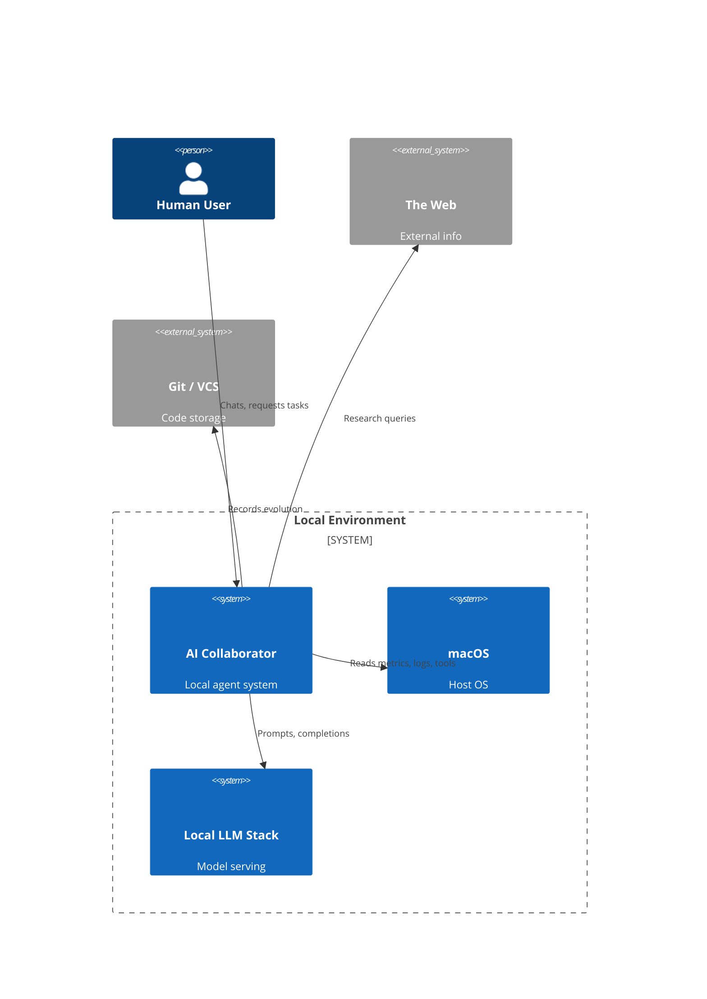
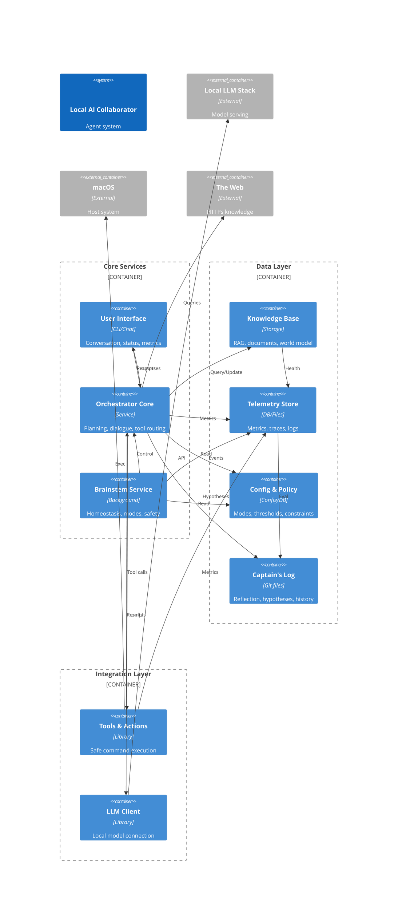

# C4 Context & Container Diagrams — Personal Local Agent

*A structural view of the system with biological anchors.*

This document presents a C4-style view of the Personal Local AI Collaborator, aligned with the biological model:

- Context level: who/what the system interacts with
- Container level: main runtime components and data stores

Use this alongside:

- `./system_architecture_v0.1.md`
- `./HUMAN_SYSTEMS_MAPPING.md`
- `./HOMEOSTASIS_MODEL.md`
- `./BRAINSTEM_SERVICE_v0.1.md`

---

## 1. C4 Level 1 — System Context Diagram

The goal of this diagram is to show **the agent as a system** in its environment: you, your Mac, local model servers, and the external web.

Biological anchors:

- The **Personal Agent** is the "organism".
- macOS + local LLM stack are the **body & brain tissue** it runs on.
- The Web is the **environment**.
- Git is a key part of the **reproductive/evolutionary system** (remembered history and evolution).

---

## 2. C4 Level 2 — Container Diagram

This view shows the internal structure of the Personal Local AI Collaborator as a single coherent system.

