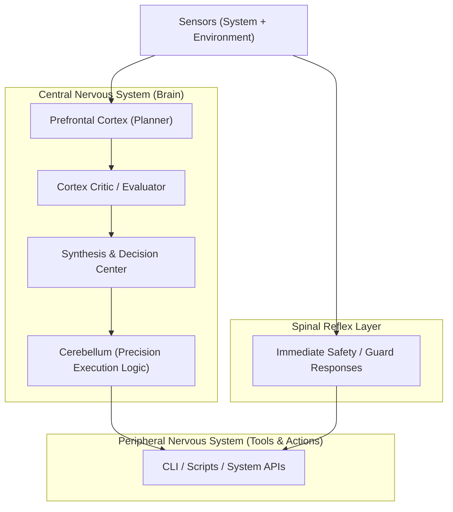
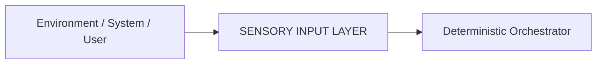
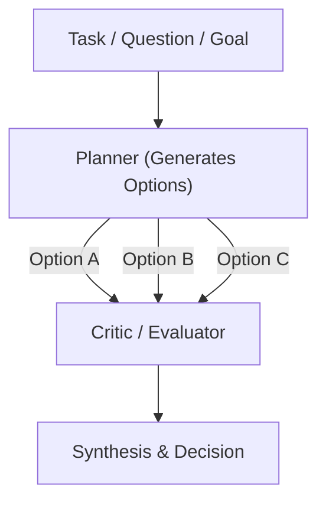
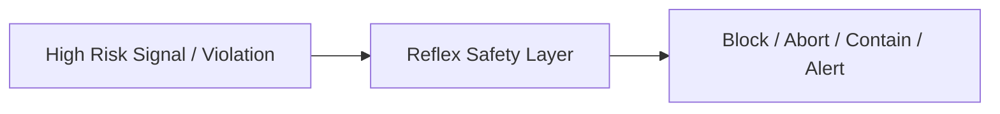
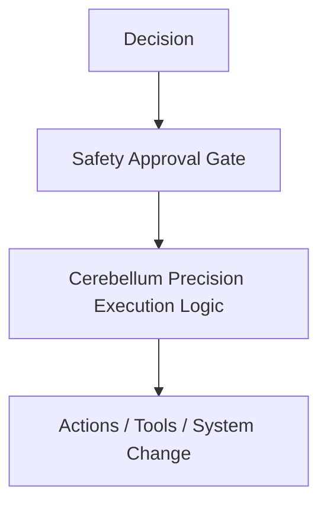
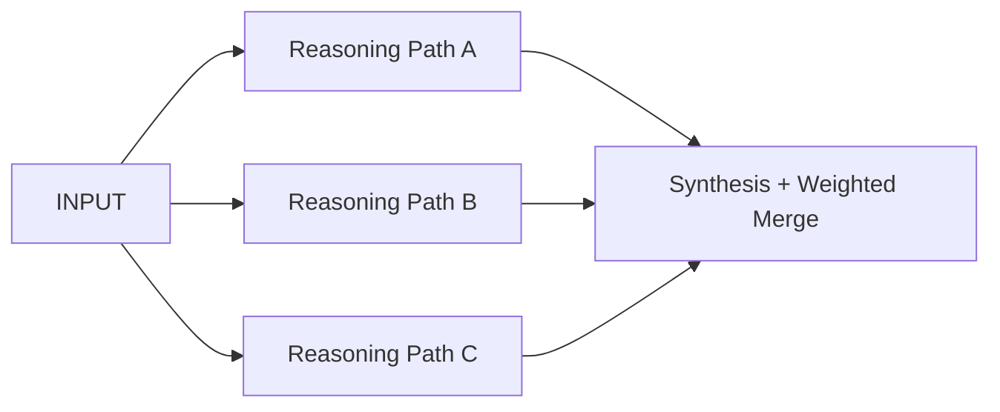
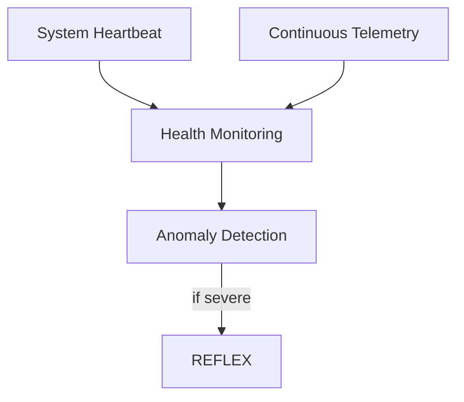

# Nervous System — Orchestrator & Inner Cognition

*A pedagogic and architectural guide to the “brain” of the Personal Agent.*

This document explains how the agent “thinks,” “routes signals,” “protects itself,” and “runs parallel thought” using inspiration from the human nervous system.

If the HUMAN_SYSTEMS_MAPPING.md explains **what** biological system corresponds to what subsystem…
This document explains **how the brain actually works in practice** inside our architecture.

---

## Core Concept

The Nervous System = **Deterministic Orchestrator + Structured Inner Dialogue + Reflex Safety**

Humans:

- sense → evaluate → decide → act
- sometimes *think deeply*
- sometimes react instantly without thinking (reflex)
- always maintain life-support even when unconscious

Our agent:

- receives inputs
- runs structured reasoning
- can run **parallel branches of thought**
- enforces safety before action
- maintains background operations always

The nervous system is not chaos. It is **highly organized intelligence**.

---

# 🧠 High‑Level Nervous System Overview

This Mermaid diagram shows the conceptual layers:

### How to read this

- The **Prefrontal Cortex** plans
- The **Critic** challenges & evaluates
- The **Synthesis Center** makes a final thoughtful choice
- The **Cerebellum** ensures execution correctness & detail handling
- Meanwhile the **Spinal Reflex layer** can trigger instant safety actions

And none of this bypasses control. This is disciplined cognition.

---

# 🌐 Signals Entering the Brain — Input Flow

Everything starts with sensing.

- System health metrics
- Logs
- Events
- Web results
- User instructions
- Stored knowledge
- Historical context
- World model updates

**Pedagogic memory anchor:**
*If you can’t sense, you cannot think.*

---

# 🧩 Inner Dialogue — Structured Multi‑Pass Reasoning

We explicitly support **internal debate**…
…but enforced by structure and governance, not emergent chaos.

### Design Philosophy

- Planner: “Here are several thoughtful paths.”
- Critic: “Here are risks, flaws, blindspots.”
- Synthesis: “Given all analysis, THIS is best.”

This is **System 2 reasoning** — slow, careful thought like humans use when stakes matter.

---

# ⚡ Reflex System — Instant Protection

Sometimes thinking is too slow.

Humans do not “think” before pulling a hand off a hot stove.
The spinal reflex acts first.

Our system must do the same.

Examples:

- detected dangerous command
- policy violation
- system integrity threat
- confidence collapse
- anomaly detection

**This path never asks permission from the cortex.**

---

# 🎯 Final Execution Path — Thoughtful Action

Only after:

- sensing
- planning
- self-critique
- synthesis
- safety approval

…can execution occur.

If safety disapproves:

- situation returns to planner OR
- operation is blocked

No “wild genius behavior.”

---

# 🔁 Parallel Thought — Multiple Streams of Reasoning

The brain runs MANY things at once.
We explicitly want this capability.

Examples:

- multiple solutions
- different strategies
- competing interpretations
- research branches
- hypothesis exploration

Then the synthesis system selects a coherent best response.

**This is intelligence, not chaos.**

---

# 🧬 Life Support — Always-On Background Brainstem

The **brainstem never turns off in humans**.
It regulates life even while sleeping.

We model the same.

This ensures:

- agent doesn’t degrade silently
- we always see state
- we always know when it’s unsafe
- survival takes precedence

---

# 📚 Memory Aid — Region to Function Mapping

| Brain Region Analogy | Our Architecture Role |
|----------------------|-----------------------|
| Prefrontal Cortex | Planner & Strategist |
| Cortex Critic Regions | Evaluator, verifier, challenger |
| Synthesis Regions | Decision integration |
| Cerebellum | Precision execution & ordering |
| Spinal Reflex | Safety reflex layer |
| Brainstem | Always‑on survival processes |

You do **not** need to memorize anatomy.
Just remember the thinking pattern it encodes.

---

# ✅ Why This Matters

This design gives you:

- creativity without chaos
- rigor without paralysis
- safety without suffocation
- parallel cognition without losing control
- transparency instead of magic

It is modern AI engineering grounded in millions of years of evolutionary success.

---

If you’d like, next steps will:

- connect this nervous system diagram to system_architecture_v0.1.md
- define which exact components implement each function
- tie this into the Homeostasis Model.
