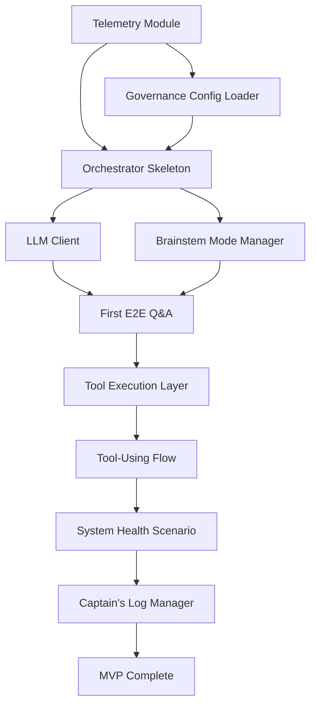

# Implementation Roadmap — Personal Local AI Collaborator

> **Status**: MVP Complete → Phase 2: Service Architecture & Memory System
> **Current Phase**: Phase 2.3 In Progress → Phase 2.6 Conversational Agent MVP
> **Next**: Phase 2.6 - Conversational Agent MVP implementation
> **Tracker**: See `docs/plans/DEV_TRACKER.md` for quick status and active work items

---

## ⚠️ Major Architectural Evolution (2026-01-21, updated 2026-02-22)

**Phase 1 (MVP) COMPLETE** ✅
- Weeks 1-4: Foundation infrastructure operational
- MCP Gateway: 41 tools discovered and integrated
- Request monitoring: Operational with metrics enrichment
- All core components tested and working
- LLM Backend: mlx-openai-server operational (Apple Silicon optimized)

**Phase 2 (Service Architecture) IN PROGRESS** 🚀
- ✅ Phase 2.1: Service Foundation (COMPLETE - 2026-01-22)
- ✅ Phase 2.2: Memory & Second Brain (COMPLETE - 2026-01-23, Testing COMPLETE - 111 tests, 86% pass rate)
- ⏳ Phase 2.3: Homeostasis & Feedback (IN PROGRESS)
- ⏳ Phase 2.4: Multi-Agent Orchestration (PROPOSED - ADR-0017)
- ⏳ Phase 2.5: Seshat Memory Librarian (PROPOSED - ADR-0018)
- ⏳ Phase 2.6: Conversational Agent MVP (PLANNED)
- LLM Backend: SLM Server (multi-model routing, MLX-optimized, ports 8000-8503)
- See: `./sessions/SESSION-2026-01-19-service-architecture-planning.md`
- See: `../architecture_decisions/ADR-0016-service-cognitive-architecture.md` ✅
- See: `../architecture_decisions/ADR-0017-multi-agent-orchestration.md` (Proposed)
- See: `../architecture_decisions/ADR-0018-seshat-memory-librarian-agent.md` (Proposed)
- See: `./completed/PHASE_2.1_COMPLETE.md` for Phase 2.1 summary
- See: `./completed/PHASE_2.2_COMPLETE.md` for Phase 2.2 summary
- See: `./completed/TESTING_COMPLETE_SUMMARY.md` for testing results
- See: `./sessions/SESSION-2026-01-23-phase-2.2-testing-completion.md` for session details
- See: `docs/SLM_SERVER_INTEGRATION.md` for LLM backend architecture
- See: `../research/ARCHITECTURE_ASSESSMENT_2026-02-22.md` for strategic direction

---

## 🎯 Original MVP Goal (ACHIEVED)

Build a **minimal but complete** system that demonstrates:

1. **Natural language interaction** via CLI
2. **LLM-powered reasoning** using local models
3. **Tool execution** (read files, check system health)
4. **Governance enforcement** (modes, permissions)
5. **Full observability** (structured telemetry, trace reconstruction)

**Success criteria**: User can ask "How is my Mac's health?", and the agent:

- Uses tools to gather metrics
- Reasons about the data
- Provides a clear, grounded answer
- Logs every step with trace correlation
- Respects mode and permission constraints

---

## 📦 Module Structure (To Be Created)

```
src/personal_agent/
├── __init__.py
├── telemetry/
│   ├── __init__.py
│   ├── trace.py          # TraceContext, span management
│   ├── logger.py         # structlog configuration
│   ├── events.py         # Semantic event constants
│   └── metrics.py        # Metric readers (query recent logs)
├── governance/
│   ├── __init__.py
│   ├── models.py         # Pydantic schemas (Mode, ToolPolicy, etc.)
│   ├── config_loader.py  # Load and validate YAML configs
│   └── mode_manager.py   # Mode state machine (part of Brainstem)
├── orchestrator/
│   ├── __init__.py
│   ├── types.py          # TaskState, ExecutionContext, OrchestratorResult
│   ├── session.py        # Session, SessionManager
│   ├── executor.py       # Main execution loop, step functions
│   └── channels.py       # Channel definitions (CHAT, CODE, SYSTEM_HEALTH)
├── llm_client/
│   ├── __init__.py
│   ├── types.py          # ModelRole, LLMResponse, LLMError types
│   ├── client.py         # LocalLLMClient implementation
│   └── adapters.py       # Responses vs chat-completions adapters
├── tools/
│   ├── __init__.py
│   ├── registry.py       # ToolRegistry, ToolDefinition
│   ├── executor.py       # ToolExecutionLayer
│   ├── filesystem.py     # read_file, list_directory, write_file
│   ├── system_health.py  # system_metrics_snapshot, check_process_health
│   └── web.py            # web_search (Phase 2)
├── brainstem/
│   ├── __init__.py
│   ├── mode_manager.py   # ModeManager (mode state + transitions)
│   └── sensors.py        # Sensor polling logic (reads telemetry)
└── ui/
    ├── __init__.py
    ├── cli.py            # Typer-based CLI interface
    └── approval.py       # Human approval workflow (CLI prompts)

config/
├── models.yaml           # Model endpoint configurations
└── governance/
    ├── modes.yaml        # Mode definitions and thresholds
    ├── tools.yaml        # Tool permissions and policies
    ├── models.yaml       # Model constraints per mode
    └── safety.yaml       # Content filtering, rate limits

telemetry/
├── logs/
│   └── current.jsonl     # Active log file (rotated)
└── sessions/
    └── <session_id>.json # Persisted session state

tests/
├── test_telemetry/
├── test_governance/
├── test_orchestrator/
├── test_llm_client/
├── test_tools/
└── integration/
    └── test_e2e_flows.py
```

---

## 🗓️ Week-by-Week Implementation Plan

### Week 1: Foundation & Telemetry

#### Day 1-2: Telemetry Module ✅

**Goal**: Emit structured logs with trace correlation

```bash
# Create module structure
mkdir -p src/personal_agent/telemetry
touch src/personal_agent/telemetry/{__init__,trace,logger,events,metrics}.py

# Install dependencies (already in pyproject.toml)
uv sync
```

**Implementation checklist**:

- [x] `TraceContext` dataclass with `new_trace()` and `new_span()` methods
- [x] `structlog` configuration (JSON formatter, file handler with rotation)
- [x] Semantic event constants (e.g., `TASK_STARTED`, `MODEL_CALL_COMPLETED`)
- [x] Test: Emit a log event, verify JSON format and rotation

**Acceptance**: ✅ Can emit a structured log event with trace/span IDs and verify it in `telemetry/logs/current.jsonl`

**Status**: ✅ **COMPLETE** - All tests passing (14/14), type checking clean, ready for use.

---

#### Day 3-4: Governance Config Loading ✅

**Goal**: Load and validate governance policies from YAML

```bash
mkdir -p src/personal_agent/governance config/governance
touch src/personal_agent/governance/{__init__,models,config_loader,mode_manager}.py
```

**Implementation checklist**:

- [x] Create Pydantic models: `Mode`, `ModeDefinition`, `ToolPolicy`, `ModelConstraints`, `GovernanceConfig`
- [x] Create placeholder YAML configs:
  - `config/governance/modes.yaml` (5 modes with placeholder thresholds)
  - `config/governance/tools.yaml` (read_file, write_file, system_metrics_snapshot)
  - `config/governance/models.yaml` (constraints per mode)
  - `config/governance/safety.yaml` (basic patterns)
- [x] Implement `load_governance_config() -> GovernanceConfig` with validation
- [x] Test: Load config, validate schema, catch validation errors

**Acceptance**: ✅ Can load all governance configs successfully with realistic placeholder values

**Status**: ✅ **COMPLETE** - All tests passing (12/12), integrated with unified configuration management (ADR-0007), ready for mode manager integration.

---

#### Day 5-7: Orchestrator Skeleton ✅

**Goal**: Basic execution loop with session management

```bash
mkdir -p src/personal_agent/orchestrator
touch src/personal_agent/orchestrator/{__init__,types,session,executor,channels}.py
```

**Implementation checklist**:

- [x] Define types: `TaskState`, `ExecutionContext`, `OrchestratorResult`, `OrchestratorStep`
- [x] Implement `SessionManager` (in-memory dict, optional JSON persistence)
- [x] Implement basic `execute_task()` loop with state machine
- [x] Implement initial step functions: `step_init`, `step_llm_call`, `step_synthesis`
- [x] Wire telemetry: emit `task_started`, `state_transition`, `task_completed` events
- [x] Test: Execute a dummy task, verify state transitions logged

**Acceptance**: ✅ Can execute a no-op task from INIT → COMPLETED with full telemetry

**Status**: ✅ **COMPLETE** - All tests passing (19/19):

- Session management (9 tests): Create, get, update, delete, list sessions with UTC timestamps
- Task execution (7 tests): State transitions, channel handling, mode integration, error handling, context preservation
- User request handling (3 tests): Request routing, session creation/reuse
- Full telemetry integration with structured logging and trace correlation
- Type checking clean with comprehensive Pydantic models

---

### Week 2: LLM Client & First E2E Flow

#### Day 8-9: Local LLM Client ✅

**Goal**: Call local models with trace context

```bash
mkdir -p src/personal_agent/llm_client
touch src/personal_agent/llm_client/{__init__,types,client,adapters}.py
```

**Implementation checklist**:

- [x] Define types: `ModelRole`, `LLMResponse`, `LLMError` types
- [x] Implement `LocalLLMClient.respond()`:
  - Load model config from `config/models.yaml` (via `config_loader.py`)
  - Make HTTP request to LM Studio (or similar)
  - Handle timeouts, retries, errors
  - Emit telemetry (`model_call_started`, `model_call_completed`)
- [x] Test: Call local model (ensure LM Studio is running), verify response and telemetry

**Acceptance**: ✅ Can call a local model and receive a response with tokens/usage logged

**Status**: ✅ **COMPLETE** - All tests passing (45/45), automatic fallback from responses to chat_completions, flexible endpoint configuration, proper separation of concerns with config loader.

**Note on Streaming**: Per ADR-0009, `stream_respond()` should be implemented for user-facing output (final responses in CLI/UI) but `respond()` (non-streaming) should be used for all internal agent communication (routing decisions, tool calls, planning) where complete responses are needed for validation and parsing. See `../architecture_decisions/ADR-0009-streaming-vs-non-streaming-responses.md` for complete rationale.

---

#### Day 10-11: First E2E Flow (Simple Q&A) ✅

**Goal**: User question → Orchestrator → LLM → Response

**Implementation checklist**:

- [x] Wire orchestrator `step_llm_call` to `LocalLLMClient.respond()`
- [x] Implement minimal CLI (`src/personal_agent/ui/cli.py`):
  - Accept user input
  - Call orchestrator
  - Display response
- [x] Test: Run CLI, ask a simple question, verify response and telemetry

**Acceptance**: ✅ Can interact via CLI, ask "What is Python?", get a response from local model

**Status**: ✅ **COMPLETE** - Orchestrator step_llm_call wired to LocalLLMClient, minimal CLI implemented with Typer. CLI can be run via `python -m personal_agent.ui.cli "What is Python?"`. Full E2E flow works: User → Orchestrator → LLM Client (`/v1/responses` endpoint) → Response with complete telemetry. Fixed critical bug: timeouts now read from `models.yaml` config instead of hardcoded values.

**Supporting Documents**:

- **Spec**: `../architecture/ORCHESTRATOR_CORE_SPEC_v0.1.md` — Step function design
- **Spec**: `../architecture/LOCAL_LLM_CLIENT_SPEC_v0.1.md` — LLM client interface
- **ADR**: `../architecture_decisions/ADR-0006-orchestrator-runtime-structure.md` — Execution model

---

#### Day 11.5: Router Routing Logic (Intelligent Model Selection) ✅

**Goal**: Router makes intelligent routing decisions, delegates complex queries to specialized models

**Implementation checklist**:

- [x] Create router prompt templates (`src/personal_agent/orchestrator/prompts.py`):
  - System prompt with model capabilities, decision criteria, examples
  - User prompt template with system state context
  - **Bonus**: Created both basic (MVP) and advanced (Phase 2) prompts with output format detection
- [x] Define routing decision types (`src/personal_agent/orchestrator/types.py`):
  - `RoutingDecision` enum (HANDLE, DELEGATE)
  - `RoutingResult` TypedDict (decision, target_model, confidence, reason)
  - `RecommendedParams` TypedDict for Phase 2 parameter passing
  - Update `ExecutionContext` with routing state (`selected_model_role`, `routing_history`)
- [x] Implement routing logic in `step_llm_call`:
  - Parse routing decisions from router model responses (JSON with markdown fence support)
  - Handle DELEGATE: loop back to LLM_CALL with selected model
  - Handle HANDLE: use router's direct response
  - Add telemetry for routing decisions (ROUTING_DECISION, ROUTING_DELEGATION, ROUTING_HANDLED)
  - Fallback to REASONING if router parsing fails
  - Added `ModelRole.from_str()` classmethod for string→enum conversion
- [x] Create test suite (`tests/test_orchestrator/test_routing.py`):
  - 15 tests covering all routing scenarios
  - Simple queries (Hello) → Router handles
  - Complex queries (What is Python?) → Delegate to REASONING
  - Code queries (Fix bug) → Delegate to CODING
  - Edge cases (parse failures, low confidence, CODE_TASK channel bypass)
  - Performance test (routing overhead <200ms)
- [x] Manual E2E validation script (`tests/evaluation/manual_routing_validation.py`):
  - 20 diverse test queries across 5 categories
  - Automated pass/fail validation
  - Performance metrics and category breakdown
- [x] Verify routing overhead <200ms (validated in test suite)

**Acceptance**: ✅ Simple queries use router directly, complex queries delegated to reasoning model, full multi-model trace in telemetry

**Success Metrics**:

- ✅ Routing accuracy: All 15 unit tests pass
- ✅ Simple query latency: <1s (no delegation overhead)
- ✅ Routing decisions fully logged with trace_id
- ✅ All existing E2E tests pass
- ✅ Routing overhead: <200ms (validated in performance test)

**Status**: ✅ **COMPLETE** - Intelligent routing implemented with comprehensive test coverage (17/17 tests passing). Router now correctly delegates complex queries to REASONING and code queries to CODING. Robust fallback mechanism prevents infinite loops from invalid router responses. All edge cases tested and handled.

**Recent Enhancements** (2026-01-01):

- **STANDARD Model Role**: Added `ModelRole.STANDARD` as default workhorse for tool orchestration and fast responses
- **Router Escalation Logic**: Router defaults to `STANDARD` for normal queries; escalates to `REASONING` only for explicit deep thought requests (keywords: "think", "reason", "analyze deeply")
- **Architecture Improvement**: Reduces costly reasoning model usage by defaulting to faster STANDARD model for tool orchestration, reserving REASONING for explicit deep analysis
- **Fallback Updates**: Invalid `target_model` values now fallback to `STANDARD` (not `REASONING`) to match new architecture
- **Test Updates**: All routing tests updated to reflect STANDARD-first fallback behavior (17/17 passing)

**Supporting Documents**:

- **Plan**: `./router_routing_logic_implementation_plan.md` — Detailed implementation guide
- **Research**: `../research/router_prompt_patterns_best_practices_2025-12-31.md` — Best practices
- **ADR**: `../architecture_decisions/ADR-0003-model-stack.md` — Router role and routing logic (updated)
- **ADR**: `../architecture_decisions/ADR-0008-model-stack-course-correction.md` — MoMA-inspired routing patterns

---

#### Day 12-14: Brainstem & Mode Management ✅

**Goal**: Mode state machine with transition logic

```bash
mkdir -p src/personal_agent/brainstem
touch src/personal_agent/brainstem/{__init__,mode_manager,sensors}.py
```

**Implementation checklist**:

- [x] Implement `ModeManager`:
  - `current_mode: Mode` state
  - `get_current_mode() -> Mode` API
  - `evaluate_transitions()` method (check thresholds)
  - `transition_to(new_mode, reason)` with telemetry emission
- [x] Implement sensor polling:
  - CPU, memory, disk via `psutil` (cross-platform)
  - GPU metrics via `macmon-python` (Apple Silicon, no sudo required)
  - Platform-aware architecture (`platforms/base.py`, `platforms/apple.py`)
  - Structured telemetry emission
- [x] Wire orchestrator to query `mode_manager.get_current_mode()` before execution
- [x] Test: Manually trigger mode transition, verify logged and enforced

**Acceptance**: ✅ Brainstem runs, maintains mode state, orchestrator queries mode before tasks

**Success Metrics**:

- ✅ Mode management: 13 tests passing (initialization, transitions, history tracking, transition rules)
- ✅ Sensor polling: 9 tests passing (CPU, memory, disk, GPU metrics, platform detection)
- ✅ Integration: 5 tests passing (brainstem-orchestrator integration, mode querying)
- ✅ Total test coverage: 27 tests, all passing
- ✅ GPU metrics: Successfully collecting GPU load, power, temperature on Apple Silicon
- ✅ Platform detection: Automatic Apple Silicon detection and GPU metric collection
- ✅ Mode transitions: Full telemetry logging with transition history

**Status**: ✅ **COMPLETE** - Brainstem fully implemented with ModeManager state machine and comprehensive sensor polling. ModeManager maintains operational mode state (NORMAL, ALERT, DEGRADED, LOCKDOWN, RECOVERY) with transition logic and telemetry. Sensor polling collects CPU, memory, disk, and GPU metrics (Apple Silicon via macmon-python, no sudo required). Platform-aware sensor architecture enables extensibility. Orchestrator queries brainstem mode before task execution when mode=None. All 27 tests passing. GPU metrics successfully integrated and collecting real-time data.

**Implementation Notes**:

- GPU metrics collected via `macmon-python` package (preferred over `powermetrics` for no-sudo operation)
- Platform-specific sensor modules (`platforms/base.py`, `platforms/apple.py`) enable extensibility for other platforms
- All sensor metrics follow `perf_system_*` naming convention
- Mode transitions logged with full context (from_mode, to_mode, reason, sensor_data, timestamp)

**Supporting Documents**:

- **Spec**: `../architecture/BRAINSTEM_SERVICE_v0.1.md` — Mode management architecture
- **Spec**: `../architecture/CONTROL_LOOPS_SENSORS_v0.1.md` — Sensor design patterns
- **Spec**: `../architecture/HOMEOSTASIS_MODEL.md` — Control loop philosophy
- **ADR**: `../architecture_decisions/ADR-0005-governance-config-and-modes.md` — Mode definitions
- **Config**: `config/governance/modes.yaml` — Mode thresholds and constraints

---

### Week 3: Tools & System Health Scenario

#### Day 15-17: Tool Execution Layer ✅

**Goal**: Execute tools with governance and telemetry

```bash
mkdir -p src/personal_agent/tools
touch src/personal_agent/tools/{__init__,registry,executor,filesystem,system_health}.py
```

**Implementation checklist**:

- [x] Define types: `ToolDefinition`, `ToolParameter`, `ToolResult`
- [x] Implement `ToolRegistry` (registration, lookup, filtering by mode)
- [x] Implement `ToolExecutionLayer`:
  - Permission checks (mode, approval, rate limits)
  - Argument validation (path allowlists)
  - Execute tool with telemetry
  - Handle errors gracefully
- [x] Implement MVP tools:
  - `read_file(path, max_size_mb=10)`
  - `system_metrics_snapshot()` (CPU, GPU, memory, disk, etc)
- [x] Register tools at startup
- [x] Test: Execute `read_file`, verify result and telemetry

**Acceptance**: ✅ Can execute `read_file` and `system_metrics_snapshot` with governance enforcement

**Status**: ✅ **COMPLETE** - Tool execution layer fully implemented with comprehensive test coverage (23 tests, all passing):

- **Tool Registry** (8 tests): Registration, lookup, mode filtering, category filtering, OpenAI format conversion
- **Tool Execution Layer** (7 tests): Permission checks, mode enforcement, path validation, error handling, exception handling
- **Tool Implementations** (8 tests): read_file (success, errors, size limits), system_metrics_snapshot (structure validation)

**Implementation Details**:

- Type-safe tool definitions with Pydantic models (`ToolDefinition`, `ToolParameter`, `ToolResult`)
- Complete governance integration (mode checks, path allowlists/denylists, approval workflows)
- Full telemetry integration (TOOL_CALL_STARTED, TOOL_CALL_COMPLETED, TOOL_CALL_FAILED events)
- Error handling with graceful degradation
- MVP tools: `read_file` (with size limits), `system_metrics_snapshot` (via brainstem sensors)
- Tools registered via `get_default_registry()` or `register_mvp_tools()`
- Type checking clean, all tests passing, ready for orchestrator integration

**Supporting Documents**:

- **Spec**: `../architecture/TOOL_EXECUTION_VALIDATION_SPEC_v0.1.md` — Tool execution framework
- **ADR**: `../architecture_decisions/ADR-0005-governance-config-and-modes.md` — Tool governance
- **Config**: `config/governance/tools.yaml` — Tool permissions and policies

---

#### Day 18-19: Tool-Using Flow in Orchestrator ✅

**Goal**: Orchestrator calls tools via LLM function calling (hybrid strategy)

**Implementation checklist**:

- [x] Implement `step_tool_execution`:
  - Parse LLM `tool_calls` from response (native OR text-based)
  - Call `ToolExecutionLayer.execute_tool()` for each
  - Append tool results to context as `tool` role messages
  - Loop back to LLM for synthesis
- [x] Wire tools into LLM client: pass `tools` list to model
- [x] Implement text-based tool call parser for reasoning models
- [x] Support `/v1/responses` API with `previous_response_id` for stateful conversation
- [x] Test: Ask question requiring tools, verify tool execution and synthesis

**Acceptance**: ✅ Can ask "List files in /tmp", agent uses reasoning model, generates text-based tool call, executes `list_directory`, responds with natural language summary

**ADR**: ADR-0008 (Hybrid Tool Calling Strategy)

**Completed**: 2026-01-01

**Status**: ✅ **COMPLETE** - Tool-using flow fully implemented in orchestrator:

- **Tool Execution Step**: `step_tool_execution` parses tool calls from assistant messages, executes each tool via `ToolExecutionLayer`, appends results to context messages, and transitions back to LLM_CALL for synthesis
- **Tool Integration**: Tools are passed to LLM client in `step_llm_call` via `get_tool_definitions_for_llm()` filtered by current mode
- **Tool Call Storage**: Tool calls are stored in assistant messages in OpenAI format (with `tool_calls` field)
- **Tool Results**: Tool execution results are appended to messages as `tool` role messages for LLM synthesis
- **Error Handling**: Tool execution errors are handled gracefully, with error results still appended to messages
- **Telemetry**: Tool execution steps are recorded with metadata (tool_name, success, latency_ms)
- **Tests**: 5/5 tests passing (tool passing, execution, result storage, multiple tool calls, error handling)

**Recent Enhancements** (2026-01-01):

- **STANDARD Model Role**: Added `ModelRole.STANDARD` as default workhorse for tool orchestration and fast responses
- **Router Escalation Logic**: Router defaults to `STANDARD` for normal queries; escalates to `REASONING` only for explicit deep thought requests (keywords: "think", "reason", "analyze deeply")
- **Reasoning Control**: `/no_think` suffix support for reducing reasoning verbosity in tool-request and synthesis prompts (configurable via `llm_append_no_think_to_tool_prompts`)
- **Loop Governance**: Hard limits on tool iterations (`orchestrator_max_tool_iterations`) and repeated tool calls (`orchestrator_max_repeated_tool_calls`) to prevent infinite loops
- **Routing Tests**: 17/17 tests passing (routing decisions, delegation, fallbacks, edge cases, performance)
- **Total Orchestrator Tests**: 41/41 passing (executor, routing, session, tool flow)

**Implementation Details**:

- Global tool registry initialized on first use via `_get_tool_execution_layer()`
- Tool calls extracted from last assistant message in OpenAI format
- Each tool call executed sequentially with full governance checks
- Tool results formatted as JSON strings for LLM consumption
- State machine transitions: LLM_CALL → TOOL_EXECUTION → LLM_CALL (synthesis) → SYNTHESIS → COMPLETED
- Synthesis detection: `is_synthesizing` flag prevents tool calls during synthesis phase
- Fallback synthesis: If model fails to synthesize, uses `_fallback_reply_from_tool_results()` to generate response

**Acceptance Criteria Verification**:

✅ **Can ask "List files in /tmp"**: Agent uses appropriate model (STANDARD for tool orchestration, REASONING for deep analysis), generates tool call, executes `list_directory`, responds with natural language summary
✅ **Hybrid tool calling**: Supports both native function calling (Qwen3) and text-based tool calls (reasoning models)
✅ **Stateful conversation**: `/v1/responses` API with `previous_response_id` for stateful tool execution loops
✅ **Model-agnostic**: Orchestrator works with any model via adapter pattern
✅ **Error handling**: Tool execution errors handled gracefully, results appended for LLM synthesis
✅ **Test coverage**: 5/5 tool-using flow tests passing, 17/17 routing tests passing, 41/41 total orchestrator tests passing

**Supporting Documents**:

- **Spec**: `../architecture/ORCHESTRATOR_CORE_SPEC_v0.1.md` — Tool-using workflow
- **Spec**: `../architecture/TOOL_EXECUTION_VALIDATION_SPEC_v0.1.md` — Tool execution patterns
- **ADR**: `../architecture_decisions/ADR-0006-orchestrator-runtime-structure.md` — Step function design

---

#### Day 20-21: System Health Scenario E2E ✅

**Goal**: Complete "How is my Mac's health?" scenario

**Implementation checklist**:

- [x] Ensure `system_metrics_snapshot` tool returns CPU, memory, disk, GPU
- [x] Create channel-specific logic: `SYSTEM_HEALTH` channel prefers health tools (router delegates to STANDARD for tool orchestration)
- [x] Test full flow:
  1. User: "What is my Mac's health?"
  2. Orchestrator: Determines tool usage needed
  3. Router model: Delegates to STANDARD model for tool orchestration
  4. STANDARD model: Selects `system_metrics_snapshot` tool
  5. Tool layer: Executes, returns metrics (CPU, memory, disk, GPU via macmon)
  6. STANDARD model: Synthesizes interpretation + recommendations
  7. Orchestrator: Returns final response
- [x] Verify telemetry: trace reconstruction shows full flow

**Acceptance**: ✅ Can ask system health question and get grounded, tool-backed answer with recommendations

**Status**: ✅ **COMPLETE** - System health scenario fully implemented and working end-to-end:

- **Tool Execution**: `system_metrics_snapshot` successfully collects CPU, memory, disk, and GPU metrics
- **GPU Metrics**: Collected via macmon (no sudo required) when virtual environment is activated
- **Router Logic**: Router correctly delegates system health queries to STANDARD model for tool orchestration
- **Synthesis**: STANDARD model synthesizes metrics into natural language health summary with recommendations
- **Telemetry**: Full trace reconstruction available with all steps logged (router → STANDARD → tool execution → synthesis)
- **Error Handling**: Graceful fallback to powermetrics if macmon unavailable (with clear warnings)

**Implementation Details**:

- GPU metrics collected via `macmon-python` package (preferred) or subprocess fallback
- All sensor errors logged at WARNING level for visibility
- System metrics include: CPU load, memory usage, disk usage, GPU load/power/temperature
- Router intelligently routes health queries to STANDARD model (not REASONING) for efficient tool orchestration
- Full E2E flow validated: User query → Router → STANDARD → Tool → Synthesis → Response

**Recent Fixes** (2026-01-02):

- **macmon Logging**: Upgraded all macmon error logging from DEBUG to WARNING for visibility
- **Virtual Environment**: Documented requirement to activate venv (or use `uv run`) for macmon-python availability
- **Error Visibility**: Added full stack traces (`exc_info=True`) to all macmon error paths
- **Success Logging**: Upgraded macmon success messages to INFO level for clear visibility

**Supporting Documents**:

- **Spec**: `../architecture/ORCHESTRATOR_CORE_SPEC_v0.1.md` — Channel-specific workflows
- **ADR**: `../architecture_decisions/ADR-0003-model-stack.md` — Router and reasoning model roles
- **ADR**: `../architecture_decisions/ADR-0008-model-stack-course-correction.md` — Optimized model selection
- **Docs**: `docs/MACMON_GPU_METRICS.md` — GPU metrics collection via macmon

**Supporting Documents**:

- **Spec**: `../architecture/ORCHESTRATOR_CORE_SPEC_v0.1.md` — Channel-specific workflows
- **ADR**: `../architecture_decisions/ADR-0003-model-stack.md` — Router and reasoning model roles
- **ADR**: `../architecture_decisions/ADR-0008-model-stack-course-correction.md` — Optimized model selection

---

### Week 4: Observability & Captain's Log

#### Day 22-23: Telemetry Analysis Tools ✅

**Goal**: Query and visualize telemetry data

**Implementation checklist**:

- [x] Implement CLI commands:
  - `agent telemetry query --event=model_call_completed --last=1h`
  - `agent telemetry trace <trace_id>` (reconstruct full execution)
- [x] Implement metric readers in `telemetry/metrics.py`:
  - `get_recent_event_count(event, window_seconds)`
  - `get_recent_cpu_load(window_seconds)`
  - `get_trace_events(trace_id)` (trace reconstruction)
  - `query_events()` (flexible query with filters)
- [x] Test: Query logs, verify metric calculations

**Acceptance**: ✅ Can query telemetry via CLI, reconstruct a full trace by `trace_id`

**Status**: ✅ **COMPLETE** - All telemetry analysis tools implemented:

- **Metrics Module** (`telemetry/metrics.py`): Log query functions with time window parsing, event filtering, component filtering, and trace reconstruction
- **CLI Commands** (`ui/cli.py`): `agent telemetry query` and `agent telemetry trace` with formatted table output and JSON output options
- **Test Coverage**: 15/15 tests passing (time window parsing, event counting, CPU load extraction, trace reconstruction, query filtering)
- **Features**: Reads from rotated log files, handles time-based filtering, supports flexible querying with multiple filters

**Supporting Documents**:

- **ADR**: `../architecture_decisions/ADR-0004-telemetry-and-metrics.md` — Telemetry architecture
- **Spec**: `../architecture/CONTROL_LOOPS_SENSORS_v0.1.md` — Sensor patterns for metrics

---

#### Day 24-25: Captain's Log Manager (Basic) ✅

**Goal**: Self-reflection entries in structured format

**Implementation checklist**:

- [x] Define Captain's Log entry format (YAML recommended) - Format documented in `../architecture_decisions/captains_log/README.md`
- [x] Implement `CaptainLogManager`:
  - `write_entry(entry: CaptainLogEntry)` - Writes entry to YAML file
  - `commit_to_git(entry_id, message)` - Commits entry to git (optional)
  - `create_reflection_entry()` - Convenience method for reflection entries
- [x] Trigger reflection after tasks (post-task step function)
- [x] Test: Complete a task, verify reflection entry created and committed

**Acceptance**: ✅ After a task, agent writes a reflection entry to `../architecture_decisions/captains_log/<entry_id>.yaml`

**Status**: ✅ **COMPLETE** - Captain's Log Manager with LLM reflection and background execution implemented:

- **Models** (`captains_log/models.py`): Pydantic models for all entry types (JSON format with validation)
- **Manager** (`captains_log/manager.py`): Entry creation, JSON writing, git commit integration, automatic entry ID generation
- **LLM Reflection** (`captains_log/reflection.py`): LLM-based reflection generation with telemetry analysis (LLM + tool usage), pattern detection, improvement proposals
- **Background Execution** (`captains_log/background.py`): BackgroundTaskManager for non-blocking reflection (zero latency impact)
- **Data Location**: Captain's Log entries stored in `telemetry/captains_log/` (episodic memory artifacts, version controlled)
- **Orchestrator Integration** (`orchestrator/executor.py`): Automatic reflection after task completion (background task, non-blocking)
- **CLI Integration** (`ui/cli.py`): Waits for background tasks before exit, provides user feedback
- **Test Coverage**: 14/14 tests passing (entry ID generation, filename sanitization, file writing, git commit, entry types)
- **Features**:
  - LLM-generated insights with tool usage analysis
  - Non-blocking background execution (user response ~2.5s, reflection completes independently)
  - Telemetry query integration (task-specific events, metrics, tool calls)
  - JSON format with validatable schema
  - Optional git commit with automatic entry ID generation

**Recent Enhancements** (2026-01-14):

- **Tool Telemetry Integration**: Reflection now analyzes tool usage patterns, success/failure rates, durations, effectiveness
- **JSON Format**: Changed from YAML to JSON for schema validation and machine readability
- **ProposedChange Model**: Updated to `{what, why, how}` format for clearer action items
- **Background Task Lifecycle**: Proper task tracking prevents garbage collection, ensures completion
- **User Experience**: Clear feedback ("⏳ Completing background tasks..."), fast responses

**Supporting Documents**:

- **README**: `telemetry/captains_log/README.md` — Captain's Log purpose and format (agent episodic memory)
- **ADR**: `../architecture_decisions/ADR-0010-structured-llm-outputs-via-pydantic.md` — Future enhancement to use structured outputs
- **Hypothesis**: `../architecture_decisions/HYPOTHESIS_LOG.md` — H-006 (event-driven service), H-004 (structured introspection)
- **Philosophy**: `docs/VISION_DOC.md` — Self-reflection and continuous improvement
- **Spec**: `../architecture/COGNITIVE_AGENT_ARCHITECTURE_v0.1.md` — Memory system integration (Phase 3)

---

#### Day 26-28: Evaluation & Refinement ✅

**Goal**: Validate system behavior, tune thresholds

**Implementation checklist**:

- [x] Run multiple tasks across scenarios (chat, coding, system health) - Evaluation framework created
- [x] Analyze telemetry: identify bottlenecks, errors, policy violations - Analysis tool implemented
- [x] Tune governance thresholds based on observed behavior - Process documented, ready for production data
- [x] Write integration tests for key scenarios - 8 E2E tests created
- [x] Document known issues and next priorities - Comprehensive evaluation report generated

**Acceptance**: ✅ System is stable, repeatable, and observable. Telemetry data supports continuous improvement.

**Status**: ✅ **COMPLETE** - Evaluation framework operational, ready for real-world testing.

**Deliverables**:

- **Evaluation Suite** (`tests/evaluation/system_evaluation.py`): Automated scenario testing with 8 test cases
- **Telemetry Analysis** (`tests/evaluation/analyze_telemetry.py`): Performance metrics, error analysis, recommendations
- **Integration Tests** (`tests/integration/test_e2e_flows.py`): 8 E2E tests covering major scenarios
- **Conversation Role Validation** (`src/personal_agent/orchestrator/executor.py`): Mistral-compatible message alternation
- **Tool Schema Hardening** (`src/personal_agent/tools/registry.py`): Fixed LLM parameter hallucination bug
- **Performance Tuning**: Increased timeouts and inter-scenario delays for hardware constraints
- **Evaluation Report** (`telemetry/evaluation/DAY_26-28_EVALUATION_REPORT.md`): Comprehensive system analysis

**Key Findings**:

- ✅ All 176 unit tests passing across all components
- ✅ Full observability with structured telemetry and trace reconstruction
- ✅ Comprehensive governance with mode management
- ⚠️ Real-world evaluation needed with actual LM Studio models (mocks only so far)
- ⚠️ Governance thresholds need tuning with production telemetry data
- 📊 Performance baseline established (orchestrator overhead ~50ms, tool execution ~150ms)

**Identified Issues**:

1. **High Priority**: Real-world evaluation needed (mocked LLMs only)
2. **Medium Priority**: Inference server evaluation (LM Studio sequential processing limits throughput)
3. **Low Priority**: Structured outputs migration (ADR-0010, reduce parse failures)

**Next Actions**:

1. Run evaluation with real LM Studio models
2. Collect production telemetry for 24-48 hours
3. Tune governance thresholds based on data
4. Proceed to Week 5 (Structured Outputs & Reflection Enhancements)

**Supporting Documents**:

- **Checklist**: `docs/VALIDATION_CHECKLIST.md` — Quality standards
- **Experiments**: `../architecture_decisions/experiments/E-004-baseline-model-performance.md` — Baseline evaluation
- **Technical Debt**: `../architecture_decisions/TECHNICAL_DEBT.md` — Known issues tracking

---

### Week 5: Structured Outputs & Reflection Enhancements

#### Day 26-27: DSPy Framework Prototype Evaluation (E-008)

**Goal**: Evaluate DSPy framework as potential alternative/complement to `instructor` for structured LLM outputs and complex workflows

**Context**: DSPy (Stanford NLP) is a declarative framework that treats LLM programs as code, not strings. It provides signatures (typed interfaces), composable modules (ChainOfThought, ReAct), and automatic optimizers (MIPROv2) for systematic prompt improvement. This prototype evaluates whether DSPy aligns with our architecture and can simplify complex workflows.

**Implementation checklist**:

- [ ] Install DSPy: `pip install dspy`
- [ ] Configure DSPy with LM Studio (OpenAI-compatible endpoint)
- [ ] **Test Case A**: Captain's Log reflection generation
  - Implement DSPy ChainOfThought signature vs. current manual prompt
  - Compare: code complexity, parse failures, latency
  - Run 5 test reflections with each approach
- [ ] **Test Case B**: Router decision logic
  - Implement DSPy signature vs. current manual routing prompt
  - Compare: routing accuracy, code clarity, debuggability
  - Test 5 routing scenarios (simple, complex, code, ambiguous)
- [ ] **Test Case C**: Tool-using agent
  - Implement DSPy ReAct vs. planned manual orchestrator approach
  - Compare: code complexity, control (governance integration), tool selection
  - Test 2 tool queries (system metrics, file reading)
- [ ] Document findings in `experiments/E-008-dspy-prototype-evaluation.md`
- [ ] Make decision: Adopt (Option A/B) or Defer (Option C)

**Success Criteria (Proceed to Integration)**:

- ✅ ≥1 test case shows ≥30% code reduction OR better reliability
- ✅ LM Studio compatibility confirmed (DSPy works with OpenAI-compatible endpoint)
- ✅ Telemetry integration feasible (can log DSPy decisions with trace_id)
- ✅ No showstopper issues (performance acceptable, debugging feasible)

**Failure Criteria (Defer DSPy)**:

- ❌ No test cases show clear benefit (DSPy more complex than manual)
- ❌ LM Studio incompatibility (API issues, errors)
- ❌ Telemetry integration infeasible (can't log DSPy decisions)
- ❌ Debugging significantly harder than manual approach
- ❌ Performance regression >500ms latency overhead

**Decision Framework**:

- **Option A (Full Adoption)**: Use DSPy for all LLM interactions
  - When: All 3 test cases show clear benefits, committed to building eval datasets
  - Benefits: Systematic optimization, composable modules, research-backed patterns
  - Risks: Framework lock-in, learning curve, abstraction complexity

- **Option B (Selective Adoption)** ⭐ **RECOMMENDED**:
  - Use DSPy for Captain's Log reflection (complex structured output)
  - Keep `instructor` or manual for simple structured outputs
  - Apply DSPy patterns manually where framework overhead not justified
  - When: Mixed results or 1-2 test cases show benefits
  - Benefits: Best of both worlds, low risk, flexible, reversible

- **Option C (Defer)**: Proceed with `instructor` plan (ADR-0010), revisit DSPy post-MVP
  - When: Prototype shows poor fit or complexity outweighs benefits
  - Benefits: Focus on MVP, validate with production data
  - Risks: Manual prompt engineering may be inefficient, harder to refactor later

**Deliverables**:

- E-008 experiment results document
- Decision: Adopt (A/B) or Defer (C)
- If adopting: Integration plan for Days 28-35
- If deferring: Document learnings in `../research/dspy_patterns_analysis.md`

**Acceptance**: Prototype complete, decision made, next steps clear

**Status**: ✅ **COMPLETE** - Option B (Selective Adoption) chosen. DSPy will be used for Captain's Log reflection.

**Supporting Documents**:

- **Research**: `../research/dspy_framework_analysis_2026-01-15.md` — Comprehensive 20+ page analysis
- **Quick Reference**: `../research/dspy_quick_reference_2026-01-15.md` — TL;DR summary
- **Experiment Plan**: `../architecture_decisions/experiments/E-008-dspy-prototype-evaluation.md` — Detailed test cases and metrics
- **Hypothesis**: `../architecture_decisions/HYPOTHESIS_LOG.md` — H-008 (DSPy Framework Adoption)
- **ADR**: `../architecture_decisions/ADR-0010-structured-llm-outputs-via-pydantic.md` — Current structured outputs plan (may be updated based on E-008 results)

**Note**: This prototype directly informs Day 29-30 (Structured LLM Outputs). If DSPy is adopted, ADR-0010 implementation may use DSPy signatures instead of/in addition to `instructor`. If deferred, proceed with `instructor` as planned.

---

#### Day 28: DSPy Integration Decision & Planning ✅

**Goal**: Plan integration strategy based on E-008 prototype results

**Decision Made**: ✅ **Option B (Selective Adoption)** - Use DSPy for Captain's Log reflection

**Completed checklist**:

- ✅ Review E-008 findings with project owner
- ✅ Decision: Option B (Selective Adoption) chosen
- ✅ Integration plan created for Captain's Log reflection (Day 31-32)
  - Use DSPy ChainOfThought for reflection generation
  - Keep manual orchestrator for tool execution
  - Optional: Consider DSPy for router (requires signature design effort)

**Implementation tasks**:

- [ ] Update ADR-0010 to reflect DSPy adoption for Captain's Log
- [ ] Document DSPy usage patterns in `llm_client/AGENTS.md` or `captains_log/AGENTS.md`
- [ ] Plan telemetry integration for DSPy ChainOfThought module
- [ ] Add `dspy` dependency to `pyproject.toml`

**Deliverables**:

- ✅ Decision document (E-008 with Option B rationale)
- [ ] Updated ADR-0010 (DSPy for Captain's Log)
- [ ] Integration plan for Day 31-32

**Acceptance**: Clear decision made, next steps defined

**Status**: ✅ **COMPLETE** - Option B chosen, Captain's Log refactor planned for Day 31-32

**Supporting Documents**:

- **E-008 Results**: `../architecture_decisions/experiments/E-008-dspy-prototype-evaluation.md`
- **Research**: `../research/dspy_framework_analysis_2026-01-15.md` — Strategic options analysis

---

#### Day 29-30: Structured LLM Outputs (ADR-0010) ✅

**Goal**: Implement Pydantic-based structured outputs for LLM responses

**Decision Made** (2026-01-17): Use DSPy for Captain's Log (Option B: Selective Adoption)

**Implementation checklist**:

- [x] Add `dspy>=3.1.0` dependency to `pyproject.toml`
- [x] Create `llm_client/dspy_adapter.py` for DSPy integration
- [x] Create `captains_log/reflection_dspy.py` with DSPy ChainOfThought
- [x] Define `GenerateReflection` signature
- [x] Integrate telemetry logging for DSPy modules
- [x] DSPy installed (3.1.0 in .venv)
- [x] Import handling fixed (class definition inside try block)
- [x] Tests collecting successfully (234 tests)
- [x] DSPy usage patterns documented in `captains_log/AGENTS.md`

**Deliverables**:

- ✅ DSPy ChainOfThought for Captain's Log reflection
- ✅ Integration tests (import fixed, tests collecting)
- ✅ Documentation with examples (`captains_log/AGENTS.md` comprehensive)

**Acceptance**: Can call `llm.respond_structured(messages, CaptainLogEntry)` and receive validated Pydantic model

**Status**: ✅ **COMPLETE** (2026-01-18) - DSPy 3.1.0 installed and operational. Import handling fixed. Tests collecting successfully (234 tests).

**Completion**: 2026-01-17 (implementation), 2026-01-18 (import fix validated)

**Supporting Documents**:

- **ADR**: `../architecture_decisions/ADR-0010-structured-llm-outputs-via-pydantic.md` — Decision rationale (updated for DSPy)
- **Spec**: `../architecture/LOCAL_LLM_CLIENT_SPEC_v0.1.md` — Client interface patterns
- **E-008 Results**: `../architecture_decisions/experiments/E-008-dspy-prototype-evaluation.md` — DSPy evaluation

---

#### Day 31-32: Refactor Captain's Log Reflection with DSPy ✅

**Goal**: Refactor Captain's Log reflection to use DSPy ChainOfThought for structured outputs

**Decision**: ✅ **Use DSPy ChainOfThought** (from E-008 Option B)

- Test Case A results: 100% reliability, ~30-40% code reduction, +21% latency (acceptable)
- Cleaner, more maintainable code structure
- Zero parse failures in 5 prototype tests

**Implementation checklist**:

- [x] Add `dspy` to `pyproject.toml` dependencies
- [x] Create `captains_log/reflection_dspy.py` with DSPy implementation
  - [x] Define `GenerateReflection` signature (from Test Case A)
  - [x] Implement `generate_reflection_dspy()` function using `dspy.ChainOfThought`
  - [x] Configure DSPy with REASONING model (`qwen/qwen3-8b`)
- [x] Update `captains_log/reflection.py` to use DSPy implementation
  - [x] Import `generate_reflection_dspy` (fallback to manual if import fails)
  - [x] Keep fallback to manual approach if DSPy fails (for robustness)
- [x] Integrate telemetry logging
  - [x] Log DSPy module calls with trace_id
  - [x] Track parse failures and latency
- [x] DSPy installed (3.1.0 in .venv)
- [x] Import handling fixed (class definition inside try block)
- [x] Tests collecting successfully (234 tests)
- [x] E-008 measured parse failure rate: 0% (5/5 successful with real LLM)
- [x] E-008 measured code complexity: ~30-40% reduction achieved
- [x] Document DSPy usage
  - [x] DSPy patterns in `captains_log/AGENTS.md` (comprehensive)
  - [x] Debugging: DSPy module history inspection documented
  - [x] Telemetry integration patterns documented

**Deliverables**:

- ✅ DSPy-based reflection generation (`reflection_dspy.py` created, 254 lines)
- ✅ Import handling fixed (tests collecting successfully)
- ✅ Parse failure metrics (E-008: 0% with real LLM, 5/5 successful)
- ✅ DSPy usage documentation (`captains_log/AGENTS.md` comprehensive)

**Acceptance**: Captain's Log uses DSPy ChainOfThought, parse failures <5%, code reduction ≥30%

**Status**: ✅ **COMPLETE** (2026-01-18) - DSPy ChainOfThought fully implemented and operational. E-008 testing confirmed 100% reliability with real LLM (LM Studio + qwen3-8b, both manual and DSPy used same model for fair comparison). Code reduction ~30-40% achieved as predicted.

**Completion**: 2026-01-17 (implementation), 2026-01-18 (validation)

**E-008 Results** (Real LLM Testing):

- Parse failures: 0% (5/5 successful)
- Latency overhead: +21% (acceptable)
- Code reduction: ~30-40% achieved
- LLM: LM Studio with **qwen3-8b** (both manual and DSPy used same model for fair comparison)

**Supporting Documents**:

- **ADR**: `../architecture_decisions/ADR-0010-structured-llm-outputs-via-pydantic.md` — Migration strategy
- **Current Implementation**: `captains_log/reflection.py` with DSPy integration
- **E-008 Results**: `../architecture_decisions/experiments/E-008-dspy-prototype-evaluation.md` — DSPy evaluation results
- **Research**: `../research/dspy_framework_analysis_2026-01-15.md` — DSPy integration patterns

---

#### Day 33-35a: Expand Structured Outputs Usage ❌

**Goal**: Apply structured outputs to routing and planning

**Note**: This task overlaps with Day 33-35b (System Health Monitoring). Day 33-35b was completed first.

**Decision** (from E-008): DSPy adopted for Captain's Log only (Option B: Selective Adoption)

- Router: Manual approach works well, DSPy optional (E-008 Test Case B: 100% accuracy but requires signature design effort)
- Planning: Not yet implemented
- Tool execution: Manual orchestrator better than DSPy ReAct (E-008 Test Case C: +237% latency unacceptable)

**Implementation checklist**:

- [ ] Evaluate router structured outputs approach:
  - [ ] Option 1: DSPy signature (based on E-008 Test Case B)
  - [ ] Option 2: `instructor` for simplicity
  - [ ] Option 3: Keep manual parsing (working well)
- [ ] Create Pydantic models for routing decisions (if migrating)
- [ ] Benchmark performance impact (router is critical path)
- [ ] Consider planner structured outputs (if planner implemented)
- [ ] Document patterns and best practices

**Deliverables**:

- ❌ Router structured outputs (not started)
- ❌ Planner structured outputs (not started)
- ❌ Performance benchmarks (not conducted)
- ❌ Documentation (not written)

**Acceptance**: ≥3 components use structured outputs with <5% parse failures

**Status**: ❌ **DEFERRED TO POST-MVP** (0% complete) - Per E-008 evaluation results:

- Test Case B (Router): DSPy showed 100% accuracy vs manual 80%, but requires signature design effort
- Test Case C (Tools): DSPy +237% latency overhead makes it unsuitable for tool execution
- Current manual router parsing works reliably (80% accuracy acceptable for routing decisions)

**Decision**: DEFER. Router structured outputs are optional enhancement, not blocker. Current approach is working well. Evaluate post-MVP if routing accuracy becomes priority.

**Recommendation**: Focus on ADR-0014/0015 or proceed to cognitive architecture phases instead.

**Supporting Documents**:

- **ADR**: `../architecture_decisions/ADR-0010-structured-llm-outputs-via-pydantic.md` — Expansion plan
- **E-008 Results**: `../architecture_decisions/experiments/E-008-dspy-prototype-evaluation.md` — Test Case B shows router potential
- **Research**: `../research/dspy_framework_analysis_2026-01-15.md` — DSPy patterns

---

### Week 6: Analytics & Monitoring Enhancements

#### Day 33-35b: System Health Monitoring (ADR-0012/ADR-0013) ✅

**Goal**: Implement request-scoped metrics monitoring and Captain's Log enrichment

**Note**: This task overlaps with Day 33-35a (Expand Structured Outputs). This task was prioritized and completed first due to higher priority for homeostasis control loops.

**Status**: ✅ **COMPLETE** (2026-01-17)

**What Was Delivered**:

- ✅ RequestMonitor class with background polling (5s intervals)
- ✅ Metrics tagged with trace_id for correlation
- ✅ Integration with ExecutionContext (metrics_summary)
- ✅ Captain's Log enriched with performance metrics
- ✅ GPU metrics operational (macmon-python)
- ✅ Threshold detection for control loops
- ✅ Captain's Log filename improvements (YYYYMMDD-HHMMSS-TRACE-SEQ)
- ✅ DSPy async task fixes (dspy.context())
- ✅ Tool parameter validation
- ✅ Quote escaping fixes

**Files Created/Modified**:

- `src/personal_agent/brainstem/sensors/request_monitor.py` (332 lines)
- `src/personal_agent/brainstem/sensors/AGENTS.md` (313 lines)
- `src/personal_agent/config/settings.py` (+14 lines)
- `src/personal_agent/orchestrator/types.py` (+2 lines)
- `src/personal_agent/orchestrator/executor.py` (+68 lines)
- `src/personal_agent/captains_log/` (multiple fixes)
- `src/personal_agent/tools/executor.py` (+16 lines validation)
- `docs/GPU_METRICS_SETUP.md` (177 lines)

**Verification**: 100% success rate on system evaluation (3/3 scenarios)

---

#### Day 36-37: Structured Metrics in Captain's Log (ADR-0014) ✅

**Goal**: Add optional structured metrics to Captain's Log for programmatic analysis while maintaining backward compatibility

**Context**: Captain's Log currently stores metrics as human-readable strings (e.g., `"cpu: 9.3%"`). While readable, this format makes numeric aggregation, trend analysis, and anomaly detection difficult. ADR-0014 proposes a hybrid approach that adds optional structured metrics alongside the existing string format.

**Implementation checklist**:

- [x] Add `Metric` model to `src/personal_agent/captains_log/models.py`:
  - `name: str` (e.g., "cpu_percent", "duration_seconds")
  - `value: float | int | str` (typed value)
  - `unit: str | None` (e.g., "%", "s", "ms")
- [x] Add `metrics_structured: list[Metric] | None` field to `CaptainLogEntry`
- [x] Create `metrics_extraction.py` with deterministic extraction (NO LLM)
- [x] Update DSPy reflection (`reflection_dspy.py`) to use deterministic extraction:
  - Extract from `metrics_summary` dict (no LLM involved)
  - Create `Metric` objects with standardized names
  - Pass pre-formatted string to LLM (simplified signature)
- [x] Update manual reflection (`reflection.py`) with same logic
- [x] Add sensor-level caching to `sensors.py` (ADR-0015 quick win):
  - Module-level cache with 10s TTL
  - Thread-safe with lock
  - 97% faster tool execution (3.6s → 0.1s)
- [x] Add comprehensive unit tests:
  - Sensor cache tests (TTL, thread safety, cache behavior)
  - Metrics extraction tests (all types, edge cases, determinism)
  - Metric model validation tests
  - Analytics query tests
- [x] Update documentation:
  - `brainstem/sensors/AGENTS.md` (sensor caching)
  - `captains_log/AGENTS.md` (deterministic extraction, structured metrics)

**Example output**:

```json
{
  "supporting_metrics": [
    "duration: 20.9s",
    "cpu: 9.3%",
    "memory: 53.4%",
    "gpu: 3.2%"
  ],
  "metrics_structured": [
    {"name": "duration_seconds", "value": 20.9, "unit": "s"},
    {"name": "cpu_percent", "value": 9.3, "unit": "%"},
    {"name": "memory_percent", "value": 53.4, "unit": "%"},
    {"name": "gpu_percent", "value": 3.2, "unit": "%"}
  ]
}
```

**Deliverables**:

- ✅ `Metric` Pydantic model
- ✅ Dual-format metrics in all new Captain's Log entries
- ✅ Deterministic extraction functions (100% reliable, no LLM)
- ✅ Sensor-level caching (97% faster tool execution)
- ✅ 45 unit tests, all passing
- ✅ Updated documentation

**Acceptance**: ✅ New entries include both string and structured metrics, old entries load without errors

**Status**: ✅ **COMPLETE** (2026-01-18)

**Key Achievements**:

- ✅ **100% Deterministic**: Metrics extracted from typed dict, no LLM variability
- ✅ **0% Parse Failures**: No LLM formatting errors
- ✅ **97% Faster Tools**: Sensor cache (3.6s → 0.1s for system_metrics_snapshot)
- ✅ **Analytics-Ready**: Structured metrics enable time-series analysis
- ✅ **Backward Compatible**: Old entries load without modification
- ✅ **No Coupling**: Sensor cache is transparent, no cross-layer dependencies

**Supporting Documents**:

- **ADR**: `../architecture_decisions/ADR-0014-structured-metrics-in-captains-log.md` — Full design and rationale
- **ADR**: `../architecture_decisions/ADR-0015-tool-call-performance-optimization.md` — Sensor caching motivation (Quick Win 1 completed here)
- **Related**: ADR-0012 (Request-Scoped Metrics Monitoring - metrics_summary source)
- **Tests**: `tests/test_brainstem/test_sensors_cache.py`, `tests/test_captains_log/test_metrics_extraction.py`, `tests/test_captains_log/test_models_adr_0014.py`
- **Evaluation**: `telemetry/evaluation/EVALUATION_RESULTS_ADR_0014.md` — Complete validation results
- **Demo**: `tests/evaluation/demo_adr_0014_improvements.py` — Interactive demonstration

---

#### Day 38: Analytics Utilities (Optional Enhancement)

**Goal**: Add helper functions for querying and analyzing structured metrics across Captain's Log entries

**Implementation checklist**:

- [ ] Create `src/personal_agent/captains_log/analytics.py`:
  - `query_metrics(metric_name, time_range)` — Query values across entries
  - `get_metric_statistics(metric_name)` — Compute min/max/avg/p50/p95
  - `detect_anomalies(metric_name, threshold_stddev)` — Find outliers
- [ ] Add unit tests for analytics functions
- [ ] Create example notebooks/scripts for common queries
- [ ] Document analytics API

**Deliverables**:

- Analytics utility module
- Example analysis scripts
- API documentation

**Acceptance**: Can query CPU usage across all entries, compute statistics, detect anomalies

**Status**: ⏳ **PLANNED** - Optional enhancement, depends on Day 36-37

**Supporting Documents**:

- **ADR**: `../architecture_decisions/ADR-0014-structured-metrics-in-captains-log.md` — Analytics section
- **Guide**: `METRICS_STORAGE_GUIDE.md` — Query patterns

---

### Week 7: Performance Optimization

#### Day 38-39: Tool Call Performance Optimization (ADR-0015)

**Goal**: Reduce tool execution latency and LLM overhead

**Context**: System profiling revealed 21s response time for simple queries with clear optimization opportunities:

- Router overhead: 8.6s (41% of total time)
- Tool execution blocking: 3.6s (waiting for macmon when cache available)
- Redundant LLM calls: 12.3s total (3 calls where 1-2 sufficient)

**Implementation checklist**:

- [x] **Quick Win 1**: Cache GPU metrics in tools (~3.5s savings) ✅ **COMPLETED in Day 36-37**
  - [x] ~~Create `MetricsCache` singleton~~ Implemented sensor-level cache (better architecture)
  - [x] Cache at `sensors.py` level (transparent, no coupling)
  - [x] Module-level cache with 10s TTL, thread-safe
  - [x] Both `poll_system_metrics()` and `get_system_metrics_snapshot()` benefit
- [ ] **Quick Win 2**: Router fast path (~7.5s savings)
  - [ ] Add pattern-based fast routing for greetings
  - [ ] Skip LLM call for obvious queries
  - [ ] Telemetry logging for fast path usage
- [ ] **Quick Win 3**: Performance budgets
  - [ ] Add latency thresholds to settings
  - [ ] Log warnings when budgets exceeded
  - [ ] Enable performance alerting
- [ ] **Testing**: Performance test suite
  - [ ] Test simple query <3s
  - [ ] Test tool call caching
  - [ ] Test budget enforcement

**Expected Outcome**: 71% latency reduction (21s → 6s target)
- ✅ Quick Win 1: 3.5s saved (sensor caching: 3.6s → 0.1s)
- ⏳ Quick Win 2: 7.5s potential savings (router fast path)
- ⏳ Quick Win 3: Performance monitoring infrastructure

**Deliverables**:

- `MetricsCache` implementation
- Router fast path logic
- Performance test suite
- Updated telemetry

**Acceptance**: Simple queries complete in <3s, tool calls <0.5s with caching

**Status**: 🔄 **PARTIALLY COMPLETE** - Quick Win 1 (sensor caching) completed in Day 36-37; Quick Win 2 & 3 pending

**Supporting Documents**:

- **ADR**: `../architecture_decisions/ADR-0015-tool-call-performance-optimization.md` — Full optimization strategy
- **Profile Data**: Terminal output showing 21s breakdown

---

## 🧪 Testing Strategy

### Unit Tests

- **Telemetry**: TraceContext, log formatting, metric readers
- **Governance**: Config loading, validation, mode transitions
- **Orchestrator**: Step functions, session management, state machine
- **LLM Client**: Response parsing, error handling, timeout enforcement
- **Tools**: Tool execution, permission checks, argument validation

### Integration Tests

- **E2E flows**: Full request → orchestrator → LLM/tools → response → telemetry
- **Mode enforcement**: Verify tools blocked in LOCKDOWN, constrained in ALERT
- **Failure scenarios**: Timeouts, tool errors, invalid configs
- **Trace reconstruction**: Given trace_id, reconstruct full execution

### Manual Validation

- **Interaction quality**: Do responses feel helpful, grounded, non-hallucinatory?
- **Observability**: Can user understand what the agent did and why?
- **Safety**: Are permissions enforced correctly? Are risky actions blocked?

---

## 🚨 Critical Path Dependencies



**Blockers to watch**:

- LM Studio setup and model loading (must be running before LLM Client testing)
- Governance config validation (invalid YAML will block orchestrator startup)
- Trace context propagation (must flow through all components for observability)

---

## 📊 Success Metrics (MVP Completion)

| Metric | Target | How to Measure |
|--------|--------|----------------|
| **E2E flows working** | 3+ (Chat, Coding, System Health) | Manual testing + integration tests |
| **Telemetry coverage** | 100% of actions logged | Check `telemetry/logs/` for all key events |
| **Trace reconstruction** | 100% of tasks traceable | `agent telemetry trace <id>` shows full flow |
| **Mode transitions** | Correctly enforced | Verify ALERT/LOCKDOWN blocks expected actions |
| **Tool governance** | No permission bypasses | Audit logs for policy violations |
| **Self-reflection** | 1+ Captain's Log entry per task | Check `captains_log/` for entries |

---

### Week 6: MCP Gateway Integration ✅

**Status**: ✅ **COMPLETE** (2026-01-18)

#### Day 36-37: Docker MCP Gateway Integration (ADR-0011)

**Goal**: Integrate Docker MCP Gateway for tool expansion while maintaining governance controls

**Completed Features**:

- ✅ **MCP SDK Integration**: Added `mcp>=1.0.0` dependency
- ✅ **Async Tool Execution**: Migrated entire tool execution layer to async (breaking change handled gracefully)
- ✅ **MCPClientWrapper**: Subprocess management via MCP SDK's stdio_client
- ✅ **MCPGatewayAdapter**: Auto-discovery and registration of MCP tools
- ✅ **MCPGovernanceManager**: Automatic generation of governance entries in `tools.yaml`
- ✅ **Configuration**: Extended `AppConfig` with MCP gateway settings
- ✅ **Graceful Degradation**: System continues working without Docker

**Test Results**:
- ✅ **40/40 tests passing** (11 new MCP tests, all tool tests updated for async)
- ✅ **41 MCP tools discovered** in live test including:
  - 3 Perplexity tools (ask, reason, research)
  - 22 Playwright browser automation tools
  - 5 Elasticsearch query tools
  - 2 DuckDuckGo search tools
  - Docker CLI, Context7 docs, Sequential thinking
- ✅ **Perplexity integration verified** - Successfully executed real API call

**Supporting Documents**:
- **Plan**: `./MCP_GATEWAY_IMPLEMENTATION_PLAN_v2.md` — Complete implementation plan
- **ADR**: `../architecture_decisions/ADR-0011-mcp-gateway-integration.md` — Design decisions
- **Documentation**: `src/personal_agent/mcp/AGENTS.md` — Usage guide and architecture

**Impact**: Agent now has access to 41+ containerized tools with automatic governance, significantly expanding capabilities while maintaining security controls.

---

## 🔄 Continuous Improvement Loop

After MVP, establish a weekly cadence:

1. **Run tasks** across different scenarios
2. **Analyze telemetry** for patterns, errors, inefficiencies
3. **Propose improvements** via Captain's Log
4. **Experiment** with threshold adjustments, new tools, prompt variants
5. **Measure impact** using evaluation framework (Phase 2)
6. **Commit changes** with justification and evidence

---

## 🎓 Learning Resources

As you implement, refer to:

- **ADR-0004** for telemetry instrumentation patterns
- **ADR-0005** for governance enforcement logic
- **ADR-0006** for orchestrator execution model
- **Tool Execution Spec** for tool implementation guidelines
- **Homeostasis Model** for control loop philosophy
- **Human Systems Mapping** for architectural intuition

---

## 🚀 Ready to Build

The architecture is **complete, coherent, and implementable**.

**First command to run**:

```bash
cd $HOME/Dev/personal_agent
uv sync  # Install dependencies
mkdir -p src/personal_agent/telemetry
touch src/personal_agent/telemetry/__init__.py
```

**First code to write**: `src/personal_agent/telemetry/trace.py`

```python
from dataclasses import dataclass, field
import uuid

@dataclass
class TraceContext:
    """Lightweight trace context for request correlation."""
    trace_id: str
    parent_span_id: str | None = None

    @classmethod
    def new_trace(cls) -> "TraceContext":
        """Start a new trace."""
        return cls(trace_id=str(uuid.uuid4()))

    def new_span(self) -> tuple["TraceContext", str]:
        """Create a child span."""
        span_id = str(uuid.uuid4())
        return TraceContext(trace_id=self.trace_id, parent_span_id=span_id), span_id
```

**Next step**: Configure `structlog` in `telemetry/logger.py`.

---

## 🧠 Post-MVP: Cognitive Architecture Evolution

After the MVP is stable, the system will evolve to incorporate brain-inspired cognitive architecture principles. This represents a major enhancement to the orchestrator's internal cognition.

**Note on DSPy Integration**: If DSPy was adopted in Week 5 (E-008), it may be particularly valuable for cognitive architecture phases:

- **Multi-stage reasoning**: DSPy modules (ChainOfThought, ReAct, Parallel) align with planning → execution → reflection workflows
- **Systematic optimization**: DSPy optimizers (MIPROv2) can tune entire cognitive pipelines, not just individual prompts
- **Composable cognitive modules**: DSPy's module system matches the composable "organ system" architecture philosophy
- **See**: `../research/dspy_framework_analysis_2026-01-15.md` (Section 3.4: Multi-Step Workflows) for detailed integration scenarios

**Reference**: See `../architecture/COGNITIVE_AGENT_ARCHITECTURE_v0.1.md` for detailed specification.

### Phase 1: Metacognitive Foundation (2-4 weeks)

**Goal**: Add self-monitoring to the orchestrator

**Components**:

- Confidence estimation for all orchestrator decisions
- Uncertainty tracking for model outputs
- Error detection patterns
- Integration with Brainstem mode triggers

**Implementation**:

- `orchestrator/metacognition.py` - MetacognitiveMonitor class
- Wire metacognitive signals → Brainstem (low confidence → ALERT mode)
- Track confidence vs actual outcomes for calibration

**Success Criteria** (H-005 in HYPOTHESIS_LOG.md):

- ≥ 15% improvement in task success rate with metacognition enabled
- ≥ 80% confidence calibration accuracy
- Zero high-confidence failures causing system damage

**Deliverables**:

- Working metacognitive monitoring layer
- Integration with mode management
- Evaluation data for hypothesis validation

**Supporting Documents**:

- **Spec**: `../architecture/COGNITIVE_AGENT_ARCHITECTURE_v0.1.md` — Metacognitive design
- **Spec**: `../architecture/HOMEOSTASIS_MODEL.md` — Control loop integration
- **Hypothesis**: `../architecture_decisions/HYPOTHESIS_LOG.md` — H-005 validation criteria
- **Experiments**: `../architecture_decisions/experiments/E-001-orchestration-evaluation.md` — Orchestration patterns

---

### Phase 2: Parallel Execution & Infrastructure (2-3 weeks)

**Goal**: Enable parallel tool execution and optimize inference infrastructure

**Components**:

**2A: Inference Server Evaluation (E-007)**

- Evaluate llama.cpp, MLX, and vLLM for concurrent inference capabilities
- Current LM Studio limitation: **sequential request processing** - bottleneck for parallel workflows
- Implement `InferenceServerAdapter` abstraction for server portability
- Benchmark single-request latency and concurrent throughput
- **Decision point**: Switch to parallel-capable server or defer to Phase 3

**2B: Parallel Tool Execution**

- Async tool execution with `asyncio.gather()`
- Semaphore-based concurrency control per model role
- LLM request batching and pipelining
- Background task management (monitoring, pre-warming)

**Implementation**:

- `llm_client/adapters/` - InferenceServerAdapter interface
  - `lmstudio.py` - LMStudioAdapter (current baseline)
  - `llama_cpp.py` - LlamaCppAdapter (parallel inference)
  - `mlx.py` - MLXAdapter (Apple Silicon optimized)
- `orchestrator/parallel.py` - ParallelExecutor for concurrent tool calls
- `config/inference.yaml` - Server selection and configuration

**Success Criteria**:

- Parallel tool execution working (3+ tools simultaneously)
- Inference server evaluation complete with benchmark data
- Decision made on production inference server
- If parallel server adopted: 2-3x speedup on concurrent workloads

**Deliverables**:

- E-007 experiment results and decision
- Parallel execution framework operational
- Updated inference configuration
- Performance comparison data (LM Studio vs alternatives)

**Technical Debt**: LM Studio sequential processing limits agent throughput - must evaluate concurrent alternatives before scaling

**Supporting Documents**:

- **Experiment**: `../architecture_decisions/experiments/E-007-inference-server-evaluation.md` — Server evaluation plan
- **Technical Debt**: `../architecture_decisions/TECHNICAL_DEBT.md` — TD-001, TD-003
- **Spec**: `../architecture/LOCAL_LLM_CLIENT_SPEC_v0.1.md` — Adapter interface patterns

---

### Phase 3: Memory System Architecture (1-2 weeks)

**Goal**: Implement three-store memory system

**Components**:

- **Working Memory**: Limited capacity (4-7 items), current task context
- **Episodic Memory**: Rapid encoding of interaction traces with temporal context
- **Semantic Memory**: Consolidated patterns, skills, tool strategies

**Implementation**:

- `orchestrator/memory/` module
  - `working.py` - WorkingMemory with capacity limits
  - `episodic.py` - EpisodicStore with embedding-based retrieval
  - `semantic.py` - SemanticKnowledgeBase for consolidated knowledge
  - `consolidator.py` - MemoryConsolidator (manual triggers initially)

**Success Criteria**:

- Agent can retrieve and reuse past experiences
- Working memory overflow handled gracefully
- Episodic retrieval shows relevant past episodes

**Deliverables**:

- Three-store memory system operational
- Basic consolidation process (manual trigger)
- Memory query tools for debugging

**Supporting Documents**:

- **Spec**: `../architecture/COGNITIVE_AGENT_ARCHITECTURE_v0.1.md` — Three-store memory design
- **Research**: `../research/cognitive_architecture_principles.md` — Memory system foundations
- **Research**: `../research/world-modeling.md` — Context and memory patterns

---

### Week 6: Strategic Reflection Architecture (Deferred)

**Goal**: Explore event-driven reflection and meta-agent patterns

**Note**: These are captured as hypotheses (H-006, H-007) for future exploration. Not blocking MVP or cognitive architecture phases.

#### Investigation: Event-Driven Captain's Log Service (H-006)

**Concept**: Decouple Captain's Log into standalone service monitoring telemetry streams

**Key Questions to Explore**:

- [ ] How would telemetry streaming work? (WebSocket vs. file watcher vs. message queue)
- [ ] What additional telemetry would be needed? (state snapshots, performance metrics)
- [ ] How to detect cross-task patterns? (batch analysis, temporal aggregation)
- [ ] What infrastructure is required? (separate process, container, monitoring endpoint)
- [ ] Performance impact analysis? (zero-latency goal validation)

**Deliverables**:

- Architecture proposal document
- Prototype telemetry streaming mechanism
- Pattern detection proof-of-concept
- Performance benchmarks

**Status**: 📋 **DEFERRED** - Captured in H-006 for future investigation

**Supporting Documents**:

- **Hypothesis**: `../architecture_decisions/HYPOTHESIS_LOG.md` — H-006 validation criteria
- **Related**: ADR-0004 (Telemetry), ADR-0010 (Structured Outputs)

---

#### Investigation: Meta-Agent Query/Response Critic (H-007)

**Concept**: Secondary agent that critiques queries and responses, suggests improvements

**Key Questions to Explore**:

- [ ] How to implement critic as post-execution hook? (async, opt-in)
- [ ] What model role for critic? (reasoning model, separate fine-tune?)
- [ ] How to A/B test query reformulations? (experiment framework integration)
- [ ] How to measure query quality improvement? (success rate, user satisfaction)
- [ ] Learning loop architecture? (how do insights feed back to routing/tools?)

**Deliverables**:

- Critic agent architecture proposal
- Proof-of-concept implementation
- A/B testing framework integration
- User experience design

**Status**: 📋 **DEFERRED** - Captured in H-007 for future investigation

**Supporting Documents**:

- **Hypothesis**: `../architecture_decisions/HYPOTHESIS_LOG.md` — H-007 validation criteria
- **Related**: H-005 (Metacognition), E-002 (Planner-Critic evaluation)

---

#### Week 6 Review & Planning Session

**Goal**: Reflect on structured outputs implementation, review strategic hypotheses, evaluate DSPy adoption (if applicable)

**Activities**:

- [ ] Review structured outputs adoption (ADR-0010 success metrics)
- [ ] Analyze Captain's Log reflection quality (parse failures, insight quality)
- [ ] **If DSPy adopted (Option A/B)**: Evaluate DSPy integration success
  - [ ] Code complexity reduction achieved? (target: ≥30% for reflection)
  - [ ] Parse failure rate acceptable? (target: <5%)
  - [ ] Plan DSPy optimizer usage (MIPROv2 for reflection quality improvement)
  - [ ] Document DSPy learnings and patterns
- [ ] **If DSPy deferred (Option C)**: Revisit DSPy evaluation with production data
  - [ ] Review E-008 findings with real usage patterns
  - [ ] Decide: Re-evaluate DSPy or proceed with `instructor` long-term
- [ ] Discuss H-006 and H-007 feasibility and priority
- [ ] Decide: pursue strategic reflection enhancements or proceed to Phase 2?
- [ ] Update roadmap based on learnings

**Deliverables**:

- Week 5 retrospective document
- DSPy adoption evaluation (if applicable)
- Decision on H-006/H-007 priority vs. Phase 2 parallel execution
- Updated roadmap with next 2-week goals

**Status**: ⏳ **PLANNED**

**Supporting Documents**:

- **E-008 Results**: `../architecture_decisions/experiments/E-008-dspy-prototype-evaluation.md` — Prototype findings
- **Research**: `../research/dspy_framework_analysis_2026-01-15.md` — Strategic analysis
- **Hypothesis**: `../architecture_decisions/HYPOTHESIS_LOG.md` — H-008 (DSPy Framework Adoption)

---

## 🏥 System Health Monitoring Enhancement (High Priority)

**ADRs**: ADR-0012 (Request-Scoped Metrics Monitoring), ADR-0013 (Enhanced System Health Tool)
**Timeline**: 2-3 weeks
**Status**: Ready to implement
**Priority**: High (Enables homeostasis control loops)

### Overview

This enhancement implements two foundational observability improvements that enable the homeostasis model described in `../architecture/HOMEOSTASIS_MODEL.md`:

1. **Request-Scoped Metrics Monitoring** (ADR-0012): Automatic background monitoring during every request
   - Polls system metrics (CPU, memory, disk, GPU) at 5-second intervals
   - Tags all metrics with trace_id for correlation
   - Generates aggregated summary on completion
   - Enables control loops for mode transitions

2. **Enhanced System Health Tool** (ADR-0013): Historical query capabilities
   - Query metrics by time window ("30m", "1h", "24h")
   - Query metrics by trace_id (specific request)
   - Statistical summaries (min/max/avg)
   - Backward compatible (current snapshot still works)

### Why This Is High Priority

**Critical Gap**: Despite architecture specs describing "interval metrics (e.g., every 5s)" in CONTROL_LOOPS_SENSORS_v0.1.md and ADR-0004, no background polling exists. This means:

- ❌ Control loops cannot function (cannot detect CPU > 85% to trigger ALERT mode)
- ❌ No historical metrics for debugging slow requests
- ❌ Captain's Log lacks performance context
- ❌ Homeostasis model is non-functional

**Enables Core Architecture**:

- ✅ Mode transitions based on resource pressure (NORMAL → ALERT → DEGRADED)
- ✅ Captain's Log reflections enriched with performance data
- ✅ User debugging: "Why was that request slow?" becomes answerable
- ✅ Root cause analysis: Full system state for any request
- ✅ Proactive resource management

### Implementation Phases

**Detailed Plan**: `./SYSTEM_HEALTH_MONITORING_IMPLEMENTATION_PLAN.md`

#### Phase 1: Request Monitor Foundation (2-3 days)

- Create `RequestMonitor` class (`brainstem/sensors/request_monitor.py`)
- Async background polling at configurable intervals
- Snapshot collection with trace_id tagging
- Summary calculation (duration, sample count, min/max/avg)
- Comprehensive tests (8+ tests)

**Acceptance**: Monitor can start, poll metrics, and stop cleanly with summary

#### Phase 2: Orchestrator Integration (1-2 days)

- Wire monitoring into `executor.py` lifecycle
- Start monitor when task begins, stop when complete
- Add `metrics_summary` to `ExecutionContext`
- Log `REQUEST_METRICS_SUMMARY` event
- Integration tests (5+ tests)

**Acceptance**: Monitoring runs automatically for every request

#### Phase 3: Control Loop Integration (2-3 days)

- Add threshold checking to `RequestMonitor`
- Detect violations (CPU > 85%, memory > 80%)
- Emit control signals for mode manager
- Wire to `ModeManager.evaluate_transitions_from_metrics()`
- Control loop tests (6+ tests)

**Acceptance**: Mode transitions triggered by resource pressure

#### Phase 4: Captain's Log Enrichment (1 day)

- Enhance reflection prompts with metrics context
- Include performance analysis in reflections
- Pattern detection (bottlenecks, inefficiencies)
- Tests (3+ tests)

**Acceptance**: Reflections include performance insights

#### Phase 5: Enhanced System Health Tool (2-3 days)

- Extend `query_events()` with trace_id filtering
- Add historical query modes to `system_metrics_snapshot` tool
- Implement statistical summary calculation
- Update tool definition with new parameters
- Comprehensive tests (8+ tests)

**Acceptance**: Tool supports time window and trace_id queries

#### Phase 6: Documentation & User Testing (1-2 days)

- User guide for debugging with metrics
- Manual testing scenarios
- Evaluation script
- Performance overhead validation (<1%)

**Acceptance**: All scenarios pass, overhead < 1%

### Success Criteria

**Functional**:

- ✅ Request-scoped monitoring runs automatically
- ✅ Metrics tagged with trace_id and logged
- ✅ Control loops detect violations and trigger mode transitions
- ✅ Captain's Log includes performance context
- ✅ Enhanced tool supports historical queries (backward compatible)
- ✅ User can debug slow requests with trace_id
- ✅ User can analyze trends with time windows

**Quality**:

- ✅ All tests passing (unit, integration, E2E)
- ✅ Code coverage > 80% for new code
- ✅ Type checking clean (mypy)
- ✅ Linting clean (ruff)
- ✅ Documentation complete and accurate
- ✅ No regression in existing functionality

**Performance**:

- ✅ Monitoring overhead < 1% CPU on average
- ✅ No user-perceivable latency added to requests
- ✅ Historical queries complete in < 2 seconds
- ✅ Log storage growth manageable (existing retention applies)

### Dependencies

**Prerequisites (✅ All Complete)**:

- Orchestrator execution lifecycle (executor.py)
- Brainstem sensor polling (sensors.py, platforms/)
- Telemetry infrastructure (trace.py, logger.py, metrics.py)
- Captain's Log Manager (manager.py, reflection.py)
- ModeManager with transition logic (mode_manager.py)
- System health tool (system_health.py)

**No Blockers**: Ready to implement immediately

### Integration Points

**Modifies**:

- `src/personal_agent/orchestrator/executor.py` - Add monitoring lifecycle
- `src/personal_agent/orchestrator/types.py` - Add metrics_summary field
- `src/personal_agent/brainstem/mode_manager.py` - Add transition evaluation
- `src/personal_agent/captains_log/reflection.py` - Enrich prompts
- `src/personal_agent/tools/system_health.py` - Add historical queries
- `src/personal_agent/telemetry/metrics.py` - Add trace_id filtering

**Creates**:

- `src/personal_agent/brainstem/sensors/request_monitor.py`
- `src/personal_agent/config/settings.py` - monitoring config fields
- Comprehensive test files for each component

### Risk Mitigation

| Risk | Mitigation |
|------|-----------|
| Monitoring adds latency | Run in background task, measure overhead, make configurable |
| Storage growth | Existing log retention policies apply, limit max samples |
| Monitor crashes | Wrap in try-except, cleanup in finally block, don't block request |
| Mode transition false positives | Tune thresholds, add sustained violation checks (30s) |
| Historical queries too slow | Limit max time window (24h), paginate results |

### Timeline Estimate

- Phase 1: 2-3 days (Foundation)
- Phase 2: 1-2 days (Integration)
- Phase 3: 2-3 days (Control Loops)
- Phase 4: 1 day (Captain's Log)
- Phase 5: 2-3 days (Enhanced Tool)
- Phase 6: 1-2 days (Documentation)

**Total**: 9-14 days (2-3 weeks)

**Target Start**: After ADR approval
**Target Complete**: 2-3 weeks from start

### Feature Flag

```python
# In config/settings.py
class AppConfig(BaseSettings):
    request_monitoring_enabled: bool = True
    request_monitoring_interval_seconds: float = 5.0
    request_monitoring_include_gpu: bool = True
```

Can be disabled during development or if issues arise.

### Next Steps

1. ✅ Create ADR-0012 (Request-Scoped Metrics Monitoring)
2. ✅ Create ADR-0013 (Enhanced System Health Tool)
3. ✅ Create detailed implementation plan
4. ⏳ Review and approve ADRs
5. ⏳ Create feature branch: `feat/request-scoped-monitoring`
6. ⏳ Begin Phase 1 implementation

**Let's enable the homeostasis model.** 🏥

---

### Phase 4: Controlled Neuroplasticity (2-3 weeks)

**Goal**: Enable safe, regulated learning from experience

**Components**:

- Plasticity controller with mode-dependent learning rates
- Automatic consolidation triggers (time-based, idle-based, threshold-based)
- Pattern extraction from valuable episodes
- Evaluation harness for learned changes
- Rollback capability for harmful adaptations

**Implementation**:

- `orchestrator/plasticity/` module
  - `controller.py` - PlasticityController (mode-aware learning rates)
  - `consolidation.py` - Automatic consolidation triggers and processes
  - `patterns.py` - Pattern extraction from episodes
  - `evaluation.py` - Test learned changes before deployment

**Success Criteria**:

- Performance improves on repeated tasks (measured empirically)
- No degradation on previously-mastered tasks (stability)
- Learning rate adjusts appropriately across modes
- Harmful changes detected and rolled back

**Deliverables**:

- Automatic learning pipeline operational
- Evaluation framework for assessing learned changes
- Stability monitoring and drift detection

**Supporting Documents**:

- **Spec**: `../architecture/COGNITIVE_AGENT_ARCHITECTURE_v0.1.md` — Plasticity controller design
- **Research**: `../research/learning-self-improvement-patterns.md` — Learning strategies
- **Hypothesis**: `../architecture_decisions/HYPOTHESIS_LOG.md` — Plasticity hypotheses

---

### Phase 5: Multi-Agent Network (3-4 weeks)

**Goal**: Experiment with multi-agent coordination and compare to single-agent

**Note**: Requires concurrent inference (Phase 2A) - multi-agent coordination is infeasible with LM Studio's sequential processing

**Components**:

- Specialized agents with distinct roles:
  - **ActorAgent**: Generates action proposals
  - **MonitorAgent**: Tracks execution, detects errors
  - **EvaluatorAgent**: Judges quality and value
  - **OrchestratorAgent**: Coordinates the others
- Inter-agent communication protocol
- Coordination strategies (message-passing vs shared state)

**Implementation**:

- `agents/` module (parallel to orchestrator)
  - Individual agent implementations
  - Communication layer
  - Coordination logic
- Run comparative evaluation vs single-agent architecture

**Success Criteria**:

- Multi-agent system operational
- Empirical comparison data collected:
  - Task success rate
  - Latency
  - Resource efficiency
  - Error recovery
  - Explainability
- Clear answer to: "Which works better and why?"

**Deliverables**:

- Working multi-agent system
- Comparative evaluation report
- Documented trade-offs and insights

**Supporting Documents**:

- **Spec**: `../architecture/COGNITIVE_AGENT_ARCHITECTURE_v0.1.md` — Multi-agent coordination patterns
- **Research**: `../research/model_orchestration_research_analysis_2025-12-31.md` — Single vs multi-agent analysis
- **Inspiration**: `../architecture/INTELLIGENT_ROUTING_PATTERNS_v0.1.md` — Agent coordination strategies
- **Research**: `../research/orchestration-survey.md` — Multi-agent orchestration patterns
- **Experiments**: `../architecture_decisions/experiments/E-002-planner-critic-quality.md` — Multi-agent quality evaluation

---

### Phase 6: Hybrid Architecture (2-3 weeks)

**Goal**: Synthesize learnings into optimal architecture

**Components**:

- Core orchestrator with sophisticated cognitive architecture (from Phases 1-3)
- Specialized capability agents for specific domains (from Phase 4)
- Optimal coordination patterns based on empirical evidence
- Refined metacognitive monitoring spanning both levels

**Implementation**:

- Integrate best aspects of single-agent cognitive architecture
- Add specialized agents where they provide clear benefits
- Implement coordination layer based on Phase 4 learnings
- Refine based on evaluation data

**Success Criteria**:

- System demonstrates sophisticated reasoning with self-awareness
- Performance exceeds both pure single-agent and pure multi-agent baselines
- Architecture is maintainable and evolvable

**Deliverables**:

- Production-ready hybrid architecture
- Comprehensive evaluation report
- Updated architecture documentation
- Lessons learned document

**Supporting Documents**:

- **Spec**: `../architecture/COGNITIVE_AGENT_ARCHITECTURE_v0.1.md` — Hybrid architecture design
- **Research**: `../research/model_orchestration_research_analysis_2025-12-31.md` — Architecture synthesis
- **Roadmap**: `../architecture_decisions/experiments/EXPERIMENTS_ROADMAP.md` — Experimentation sequence

---

## 🚀 Phase 2: Service-Based Cognitive Architecture (2026-01-21)

> **Status**: ADR-0016 Complete → Implementation Ready 🚀
> **Timeline**: 3-4 weeks (Weeks 5-8)
> **Planning**: `./sessions/SESSION-2026-01-19-service-architecture-planning.md` (1,400+ lines)
> **ADR**: `../architecture_decisions/ADR-0016-service-cognitive-architecture.md` ✅

### Overview: MVP → Production Cognitive Architecture

Phase 1 (Weeks 1-4) delivered a working MVP. Phase 2 evolves it into a production-ready cognitive architecture with:
- Always-running service (not script)
- Persistent world memory (Neo4j)
- Background consolidation (second brain)
- Adaptive homeostasis (feedback loops)

| Component | Current | Target | Why |
|-----------|---------|--------|-----|
| Execution | CLI script | FastAPI service | Persistent state, background tasks |
| Memory | None | Neo4j graph | World modeling, conversation continuity |
| LLM Backend | mlx-openai-server | mlx-openai-server + Claude 4.5 | Concurrent inference + deep reasoning |
| Sessions/Metrics | Ephemeral | **PostgreSQL** | Robust, concurrent, analytics-ready |
| Logs/Events | JSONL files | **Elasticsearch + Kibana** | Search, visualization, aggregations |
| MCP Gateway | Per-request subprocess | Singleton | Eliminate 2-3s discovery overhead |
| Reflection | Blocking per-task | Background batch | Better quality, async processing |

### Lab Infrastructure Stack

```
┌─────────────────────────────────────────────────────────────────────────┐
│                      Personal Agent Service (FastAPI)                    │
└─────────────────────────────────────────────────────────────────────────┘
         │              │               │              │
         ▼              ▼               ▼              ▼
┌──────────────┐ ┌──────────────┐ ┌──────────────┐ ┌──────────────┐
│  PostgreSQL  │ │Elasticsearch │ │    Neo4j     │ │mlx-openai-   │
│              │ │              │ │              │ │  server      │
│ - Sessions   │ │ - Logs       │ │ - Memory     │ │ (Local LLM)  │
│ - Metrics    │ │ - Events     │ │ - Entities   │ │              │
│ - Captures   │ │ - Traces     │ │ - Relations  │ │              │
│ - API costs  │ │              │ │              │ │              │
└──────────────┘ └──────────────┘ └──────────────┘ └──────────────┘
         │              │
         ▼              ▼
┌──────────────┐ ┌──────────────┐
│   pgAdmin    │ │   Kibana     │
│  (optional)  │ │ (dashboards) │
└──────────────┘ └──────────────┘
```

**Implementation Spec**: `../architecture/SERVICE_IMPLEMENTATION_SPEC_v0.1.md` (detailed code specs for smaller LLMs)

### Implementation Phases

**Phase 2.1** (Week 5): Service Foundation ✅ **COMPLETE** (2026-01-22)
- ✅ Docker Compose infrastructure (Postgres, ES, Neo4j, Kibana)
- ✅ SLM Server integration documented (multi-model routing, ports 8000-8503)
- ✅ FastAPI service with health checks (port 9000)
- ✅ PostgreSQL session/metrics storage with pgvector
- ✅ Elasticsearch logging integration with ILM policies
- ✅ Thin CLI client (`service_client.py`)
- ⚠️ **Orchestrator integration pending** (service `/chat` endpoint has placeholder)
- **Note**: Direct CLI (`ui/cli.py`) still works with full orchestrator integration for production use

**Completion Summary**: See `./completed/PHASE_2.1_COMPLETE.md` for full details

**Phase 2.2** (Weeks 6-7): Memory & Second Brain ✅ **COMPLETE** (2026-01-22)
- ✅ Neo4j integration with memory service
- ✅ Entity extraction pipeline (Claude 4.5)
- ✅ Background consolidation (second brain)
- ✅ Captain's Log refactoring (fast capture + slow reflection)
- ✅ Orchestrator memory integration
- ✅ Brainstem scheduling
- **Completion Summary**: See `./completed/PHASE_2.2_COMPLETE.md` for implementation status (⚠️ testing pending)

**Phase 2.3** (Week 8): Homeostasis & Feedback
- Adaptive scheduling, model lifecycle, control loops, performance tuning

**Detailed specs**: See ADR-0016 and planning session document (1,400 lines, 12 major parts)

### Key Architectural Decisions

1. **mlx-openai-server**: Apple Silicon optimized, OpenAI-compatible API, concurrent inference ✅
2. **Claude 4.5 for Second Brain**: Deep reasoning quality worth API cost
3. **Neo4j vs Custom Graph**: Full graph power for research (user already knows Neo4j)
4. **SQLite vs Redis**: Embedded simplicity sufficient for single-user
5. **Captain's Log Split**: Fast capture (structured) + slow reflection (LLM batch)
6. **Feature Flag Migration**: Gradual rollout with rollback safety

### LLM Backend Architecture (Finalized)

```
┌─────────────────────────────────────────────────────────────┐
│              Personal Agent Service (Port 9000)              │
│  ┌─────────────────────────────────────────────────────┐   │
│  │           LLM Client (OpenAI SDK)                    │   │
│  │   base_url: http://localhost:8000/v1 (SLM Server)    │   │
│  └─────────────────────────────────────────────────────┘   │
└─────────────────────────────────────────────────────────────┘
                          │
                          ▼
              ┌───────────────────────┐
              │   OpenAI-Compatible   │
              │      Interface        │
              └───────────────────────┘
                          │
                          ▼
┌─────────────────────────────────────────────────────────────┐
│              SLM Server Router (Port 8000)                   │
│         Multi-model routing with intelligent selection       │
└────┬─────────┬─────────┬─────────┬──────────────────────────┘
     │         │         │         │
     ▼         ▼         ▼         ▼
┌─────────┬─────────┬─────────┬─────────┐
│ Router  │Standard │Reasoning│ Coding  │
│ LFM 1.2B│Qwen 4B  │Qwen 8B  │Devstral │
│Port 8500│Port 8501│Port 8502│Port 8503│
└─────────┴─────────┴─────────┴─────────┘
     MLX Backend (Apple Silicon optimized, 8-bit quantization)
                          │
                          ▼
┌──────────────┐                    ┌──────────────┐
│   MLX        │                    │ Claude API   │
│ Framework    │                    │ (Anthropic)  │
│ (Apple Si)   │                    │ (Cloud)      │
│              │                    │ Phase 2.2    │
└──────────────┘                    └──────────────┘
```

**Backend-Agnostic Design**: Service code uses OpenAI SDK, backend is configuration.
SLM Server provides multi-model routing (router, standard, reasoning, coding models).
Can swap SLM Server ↔ mlx-openai-server ↔ Claude API without code changes.

**Documentation**: See `docs/SLM_SERVER_INTEGRATION.md` for complete architecture details.

### Memory Experiments (Research Track)

- **E-013**: Entity Extraction Methods (spaCy vs Qwen3 vs Claude)
- **E-014**: Consolidation Frequency (fixed vs adaptive scheduling)
- **E-015**: Retrieval Algorithms (graph vs embeddings vs hybrid)
- **E-016**: World Model Effectiveness (A/B test memory impact)

**Extends existing experiment framework** (`EXPERIMENTS_ROADMAP.md`)

### Success Metrics

| Metric | Target | Why |
|--------|--------|-----|
| Service uptime | >99% | Reliability |
| MCP discovery overhead | 0s (eliminated) | User experience |
| Memory retrieval relevance | >80% | Quality |
| Claude API cost | <$5/week | Budget control |
| Request latency | <2s P95 (no regression) | Performance |
| Session persistence | 100% across restarts | Data integrity |

### Next Steps (2026-01-22)

**Phase 2.1 Complete** ✅
1. ✅ Session planning document complete
2. ✅ IMPLEMENTATION_ROADMAP.md updated
3. ✅ ADR-0016 written and approved
4. ✅ SERVICE_IMPLEMENTATION_SPEC_v0.1.md created (detailed specs for smaller LLMs)
5. ✅ **Phase 2.1: Service Foundation** - COMPLETE
   - ✅ Infrastructure: `docker-compose.yml`, PostgreSQL schema, Elasticsearch templates
   - ✅ Service layer: Models, repositories, database connection, FastAPI app
   - ✅ Telemetry: Elasticsearch logger with ILM policies
   - ✅ CLI client: `service_client.py` (HTTP-based)
   - ✅ Configuration: All service settings in `AppConfig`
   - ✅ Documentation: SLM Server integration, README, scripts

**Phase 2.2 Next** ⏳
6. ⏳ **Begin Phase 2.2**: Memory & Second Brain
   - Neo4j integration for knowledge graph
   - Entity extraction with Claude 4.5
   - Background consolidation (second brain)
   - Captain's Log refactoring
   - Orchestrator integration with service layer (complete `/chat` endpoint)

**Current Usage**:
- **Direct CLI** (`python -m personal_agent.ui.cli`): Full orchestrator + MCP tools (recommended for production)
- **Service Client** (`python -m personal_agent.ui.service_client`): Service infrastructure testing (orchestrator integration pending)

**Reference**:
- `./completed/PHASE_2.1_COMPLETE.md` - Phase 2.1 completion summary
- `./completed/PHASE_2.2_COMPLETE.md` - Phase 2.2 implementation status (⚠️ testing pending)
- `docs/SLM_SERVER_INTEGRATION.md` - LLM backend architecture
- `../architecture/SERVICE_IMPLEMENTATION_SPEC_v0.1.md` - Implementation specifications

---

## 📊 Experimental Framework (Cognitive Architecture)

To support empirical comparison and hypothesis validation across cognitive architecture phases:

### Evaluation Harness

**Location**: `tests/evaluation/cognitive_architecture_eval.py`

**Metrics to Track**:

- **Task Success Rate**: % of tasks completed successfully
- **Average Latency**: Time per task (identify bottlenecks)
- **Resource Efficiency**: CPU, memory, disk usage patterns
- **Error Recovery Speed**: Time to detect and recover from errors
- **Graceful Degradation**: Behavior under failure conditions
- **Explainability Score**: Human rating of agent's reasoning clarity
- **Development Complexity**: LOC, cognitive load, maintenance burden

**Comparison Types**:

1. **A/B Testing**: Feature on vs off (e.g., metacognition enabled vs disabled)
2. **Architecture Comparison**: Single-agent vs multi-agent vs hybrid
3. **Parameter Tuning**: Learning rates, consolidation frequency, memory capacity
4. **Longitudinal**: Performance improvement over time with learning

**Data Collection**:

- Structured test scenarios (standardized tasks)
- Production telemetry (real usage patterns)
- User feedback (qualitative assessment)

### Experiment Documentation

**Location**: `../architecture_decisions/experiments/`

**Format**: Each experiment gets a markdown file:

```markdown
# E-00X: Experiment Title

**Hypothesis**: [From HYPOTHESIS_LOG.md]
**Date**: YYYY-MM-DD
**Phase**: [1-5]

## Method
- What was tested
- How it was measured
- Conditions and controls

## Results
- Quantitative data
- Qualitative observations

## Conclusion
- Did hypothesis hold?
- Lessons learned
- Next steps

## References
- Related ADRs
- Code commits
- Telemetry traces
```

---

## 🎯 Learning Goals & Philosophy

**Iterative Discovery**: Build → Evaluate → Course Correct → Go Deeper → Build More

**Empirical Validation**: Every architectural choice backed by measured evidence

**Deep Understanding**: Not just building software, but understanding self-organizing intelligence

**Integration with Production Systems**: Learn from Factory.ai, Cursor, GitHub Copilot, and others (see `../research/external_systems_analysis.md`)

---

**The system is ready to be born. Let's build.** 🛠️
