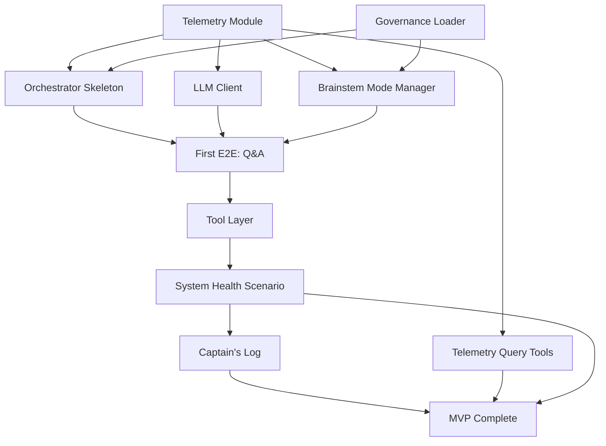

# Project Plan v0.1 — AI-Assisted Development Methodology

> **For**: Personal Local AI Collaborator MVP
> **Planning Philosophy**: Adaptive, outcome-focused, AI-velocity-aware
> **Version**: 0.1
> **Date**: 2025-12-28
> **Status**: Active

---

## 🎯 Project Goal

Build a **minimal but complete** locally-sovereign AI collaborator demonstrating:

1. Natural language interaction (CLI)
2. LLM-powered reasoning (local models)
3. Safe tool execution (filesystem, system health)
4. Governance enforcement (modes, permissions)
5. Full observability (telemetry, trace reconstruction)
6. Self-reflection capability (Captain's Log)

**Success Metric**: Project owner can ask "How is my Mac's health?" and receive a grounded, tool-backed answer with full trace visibility.

---

## 🧠 AI-Assisted Development Philosophy

### Traditional vs AI-Assisted Planning

| Traditional | AI-Assisted (This Project) |
|-------------|----------------------------|
| Estimate in **story points/hours** | Estimate in **implementation batches** |
| Velocity = points per sprint | Velocity = **batches per session** |
| Time-boxed iterations (1-2 weeks) | **Outcome-focused sessions** (done when complete) |
| Task breakdown into small units | **Dependency sequencing** (what must come first?) |
| Developer writes all code | **AI generates, human reviews/refines** |

### Key Insight

AI-assisted development **inverts the bottleneck**:

- **Old bottleneck**: Writing code (slow)
- **New bottleneck**: Understanding requirements, making decisions, reviewing quality (human-paced)

**Implication**: Plan around **decision points** and **quality gates**, not coding time.

---

## 📐 Planning Units

### 1. Implementation Batch

**Definition**: A **coherent set of artifacts** that delivers a complete capability.

**Example**: "Telemetry module complete"

- Includes: `TraceContext` class, `structlog` config, log rotation, basic tests
- Outcome: Can emit structured logs with trace correlation
- Completion: Verifiable via test (emit log, verify in file)

**Not an estimate of time**—estimate of **scope and dependency**.

### 2. Session

**Definition**: A **focused work period** with clear entry/exit criteria.

**Characteristics**:

- Has a **goal** (e.g., "Implement telemetry module")
- Contains 1-3 **implementation batches**
- Ends when **outcome achieved** (not after N hours)
- Produces **session log** documenting decisions, blockers, learnings

**Example Session**:

- Goal: "Governance config loading working"
- Batches: Pydantic models → YAML parser → config loader → tests
- Outcome: Can load `modes.yaml` and validate schema
- Duration: 2-4 hours (estimated, but flexible)

### 3. Phase

**Definition**: A **major milestone** representing significant capability unlocked.

**Example**: "Phase 1: Foundation & Telemetry"

- Multiple sessions
- Delivers: Telemetry, governance loading, orchestrator skeleton
- Unlock: Can execute a traced, mode-aware no-op task

---

## 🗺️ MVP Project Plan (4-Phase Breakdown)

### Phase 1: Foundation & Telemetry (Week 1)

**Goal**: Observability spine exists, governance loads, orchestrator skeleton runs

| Batch | Outcome | Dependencies | Estimated Sessions |
|-------|---------|--------------|-------------------|
| **Telemetry module** | Emit structured logs with trace/span IDs | None | 1 |
| **Governance config loader** | Load/validate YAML configs | None (parallel) | 1 |
| **Orchestrator skeleton** | Execute state machine, log transitions | Telemetry | 1-2 |

**Phase Exit Criteria**:

- ✅ Can emit a structured log with `trace_id` and `span_id`
- ✅ Can load `modes.yaml` and validate schema
- ✅ Orchestrator executes INIT → COMPLETED state machine with telemetry

**Risk**: Config schema misalignment (mitigation: early validation)

---

### Phase 2: LLM Client & First E2E Flow (Week 2)

**Goal**: Agent can answer a simple question using local model

| Batch | Outcome | Dependencies | Estimated Sessions |
|-------|---------|--------------|-------------------|
| **Local LLM Client** | Call local model, handle errors, emit telemetry | Telemetry | 1-2 |
| **Orchestrator LLM integration** | Wire LLM client into step functions | LLM Client, Orchestrator | 1 |
| **CLI interface** | Accept user input, display responses | Orchestrator | 1 |
| **Brainstem mode manager** | Maintain mode state, enforce constraints | Governance | 1-2 |

**Phase Exit Criteria**:

- ✅ Can ask "What is Python?" via CLI and get LLM response
- ✅ Brainstem maintains mode state (starts in NORMAL)
- ✅ Full trace from user input → LLM call → response logged

**Risk**: LM Studio connection issues (mitigation: early smoke test)

---

### Phase 3: Tools & System Health Scenario (Week 3)

**Goal**: Agent uses tools to answer grounded questions

| Batch | Outcome | Dependencies | Estimated Sessions |
|-------|---------|--------------|-------------------|
| **Tool execution layer** | Execute tools with governance checks | Governance, Telemetry | 1-2 |
| **MVP tools** | `read_file`, `system_metrics_snapshot` functional | Tool layer | 1 |
| **Orchestrator tool integration** | LLM function calling → tool execution → synthesis | Tools, Orchestrator | 1-2 |
| **System health scenario E2E** | "How is my Mac?" works end-to-end | All above | 1 (validation) |

**Phase Exit Criteria**:

- ✅ Can execute `read_file` with path validation and telemetry
- ✅ Can execute `system_metrics_snapshot` (CPU, memory, disk)
- ✅ Agent uses health tool to answer system health question

**Risk**: Tool permission logic complexity (mitigation: start with read-only tools)

---

### Phase 4: Observability & Captain's Log (Week 4)

**Goal**: System is observable, agent proposes improvements

| Batch | Outcome | Dependencies | Estimated Sessions |
|-------|---------|--------------|-------------------|
| **Telemetry query tools** | CLI commands to query logs, reconstruct traces | Telemetry | 1 |
| **Captain's Log manager** | Write structured proposals, commit to git | Telemetry | 1-2 |
| **Mode transition tuning** | Validate thresholds, trigger transitions | Brainstem, Telemetry | 1 |
| **Integration test suite** | E2E tests for key scenarios | All components | 1-2 |

**Phase Exit Criteria**:

- ✅ Can query logs: `agent telemetry trace <trace_id>`
- ✅ Agent writes Captain's Log entry after task
- ✅ Can manually trigger mode transition (e.g., high CPU → ALERT)
- ✅ Integration tests pass for chat, tool use, system health

**Risk**: Test brittleness (mitigation: focus on happy path first)

---

## 📊 Velocity Tracking

### Metric: Batches per Session

**Measurement**:

- **Session start**: Record goal and planned batches
- **Session end**: Mark completed batches
- **Calculate**: Batches completed / Session

**Target velocity**: 1.5-2.5 batches/session (assumes 2-4 hour sessions)

### Why This Metric?

- **AI-assisted code generation** makes "lines of code" meaningless
- **Decision-making and review** are the real bottlenecks
- **Batches** represent coherent chunks of completeness
- **Sessions** are natural work units in AI-assisted dev

### Tracking Template (see `./VELOCITY_TRACKING.md`)

| Session | Goal | Planned Batches | Completed | Velocity | Blockers |
|---------|------|-----------------|-----------|----------|----------|
| 2025-12-28 | Telemetry module | 3 (trace, logger, tests) | 3 | 1.0 | LM Studio connection issue (resolved) |

---

## 🚧 Dependency Graph



**Critical Path**: Telemetry → Orchestrator → LLM Client → E2E Q&A → Tool Layer → System Health

---

## 🎯 Decision Points (Require Human Input)

| Decision | Context | Options | Timeline |
|----------|---------|---------|----------|
| **Async vs Sync orchestrator** | ADR-0006 | Start async or migrate later? | Before Week 1 |
| **Governance threshold values** | ADR-0005 | Placeholder vs tuned values? | Week 2-3 |
| **Captain's Log format** | Spec missing | YAML vs JSON vs Markdown? | Week 3 |
| **MVP tool set** | Tool spec | Which 3-5 tools to implement? | Week 2 |

**Process**: When decision point reached, pause for project owner input before proceeding.

---

## ✅ Quality Gates

### Gate 1: End of Phase 1

- [ ] All Phase 1 exit criteria met
- [ ] No linter errors
- [ ] Basic tests passing
- [ ] Documentation updated

### Gate 2: End of Phase 2

- [ ] E2E Q&A flow works
- [ ] Telemetry reconstructs full trace
- [ ] Mode enforcement observable

### Gate 3: End of Phase 3

- [ ] Tool execution safe and governed
- [ ] System health scenario works
- [ ] Tool telemetry complete

### Gate 4: MVP Complete

- [ ] All scenarios functional
- [ ] Captain's Log operational
- [ ] Integration tests passing
- [ ] Documentation complete

**No Gate Skipping**: Each phase builds on previous, must pass quality gate to proceed.

---

## 🚨 Risk Register

| Risk | Impact | Probability | Mitigation |
|------|--------|-------------|------------|
| LM Studio unavailable | High (blocks LLM calls) | Medium | Early smoke test, fallback to mock |
| Config schema drift | Medium (validation fails) | Medium | Validation tests, keep schema/code in sync |
| Async complexity | High (refactor cost) | Low (if decided early) | **Decision needed:** async from start |
| Scope creep | Medium (delays MVP) | Medium | Strict adherence to MVP boundary |
| Telemetry overhead | Low (perf impact) | Low | Benchmark early, optimize if needed |

---

## 🔄 Adaptation Strategy

### When to Re-Plan

Trigger re-planning if:

- **Velocity diverges significantly** (>50% from target)
- **Critical blocker emerges** (can't proceed on critical path)
- **Scope change requested** (add/remove features)
- **Major architectural pivot** (e.g., async decision changes structure)

### Re-Planning Process

1. **Pause work** (finish current batch)
2. **Assess state** (what's complete, what's blocked)
3. **Re-sequence** (adjust dependencies, priorities)
4. **Update plan** (revise this document, bump version)
5. **Resume** with new plan

**Flexibility is a feature, not a bug.**

---

## 📝 Session Logging

**Every work session** produces a session log in `./sessions/`:

```markdown
# Session Log: 2025-12-28 — Telemetry Implementation

## Goal
Implement telemetry module with TraceContext and structlog config.

## Planned Batches
1. TraceContext class
2. structlog configuration
3. Basic tests

## Outcomes
- ✅ TraceContext implemented
- ✅ structlog configured with JSON formatter
- ⚠️ Log rotation incomplete (deferred to next session)

## Blockers
- LM Studio connection issue (resolved by restarting service)

## Decisions Made
- Use JSONL format for logs (easier to parse line-by-line)
- Start with file-based storage, add DB later

## Velocity
- Planned: 3 batches
- Completed: 2.5 batches (rotation pending)
- Velocity: 0.83 batches/session (below target, acceptable for first session)

## Next Session
- Complete log rotation
- Begin governance config loader
```

**Template**: `./sessions/SESSION_TEMPLATE.md`

---

## 🎓 Learning from Each Phase

### Post-Phase Retrospective

After each phase, document:

1. **What went well**: Techniques, decisions that worked
2. **What didn't**: Surprises, delays, mistakes
3. **Adjustments for next phase**: Process improvements

**Captured in**: Session logs + Phase summary in this document

---

## 📈 Success Indicators (Beyond MVP)

### Technical Indicators

- [ ] Zero crashes in 10 consecutive runs
- [ ] All traces reconstructable
- [ ] Mode transitions work as designed
- [ ] Tool governance prevents unsafe actions

### Collaboration Indicators

- [ ] Project owner feels augmented (not replaced)
- [ ] AI assistant proposals are relevant
- [ ] Documentation quality high
- [ ] Decision-making efficient

### Research Indicators

- [ ] Hypotheses tested and documented
- [ ] Captain's Log generates useful proposals
- [ ] Architecture evolves based on evidence
- [ ] Lessons captured for future work

---

## 🚀 Next Steps

### Immediate (This Week)

1. **Finalize async decision** (sync or async orchestrator from start?)
2. **Create directory structure** (see `PROJECT_DIRECTORY_STRUCTURE.md`)
3. **Begin Phase 1, Session 1**: Telemetry module implementation
4. **Log first session** using template

### Week 2+

Follow phase plan, adapt as needed, log progress.

---

## 📚 Related Documents

- `IMPLEMENTATION_ROADMAP.md` — Detailed week-by-week breakdown
- `PROJECT_DIRECTORY_STRUCTURE.md` — File organization
- `VISION_DOC.md` — Philosophical foundation
- `VALIDATION_CHECKLIST.md` — Quality standards
- `./VELOCITY_TRACKING.md` — Velocity data and analysis

---

## Document History

| Version | Date | Changes |
|---------|------|---------|
| 0.1 | 2025-12-28 | Initial AI-assisted adaptive project plan |

---

**This plan is a living document. Update as the project evolves.**
