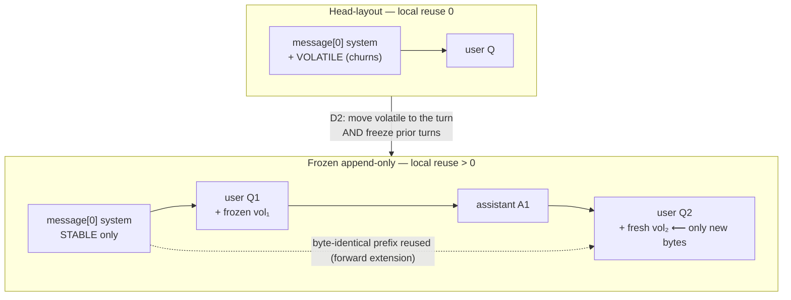
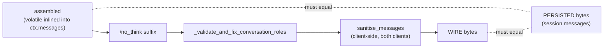
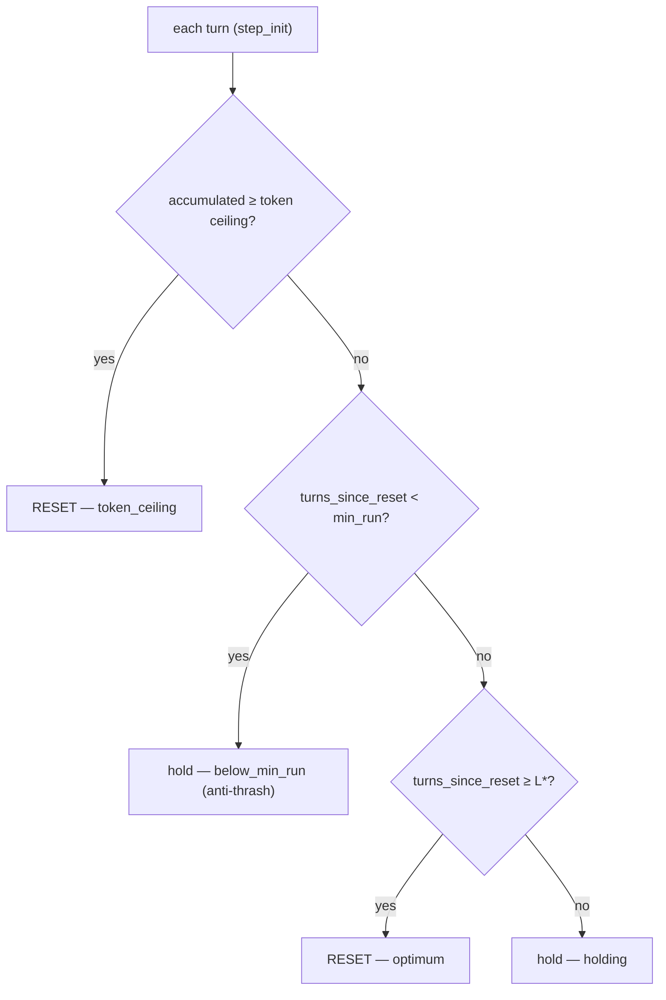
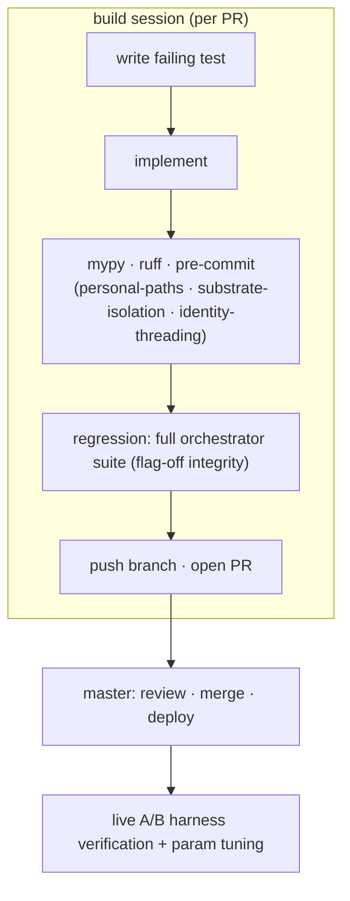

# Cache-Aware Prompt Layout & Compaction — Research & Architecture

**Status:** Implemented & live (2026-06-02) · gated behind `cache_frozen_layout_enabled`
**Subject:** Cross-turn KV-cache reuse on a local SLM via a frozen append-only prompt layout, plus a cost-optimal compaction scheduler.
**Provenance:** ADR-0081 §D1–D6 · FRE-422 (D1) · FRE-431 (D4) · FRE-433 (diagnostic spike) · FRE-434 (D2/D3 implementation) · PR #120/#127/#128/#129/#130
**Instruments:** ADR-0078 / FRE-405/406/407 (prompt identity, cache-erosion monitor, per-turn quality)
**Audience:** Architecture/research reference. Reads top-to-bottom as a narrative; §6–§9 are the algorithmic core; §10 is the code map.

---

## 1. Abstract

Local LLM inference is **prefill-bound**: for an ~8k-token prompt at ~1050 tok/s on a native
llama.cpp server, **92–96 % of turn latency is prefill** (~8 s), and generation is the cheap
remainder. A KV cache exists precisely to avoid re-paying prefill across turns — yet in this system
**cross-turn KV reuse was ≈ 0**: every turn re-prefilled the entire prompt from scratch.

This document records the investigation that root-caused that, the two-property theorem that explains
it, and the architecture that fixes it: a **frozen append-only prompt layout** (so each turn is a
strict forward extension of the last) plus a **cache-aware compaction scheduler** (so the one
unavoidable cache-reset event — compaction — fires at a computable cost optimum instead of every
turn). The work is notable less for any single algorithm than for a **reframing**: the prompt is not
a string we rebuild each turn, it is a *write-once, append-only log with a volatility gradient*, and
compaction is not a token-pressure reflex but a *scheduled renewal event*.

Key results / claims:
- The cache mechanism was never broken. **Layout** defeated it. Within a single turn, a continuation
  call already reused 9 851 / 10 238 tokens (prefill collapsed 9 550 ms → 549 ms). The bytes just
  never lined up *across* turns.
- The local and cloud backends fail and succeed for **different** reasons (§2, §5). A fix validated on
  cloud is not a fix on local. This asymmetry is the spine of the whole design.
- The make-or-break is a **byte-identity invariant**, not an algorithm: the bytes persisted for turn
  *N* must equal the bytes sent on the wire for turn *N*, after *every* transform. One stray byte
  (a `/no_think` suffix, a role re-order) silently re-zeroes reuse.

---

## 2. Background: prefill economics and two cache models

### 2.1 Why prefill dominates

A transformer processes a prompt in two phases: **prefill** (encode every input token, build the KV
cache, parallel, compute-bound) and **decode** (generate output tokens one at a time, sequential,
memory-bandwidth-bound). For agent turns the input (system prompt + tools + history) is large and the
output is small, so prefill is the cost. Measured here: **prefill 92–96 % of turn latency**.

The KV cache is the lever: if turn *N+1*'s prompt **shares a prefix** with turn *N*'s, the shared
prefix's KV entries can be reused and only the new suffix is prefilled. This is the entire economic
case for stable prompts.

### 2.2 Two cache models — and why they are not interchangeable

| | **Local** (llama.cpp, Qwen3.6-35B-A3B, `:8502`) | **Cloud** (Anthropic via LiteLLM) |
|---|---|---|
| Reuse rule | **Exact forward-extension prefix only.** Any byte change at offset *N* invalidates the entire cache from 0 — *including the identical head before the divergence point.* | **Explicit `cache_control` breakpoints.** The provider caches the prefix up to each marked block; an unchanged marked prefix is reused even if later content differs. |
| Partial-reuse knob | `--cache-reuse` is **architecturally unavailable** for this attention architecture (7 configs tried). Do **not** design around a backend knob. | N/A — breakpoints are the mechanism. |
| Truth metric | SLM-server `timings.cache_n` / `prompt_n` on the turn's **first full-context call**. **Not** ES `cache_read_tokens` aggregates (they mislead). | `cache_read` / `cache_creation` token deltas. |

**The consequence that drives everything:** local reuse requires the *whole wire sequence* to be a
byte-identical forward extension. Cloud reuse only requires the *marked prefix* to be stable. A
trailing volatile block that is *ephemeral* (recomputed, not frozen) satisfies cloud (the marked
prefix before it is stable) but **not** local (next turn the sequence diverges mid-stream).

---

## 3. The problem: cross-turn KV reuse ≈ 0

Two coupled defects, both **harness-side** (the SLM config was already well-tuned: native
llama-server, `cache_prompt` on, q8 KV, flash-attn).

### 3.1 Defect 1 — volatility-inverted layout

The assembled system prompt placed **per-turn-volatile** content (recalled memory + selected skill
bodies) *inside the system message*, which the client inserts at **message index 0** — the head of
the wire sequence. That block changes every turn. So message[0] churned by construction.

```
HEAD-LAYOUT (broken) — volatile in the system head
┌──────────────────────────────── message[0] (system) ───────────────────────────────┐
│ tool rules · tool-awareness · operator · skill INDEX  │ skill BODIES · RECALL ⟵churn │
└──────────────────────────────────────────────────────┴───────────────────────────────┘
  └────────────── stable bytes ─────────────────────────┘ └─ different every turn ──┘
        ^ but the churn is BEFORE the end of message[0], and message[0] is at offset 0,
          so the local cache invalidates from byte 0 → full re-prefill, every turn.
```

The volatility order was *inverted*: the largest **static** block (tool rules) sat *after* the
**dynamic** one. D1 (FRE-422) and D4 (FRE-431) reordered fragments and split the skill block so the
*measured* `static_prefix_hash` went constant — but that hash covers only a **substring** of
message[0]. The actual wire bytes of message[0] still churned. **A constant `static_prefix_hash` is
necessary but not sufficient for local reuse.**

### 3.2 Defect 2 — transient per-turn re-derivation

History was rehydrated from Postgres and `apply_context_window(compressed_summary=get_summary())`
re-ran every turn, inserting a re-derived summary at a fixed index. Compaction output was never
persisted — it lived in `compression_manager._summaries` and was popped on read. So the layout
*after* the system message also changed every turn. The prefix churned from both ends.

### 3.3 The reframe

> The "reconstruct every turn" property is **not the bug — it is the lever.** It gives total freedom
> to place content deliberately. The bug is that we used that freedom to produce an
> every-turn-different, cache-hostile layout.

Two attention facts shape *where* content should go: the model attends to the **head** (primacy +
attention-sink, also the cached region) and the **tail** (recency, nearest generation) far more than
the **middle**. The middle is simultaneously the least-cached and least-attended region — the correct
place to compress, and the wrong place to bury anything important.

---

## 4. The investigation (FRE-433 diagnostic spike)

A spike isolated the cause with an **A/B harness** (`scripts/eval/fre433_cache_ab/`) that drives real
multi-turn `/chat` sessions against the live stack and reads the backend's own cache counters, for
both backends and both layouts.

### 4.1 The decisive offline construction

A hand-built sequence proved the mechanism in isolation. Two turns where turn 2 is a strict forward
extension of turn 1:

```
turn2 = [system STABLE][user VOL_V1+Q1][assistant g1][user VOL_V2+Q2]
        └ prefix byte-identical to turn-1's cached KV ┘ + new volatile tail
→ local: cache_n 6771 / prompt_n 277   (vs cache_n 0 / prompt_n 6799 for head-layout)
```

The cache works perfectly when the bytes line up. 6 799 → 277 prefill tokens.

### 4.2 The A/B matrix

| Arm | cloud (Sonnet) | local (Qwen `:8502`) |
|---|---|---|
| **A — head** (volatile in system head; current `main`) | `cache_read` 13 916, constant | **0** |
| **B — tail** (volatile relocated to a trailing *ephemeral* message) | **17.3–20.2k** ✅ (and it *improves* Sonnet caching) | **0** ❌ |

**The pivotal finding:** the relayout *alone* fixes **cloud** but **not local**. An ephemeral
trailing block isn't frozen into history, so next turn the sequence diverges mid-stream and local
reuse stays 0. **Local needs the prior turns frozen byte-identical in place.**

Refuted hypotheses (each tested and eliminated): mmproj/multimodal projector, slot eviction, cache
TTL, telemetry artifact, speculative decoding. The cause was layout, full stop.

---

## 5. The two-property theorem

Local cross-turn reuse requires **two** properties, **jointly necessary and individually
insufficient**:

1. **Volatile rides its own user turn** — recall + skill bodies attach to the *current* user message
   (out of the system head), so message[0] is byte-stable.
2. **Frozen append-only history** — a past turn's volatile block stays **byte-identical in its
   original position**; only the *newest* turn carries fresh volatile. Turn *N+1* reproduces turn
   *N*'s full sequence verbatim, then appends.

Property (1) is the layout move (fixes cloud). Property (2) is what makes it persist (fixes local).
Arm B had (1) without (2) → cloud-only.



---

## 6. Architecture — Part A: frozen append-only layout (ADR-0081 §D2)

### 6.1 The wire shape

```
[0] system  =  inner_system_before_memory ONLY   ← byte-stable across the session
[1..M] history — each PAST user turn carries its OWN frozen volatile block (never changes again)
       ‖ cloud cache_control breakpoint on message[M], the last frozen turn ‖
[M+1] current user turn:  <turn_context> skill bodies · usage-directives · recall · D3 highlights </turn_context>
                          + the user query            ← the only NEW bytes this turn
```

On local, breakpoints are irrelevant — reuse comes purely from the byte-identical forward extension.
On cloud, three breakpoints (system + history-end + last-tool) realise the "system + history-end +
last-tool" placement; the history-end one is what banks the frozen history as a cached cloud prefix.

### 6.2 The volatile carrier

Volatile is **inlined into the current user message's content** (a fenced `<turn_context>` block
above the query) — *not* carried as a separate adjacent message. A separate `role:"user"` message
immediately before the query would be merged/reordered by the role-fixer and re-touched by the
sanitiser, either of which would perturb the frozen bytes. A single user message has one role, no
adjacency, and survives both passes unchanged.

```python
def _inline_volatile_into_last_user_message(messages, volatile_block):
    block = volatile_block.strip() if volatile_block else ""
    if not block:
        return messages                      # empty → no separator bytes leak (byte-stable)
    out = deepcopy(messages)
    for i in range(len(out) - 1, -1, -1):
        if out[i].get("role") != "user":
            continue
        content = out[i].get("content")
        if not isinstance(content, str):
            return messages
        if content.lstrip().startswith("<turn_context>"):
            return out                       # already wrapped → never double-wrap
        out[i]["content"] = f"<turn_context>\n{block}\n</turn_context>\n\n{content}"
        return out
    return messages
```

### 6.3 The byte-identity invariant — the make-or-break

> **The bytes written to `session.messages` for turn *N* must equal the bytes sent on the wire for
> turn *N*, after every transform.**

This is the single property most likely to pass casual review and still zero the cache. The dispatch
path applies three transforms *after* assembly; each is a hazard:



How each was neutralised:

| Transform | Hazard | Resolution |
|---|---|---|
| `/no_think` suffix | Appends to the *current* last user message; on turn *N+1* it would rewrite turn *N*'s frozen bytes. | **Retired** (`llm_append_no_think_to_tool_prompts` default → `False`). The primary now runs with reasoning enabled and the sub-agent is an instruct variant, so the suffix was both unnecessary and the hardest hazard. |
| `_validate_and_fix_conversation_roles` | Could merge/reorder messages. | Reference-preserving (no-op) for clean alternation; the inlined carrier gives it nothing to merge. |
| `sanitise_messages` | Strips orphaned tool pairs, drops empty assistants, can truncate. | **Proven a fixed point** over clean frozen history: it returns the *same list object unchanged* when there are no orphaned pairs. Asserted in tests. |

The invariant is enforced by a **perturbation probe**: a deliberate one-byte change to a frozen turn
must be observable (it must change the prefix), proving the instrument is live. Without that probe a
silent perturbation would zero reuse undetected.

---

## 7. Architecture — Part B: cache-aware compaction scheduler (ADR-0081 §D3)

Freezing causes accumulation: turn-3's recall/skill guidance persists verbatim into turn-7's context
— monotonic token growth plus *stale* guidance. Compaction is the release valve. But compaction
**rewrites history**, which on local is a **full cache reset**. So under the frozen layout compaction
flips from an every-turn cache-buster into the *single, scheduled* reset event — a **sawtooth**.

```
reuse
 ▲            ____________               ____________
 │           /            \             /            \
 │          /  long reuse  \           /  long reuse  \
 │         /     run        \         /     run        \
 │________/                  \_______/                  \____  ← reset = falling edge (one re-prefill)
 └─────────────────────────────────────────────────────────▶ turns
          ^ rising edge: next turn forward-extends the new frozen prefix
```

### 7.1 The renewal-cost model and the closed-form optimum

Model a run of `L` turns as a renewal cost: one reset `R_backend` plus a linear per-turn hold cost
`c`. Average cost per turn:

```
A(L) = R/L + c·L/2          (reset amortised over the run  +  accumulating hold cost)
A'(L) = −R/L² + c/2 = 0  ⇒  L* = sqrt(2·R / c)          c = Δ_turn + w_q·Q_slope
```

- `Δ_turn` — measured per-turn frozen-token increment (deterministic under the frozen layout).
- `Q_slope` — quality cost per stale token (tokens-equivalent), fit online from the FRE-407 rating
  trace; **0** (growth term only) when ratings are sparse.
- `w_q` — token-equivalent of one quality point (`cache_quality_token_weight`, default 4000).

**Backend asymmetry falls out of the formula.** Larger `R` ⇒ larger `L*`:
- **Local** — any mid-history change ⇒ full re-prefill ⇒ `R` large ⇒ compact *looser* (longer runs).
- **Cloud** — only the rewritten span re-creates (history stays cached) ⇒ `R` small ⇒ compact
  *tighter/sooner*.

### 7.2 The decision (precedence)



```python
def should_reset(*, turns_since_reset, accumulated_tokens, accum_max_tokens,
                 min_run_turns, reset_cost_tokens, delta_turn_tokens,
                 quality_slope=0.0, quality_token_weight=4000.0):
    c = delta_turn_tokens + quality_token_weight * max(quality_slope, 0.0)
    l_star = math.inf if c <= 0 else math.sqrt(2.0 * reset_cost_tokens / c)
    if accum_max_tokens > 0 and accumulated_tokens >= accum_max_tokens:
        return ResetDecision(True, "token_ceiling", l_star)   # hard cap overrides
    if turns_since_reset < min_run_turns:
        return ResetDecision(False, "below_min_run", l_star)  # anti-thrash floor
    if turns_since_reset >= l_star:
        return ResetDecision(True, "optimum", l_star)         # cost optimum
    return ResetDecision(False, "holding", l_star)
```

Defaults: `min_run` 12 (local) / 4 (cloud); token ceiling `cache_frozen_accum_max_ratio` 0.50. The
old reactive triggers are reconciled away: the **0.65 soft** every-turn trigger is **removed** (the
scheduler subsumes it); the **0.85 hard** ratio is **retained only as an overflow backstop**.

### 7.3 Re-establishing the frozen prefix (the two-object summary)

A reset must produce a *new* frozen prefix, not a one-off summary. `build_frozen_reset` emits the
canonical post-reset history and a volatile distillation:

```
post-reset:  [first user] → [assistant recap = cumulative narrative] → [last K verbatim turns]
                                                                         (each still frozen)
returns:     (messages, salient_highlights, narrative)
```

Three subtle, hard-won decisions:
- **Recap role = `assistant`, not `system`.** The role-fixer keeps only the *first* system message
  and **silently drops every later one** — a `system`-role recap at index 1+ would be deleted on the
  next dispatch. An assistant "context recap" survives in place. (`FROZEN_RECAP_ROLE`.)
- **Cumulative narrative.** Any prior recap sits in the middle band and is fed back into the
  summariser, so no cold context is lost across successive resets.
- **Tail starts on a user turn.** Keeps the `[first user] → [assistant recap] → [user…]` seam
  alternating (otherwise two assistants merge under the role-fixer).

The **two-object** split resolves the freeze-vs-freshness tension: the bulk `narrative` stays
frozen/cached, while `salient_highlights` (a bounded distillation) ride the *current* turn's volatile
block and refresh per reset — per-turn freshness at zero cache cost, because they live in the already-
volatile region.

This is the precise reconciliation of "never rewrite" with "must bound accumulation": **within a run,
history is strictly append-only — zero rewrites, full reuse. The reset is the single, scheduled,
amortised rewrite exception.**

---

## 8. The three-tier context hierarchy (design frame)

The layout sits inside a MemGPT-style virtual-context hierarchy (D5 is future work, but the frame
explains *why* freezing is tolerable):

| Tier | Location | Standing cost | Fidelity |
|---|---|---|---|
| Hot — salient highlights (D3) | volatile tail | tiny | distilled |
| Warm — frozen narrative (D2) | cached prefix | paid once | lossy |
| Cold — full history (D5, future) | Postgres / ES, on-demand | ~0 | lossless |

Accumulation is bounded by the scheduler (resets), the always-cached live skill index, the per-reset
highlights, and — eventually — cold-tier retrieval.

---

## 9. Code implementation map

| Concern | Location | Symbol(s) |
|---|---|---|
| Feature flag | `config/settings.py` | `cache_frozen_layout_enabled` (default `False`, no-op when off) |
| Scheduler params | `config/settings.py` | `cache_reset_min_run_turns_{local,cloud}`, `cache_frozen_accum_max_ratio`, `cache_quality_token_weight` |
| `/no_think` retirement | `config/settings.py` | `llm_append_no_think_to_tool_prompts` default → `False` |
| Volatile carrier | `orchestrator/executor.py` | `_inline_volatile_into_last_user_message` |
| Assembly branch | `orchestrator/executor.py` | `step_llm_call` — flag-gated: message[0] = `inner_system_before_memory`; volatile inlined into `ctx.messages` |
| Scheduler bridge | `orchestrator/executor.py` | `_maybe_frozen_reset`, `_derive_reset_inputs`, `_frozen_backend` (called in `step_init`) |
| Reconciliation | `orchestrator/executor.py` | drop transient `compressed_summary` under flag; remove 0.65 soft trigger |
| Pure scheduler | `orchestrator/cache_reset_scheduler.py` | `should_reset`, `compute_optimal_run_length`, `marginal_hold_cost`, `ResetDecision` |
| Frozen reset | `orchestrator/within_session_compression.py` | `build_frozen_reset`, `FrozenResetResult`, `FROZEN_RECAP_ROLE`, `_tail_starting_on_user`, `_bound_highlights` |
| Cloud breakpoint | `llm_client/litellm_client.py` | `_apply_anthropic_cache_control(frozen_layout=…)`, `_mark_message_cache_control` |
| Per-turn highlights carrier | `orchestrator/types.py` | `ExecutionContext.salient_highlights` |

**Flag discipline:** every change is strictly gated so `cache_frozen_layout_enabled=False` is
byte-for-byte the prior D1/D4 behaviour — verified by the full orchestrator suite passing unchanged.

---

## 10. Development process

The work ran on a **three-session architecture**, each shipping via PR only:
- **adr session** — owns the ADR. Wrote ADR-0081 §D2/D3 (Part B scheduler + 6 settled decisions)
  from the FRE-433 design brief (PR #128).
- **build session** — owns the implementation (this work). Implemented from the *approved* ADR.
- **master session** — owns the live environment: review, merge, deploy, verify, Linear/MASTER_PLAN.

### 10.1 The gate that mattered

The first implementation attempt **halted at pre-flight**: the ticket said "implement from the
approved ADR," but the ADR §D2/D3 still held only the original high-level proposal — Part B (the
scheduler) and the six decisions the brief flagged were **unwritten**. Implementing then would have
meant inventing architecture during coding. The correct move was to **stop and route Phase 1 back to
the adr session**, then implement once the ADR was settled and merged. *Plan-in-ADR-format is a gate,
not a formality.*

### 10.2 One phase = one PR

The implementation was split to match the ADR's structure:
- **PR #129 — Part A (§D2 frozen layout):** delivers the headline local-reuse gate for sessions
  below the compaction threshold; the 0.85 backstop bounds overflow.
- **PR #130 — Part B (§D3 scheduler):** the cost-optimal reset; matters once sessions are long
  enough to compact.

The ticket stayed *In Progress* until both shipped (a multi-phase ticket is not Done on its first
phase).

### 10.3 TDD and quality gates

Every step was test-first. The test strategy deliberately targets the **right seam** rather than the
3 400-line `step_llm_call`: pure helpers and invariants are unit-tested; flag-off integrity is
covered by the existing orchestrator suite running on the default-off flag.



41 new tests across the two PRs:
- **Byte-identity** — transform-chain fixed-point, cross-turn forward-extension, perturbation probe.
- **Scheduler** — closed-form `L*`, decision precedence, backend asymmetry.
- **Reset** — recap role/cumulative, tail-starts-on-user, bounded highlights.
- **Wiring** — backend detection, input derivation, flag-off no-op / hold / fire.
- **Cloud cache_control** — history-end breakpoint on/off.

---

## 11. Verification & deployment

### 11.1 The harness and the identity mechanism

The A/B harness (`scripts/eval/fre433_cache_ab/`) POSTs `/chat` and reads the backend cache counters.
It runs **on the loopback gateway port** (`:9001` cloud-sim, or `:9000` for `make dev`) on the VPS —
*not* through the Cloudflare tunnel. Therefore **real Cloudflare Access is never in the path**; the
gateway's app-level FRE-343 `user_id` assertion is satisfied by **manually stamping the
`Cf-Access-Authenticated-User-Email` header** via `--auth-email`. Any accepted email passes — but the
run does **real session/memory writes** under that identity, so a **dedicated eval email** is used to
keep the eval out of a personal graph.

### 11.2 Local-truth caveat

For the local backend the authoritative reuse signal is the SLM-server `timings.cache_n` / `prompt_n`
read on the turn's **first full-context call** — measured across two *separate* turns, never a
within-turn continuation (which already reuses → a false PASS). The ES `cache_read_tokens` aggregate
can mislead and is not the gate.

### 11.3 Acceptance gates (verified live)

- Local `cache_n > 0` on the first full-context call of every turn ≥ 2 (was 0); `prompt_n` collapses
  from ~8k toward the new-tail size.
- Cloud reuse ≥ the 17–20k arm-B baseline; history-end breakpoint emitted.
- FRE-407 per-turn quality flat-or-up (the primary rollout gate — relocating recall/skill bodies out
  of the head must not degrade answers).
- Flag-off = byte-for-byte prior behaviour.

### 11.4 Operational caveats

- **Single `:8502` KV slot:** `--profile local` passes must be serialised with any other session
  exercising the slot, or thrash corrupts both.
- **Data-gated tuning:** `R_backend`, `Δ_turn`, and `Q_slope` are first-order estimates tuned
  post-deploy against the harness (the ADR records the architecture, not the parameterisation). The
  day-one cadence is `min_run` + token-ceiling driven, with `L*` refining between them. (Tracked as a
  checklist on FRE-434.)

---

## 12. Lessons & design principles

1. **Layout is a lever, not a constraint.** "Rebuilt every turn" was framed as the bug; it is the
   freedom. The fix was to use that freedom deliberately (volatility gradient) instead of accidentally.
2. **A constant hash is necessary but not sufficient.** `static_prefix_hash` going constant (D1/D4)
   looked like success but covered only a substring of the real wire bytes. Measure the thing that
   actually pays the cost (`cache_n`), not a proxy.
3. **The backend reuse rule is the design's spine.** Local = exact forward extension; cloud =
   breakpoints. A cloud-validated fix is not a local fix. Never design around an unavailable knob
   (`--cache-reuse`).
4. **The cache is byte-fragile.** The dominant failure mode is not algorithmic — it is a single
   un-persisted transform (a `/no_think` suffix, a role re-order). Instrument the byte-identity
   invariant *first* (perturbation probe), implement *second*.
5. **Determinism makes compaction computable.** Once growth is a known increment, "when to compact"
   stops being a token-pressure reflex and becomes a closed-form optimum with a backend-aware cost.
6. **Compress the middle, reinforce the tail.** Attention asymmetry: summarise the low-attention
   middle (frozen narrative), carry freshness in the high-attention tail (salient highlights).

---

## 13. Open questions & future work

- **D5 — cold tier:** `recall_session_history` tool (semantic + keyword) so cold history leaves the
  prompt entirely and is retrieved on demand; bounds accumulation losslessly.
- **D6 — pins:** durable-important → head; turn-important → tail; never buried in the middle.
- **Per-turn highlight regeneration:** today highlights refresh on reset; a cheap per-turn extraction
  would carry fresher salience between resets.
- **Index format minimisation:** the now-cached skill index is a permanent prefix resident; a
  format/size Pareto search (markdown vs JSON vs XML; field ablation) trims its standing cost — gated
  on a labelled routing-eval set, candidate for DSPy optimisation.
- **Parameter fit:** online `Q_slope` regression against the FRE-407 trace; whether `L*` should
  override `min_run` once calibrated.
- **Genuine recency:** relocating `salient_highlights`/memory into a trailing *user-adjacent* message
  (a message-array change, out of current scope) for a real recency benefit, not just cache hygiene.

---

## 14. References

- **ADR-0081** — `docs/architecture_decisions/ADR-0081-cache-aware-context-layout-and-compaction.md` (§D1–D6)
- **Design brief** — `docs/superpowers/plans/2026-06-01-fre-433-d2d3-cache-aware-compaction-brief.md`
- **Diagnostic** — `docs/superpowers/plans/2026-06-01-fre-433-crossturn-kv-reuse-diagnostic.md`
- **Implementation plan** — `docs/superpowers/plans/2026-06-01-fre-434-frozen-append-only-layout.md`
- **Harness** — `scripts/eval/fre433_cache_ab/` (`harness.py`, `dataset.yaml`, `README.md`)
- **Tickets** — FRE-422 (D1), FRE-431 (D4), FRE-433 (spike), FRE-434 (D2/D3); FRE-405/406/407 (instruments); FRE-343 (identity assertion)
- **PRs** — #120 (D1), #128 (ADR §D2/D3), #129 (Part A), #130 (Part B)
- **Adjacent research** — `docs/research/context_management_research.md`, `docs/research/PROMPT_EFFICIENCY.md`
