# Grafana dashboard render audit — FRE-1207 (T3)

**Author:** build session. **Date:** 2026-08-09. **Ticket:** FRE-1207, backing plan
`docs/superpowers/plans/2026-08-08-fre-1203-grafana-migration-program.md` § T3.

**Method.** All 16 dashboards were driven live against `http://127.0.0.1:3003` (Grafana 13.1.3,
anonymous Viewer). For every panel: (1) the dashboard was opened via Playwright, given a 4s settle,
screenshotted full-page at the browser's default width with `fullPage: true`; (2) the DOM was
asserted for `[data-testid="data-testid Panel status error"]` (render error) and panel-header text;
(3) the panel's own `targets` were extracted from the committed JSON and POSTed verbatim to
`POST /api/ds/query` at the dashboard's own time range — this is the objective, falsifiable row-count
evidence base for every verdict below, not a screenshot eyeball. Every dashboard runs `now-24h` to
`now` except `health_check` (`now-1h`). The full query→response corpus and extracted panel
definitions are reproducible from `config/grafana/dashboards/*.json` plus the query shape documented
in §0 below; they are not committed as separate artifacts (ephemeral evidence, not a deliverable).

**Total panels measured: 68 (68 declared in the 16 committed dashboard JSONs; matches the static
audit in the backing plan).**

---

## 0. How a panel was queried (reproducibility note)

Each panel's `targets[]` array is POSTed as-is:

```
POST /api/ds/query?ds_type=<elasticsearch|tempo>
{ "queries": [<target JSON verbatim>], "from": "<dashboard time.from>", "to": "<dashboard time.to>" }
```

No `datasourceId` is required — Grafana resolves purely from `datasource.uid` in the target. The
response's `results.<refId>.frames[].data.values` is summed across frames for a `row_count`; an
`error` field on the result is recorded verbatim. This is the same request shape the Grafana frontend
itself issues (confirmed by capturing the live network request for the `cost_budget` dashboard via
Playwright's `browser_network_request` before writing the replay script).

---

## 1. Program-level summary

| Metric | Count | Note |
|---|---:|---|
| Dashboards audited | 16 | all 16 committed dashboards |
| Panels audited | 68 | matches the static `fieldConfig` audit's panel count |
| Panels tripping the `Panel status error` testid | **0** | none of the 68 panels throw Grafana's own render-error indicator — but see the next row; "no testid" is not the same as "nothing visibly wrong" |
| Panels returning 0 rows at the dashboard's default time range, no error | **10** | listed in §3; not all are defects — see per-panel verdicts |
| Panels with a genuine data-quality/config defect newly found by this audit, beyond the 5 predictions | **3 distinct bug classes, 8 panel instances** | §4 — BUG-1 ×3 (`request_traces` "Trace phase totals"/"Trace detail table", `system_health` "Error events by type"), BUG-2 ×2 (`prompt-cost-cache` #2, `turn_session_artifact` #2), BUG-3 ×3 (`request_timing` #1–#3) |
| Panels disposed `delete` | **4** | all 3 `request_traces` panels + `system_health` "Consolidation activity" — see §5 for the precise list; tallied directly from the §5 disposition column |
| Panels disposed `rebuild-on-pg` | **42** | across 10 dashboards — tallied directly from §5 |
| Panels disposed `rebuild-on-es` | **20** | across 5 dashboards — tallied directly from §5 |
| Panels disposed `keep-as-is` | **2** | `health_check` #1 (fixture, working as designed), `request_timing` #4 (the one Tempo panel, correctly sourced) |

*(The three disposition-carrying rows above were regenerated by tallying the §5 `Disposition` column
directly rather than hand-computed, after an earlier draft's hand-computed totals were caught
disagreeing with §5 during self-review.)*

**Headline finding: none of the 68 panels trip Grafana's own render-error indicator, but 2 do render
an explicit in-panel error string in place of a chart** (BUG-2, §4) — so "no crash" is not the same as
"nothing visibly wrong." The program's dominant defect class is still panels that render a
plausible-looking chart or number that is **wrong, empty without disclosure, or answering a different
question than its title claims.** That is exactly the class of defect a static JSON audit cannot see
and only a rendered, data-verified pass can catch — the premise T3 was commissioned to test.

---

## 2. The five predictions — confirmed or refuted, with evidence

### Prediction 1 — REFUTED as stated; the underlying mechanism is real but narrower

> *The 9 dashboards whose panel descriptions claim a 90d/30d/1-year window should render empty at
> their now-24h default.*

**The 9 dashboards were correctly identified**: `cost_budget` (1yr, 1 panel), `expansion_decomposition`
(90d, 4 panels), `extraction_retry_health` (90d, 4 panels), `intent_classification` (90d, 5 panels),
`llm_performance` (1yr, 1 panel), `request_timing` (90d, 3 panels), `system_health` (90d, 2 panels),
`task_analytics` (90d, 5 panels), `traversal_gate` (30d, 4 panels) — 29 panels total carry this claim.

**But only 5 of those 29 actually render empty at now-24h** — `cost_budget` "Budget denials over
time" (0 rows — the underlying event genuinely stopped 2026-06-01), `llm_performance` "Model call
errors over time" (0 rows — stopped 2026-06-01), `expansion_decomposition` "Sub-agent success rate"
and "Sub-agent duration by outcome" (0 rows — sub-agent completion is rare, 98 all-time, none in the
last 24h), `extraction_retry_health` "Top denial reason" (0 rows — `budget_denied` consolidation
attempts are rare).

**The other 24 panels claiming a 90d/30d window render NON-empty at now-24h**, because the underlying
event streams (task classification, entity creation, gate decisions, CPU polling) are still live —
`intent_classification`'s 5 panels, `task_analytics`'s 5 panels, and `traversal_gate`'s 4 panels all
returned real recent rows. The prediction's *mechanism* (a stale window claim vs. a live query) is
real for two dashboards; for the other seven it is **misleading in a different way** — the panel
*does* show data, but only the last 24h of a "90d, full history" story, silently truncating the
picture the description promises without disclosing it. That is still a defect (the description
over-claims what a 24h window can show), but it is not the *empty-panel* defect the prediction named.

**Verdict: partially confirmed (5/29 panels literally empty), the broader claim (9/9 dashboards, all
their labeled panels empty) is refuted by direct query evidence.**

### Prediction 2 — REFUTED for the 3 `request_timing` panels; the underlying event family is not dead

> *The 6 panels on `request_trace`/`request_trace_step` should render empty — that family stopped
> emitting 2026-06-07.*

Direct ES aggregation against `agent-logs-*` for `event_type: request_trace`:

```
first_doc: 2026-08-05T09:06:05.662Z    last_doc: 2026-08-08T09:06:21.481Z    hits: 35
```

`request_trace` is **not dead** in the currently-queried substrate — the 3 `request_timing` panels
that query it (`Avg duration by stage`, `Total request duration over time`, `Request volume over
time`) all returned non-zero rows (150/25/25) with real, non-null values for setup/llm_inference/
tool_execution/synthesis phase durations. This directly contradicts each panel's own description
("STALE SIGNAL: request_trace has emitted zero docs since 2026-06-07" / "the chart visibly ends 24+
days before today"). **The description is stale, not the data.**

The other 2 panels on `request_traces.json` (`Trace phase totals`, `Trace detail table`) query
`request_trace_step` **filtered to a hardcoded trace_id** (`763278fa-…`) that genuinely has zero
matching documents (`curl` direct-to-ES confirms `hits.total.value: 0`). Yet the same panels return
non-zero rows (4, 10) through Grafana's API. That discrepancy is **not** the dead-family effect the
prediction named — it is a distinct, newly found bug (BUG-1, §4) that makes the trace_id filter a
silent no-op.

**Verdict: refuted for the underlying premise (the event family is live) for 3 of 6 panels; the other
3 do render effectively-empty-of-their-claimed-subject, but for an unrelated reason (a query-syntax
bug, not staleness).**

### Prediction 3 — CONFIRMED for 4 of 5 table panels; 1 uses a different (still broken) mechanism

> *All 5 `table` panels should dump raw `_source` blobs — they use ES `raw_document` with zero
> column config.*

The 5 `type: table` panels are: `health_check` "Fixture Health Check" (`logs` metric, **not**
`raw_document`), `monitors_joinability_slm` "Recent unreachable SLM probes" (`raw_document`),
`self_improvement_funnel` "Promotion throttle events" (`raw_document`), `turn_session_artifact`
"Turn classification detail" (`raw_document`), `turn_session_artifact` "Artifact envelope detail"
(`raw_document`).

4 of 5 use `raw_document` with `bucketAggs: []` — confirmed, they dump the ES `_source` blob with no
column selection or transform, exactly as predicted. The 5th (`health_check`) uses the ES `logs`
metric type instead, which Grafana renders as a `Time | Line` two-column table — structurally
different from a raw-document dump but *functionally* the same defect: no curated columns, one
undifferentiated text blob per row.

**Verdict: confirmed in mechanism (0/5 have real column config) and in effect (4/5 literally
`raw_document`); the 5th achieves the same "no useful columns" outcome through the `logs` metric
type rather than `raw_document` — a refinement of the prediction, not a refutation.**

### Prediction 4 — CONFIRMED, and worse than stated

> *The 4 `stat`-over-`date_histogram` panels should show a series or last-bucket rather than a stat.*

There are **5** `stat`-type panels in the corpus, not 4, and **all 5** use a `date_histogram` bucket
aggregation: `monitors_joinability_slm` "Joinability summary", `monitors_joinability_slm` "SLM health
summary", `request_timing` "Avg duration by stage", `self_improvement_funnel` "total reflection
count", `turn_session_artifact` "Artifact envelope + gate status summary".

Live rendering shows Grafana's stat panel *does* reduce each time-bucketed series to a single number
per metric via its default `lastNotNull` calculation — visually the panels display as clean stat
tiles (e.g. `monitors_joinability_slm`'s "Joinability summary" shows `Count 0` / `Average
duration_ms 201` as two number tiles, not a chart). So the specific visual failure mode named in the
prediction ("shows a series … not the stat") does **not** manifest — Grafana's stat-panel reducer
already handles this. The **real** defect is semantic, not visual: reducing an hourly `date_histogram`
via "last non-null bucket" silently answers *"what was true in the one bucket that happened to have
data,"* not *"what is the summary metric over the window,"* and nothing on the panel discloses which
bucket that was or that only one bucket out of 24 had a non-null value.

**Verdict: confirmed and broadened — 5/5 stat panels (not 4/5) use `date_histogram`; the visual defect
predicted does not occur, but a subtler, undisclosed reduction-semantics defect does.**

### Prediction 5 — CONFIRMED exactly as stated, quantified

> *`turn_session_artifact` panel 4 ("Artifact envelope + gate status summary") should show a large
> count of every document in agent-logs — it runs an empty query string while its description claims
> artifact gate outcomes.*

Panel 4's target: `"query": ""` against `es-agent-logs`, `metrics: [{"type": "count"}]`,
`bucketAggs: [{"type": "date_histogram", ...}]`. Live query returns 25 hourly buckets with values
ranging **1212–5251 documents per hour** (total ≈ 96,000 over the 24h window) — this is the raw
per-hour document-ingest rate of the entire `agent-logs-*` index family, not artifact envelope or gate
events. For comparison, the real artifact substrate (`artifacts` table, referenced in the backing
plan) holds **97 rows total, ever**. A panel titled "Artifact envelope + gate status summary" showing
1,000+ events per hour is off by roughly 3 orders of magnitude from what it claims to summarize.

**Verdict: confirmed, with the empty-query mechanism and the resulting count both verified directly
against live Grafana output.**

---

## 3. The 10 panels returning 0 rows at default time range (AC-3 evidence)

Each row cites the panel's own `POST /api/ds/query` result at the dashboard's own time window.

| Dashboard | Panel | Query | Rows | Why |
|---|---|---|---:|---|
| `cost_budget` | Budget denials over time | `event_type: "litellm_request_budget_denied"` | 0 | Real staleness — all 463 all-time docs fall 2026-05-07…2026-06-01; correctly disclosed in the panel description as using a 1-year window, but the *dashboard* time range is still now-24h regardless, so it renders empty despite the description |
| `expansion_decomposition` | Sub-agent success rate | `event_type: "sub_agent_complete"` | 0 | Rare event (98 all-time); none fell in the last 24h |
| `expansion_decomposition` | Sub-agent duration by outcome | `event_type: "sub_agent_complete"` | 0 | Same as above |
| `extraction_retry_health` | Top denial reason | `event_type: "consolidation_attempt_recorded" and outcome: "budget_denied"` | 0 | `budget_denied` outcomes are rare in any given 24h slice |
| `health_check` | Fixture Health Check | `event_type: "fre1072_health_check"` | 0 | **Expected** — this is a CI/fixture-verification panel that only shows data immediately after the AC-5 test injects its marker document; empty is its correct resting state, not a defect |
| `llm_performance` | Model call errors over time | `event_type: "model_call_error"` | 0 | All 531 all-time docs fall 2026-04-13…2026-06-01; none recent |
| `monitors_joinability_slm` | Joinability outcome over time | run-outcome mix | 0 | No joinability runs completed in the last 24h at audit time |
| `self_improvement_funnel` | Promotion throttle events | `raw_document`, throttle events | 0 | Throttle events are rare by design (a rate-limit safety valve) |
| `system_health` | Consolidation activity | `consolidation_triggered/started/completed` | 0 | **Real staleness, newly found**: panel's own description states events "last emitted 2026-07-01T11:40" — 38 days stale at audit time — yet the panel still queries now-24h with no staleness disclosure on the live dashboard |
| `turn_session_artifact` | Artifact envelope detail (join on artifact_id) | `event_type: ("artifact_envelope_integrity" or "artifact_gate_decision")`, `raw_document` | 0 | No artifact envelope/gate events fell in the last 24h — consistent with only 97 artifacts existing all-time |

Of these 10: **2 are expected/correct** (`health_check`, and arguably `cost_budget`'s denial panel
given its own 463-doc-history disclaimer), **1 is a newly-found staleness defect** (`system_health`
Consolidation activity — 38 days stale, undisclosed), and **7 are real but low-volume signals** whose
emptiness at any given 24h slice is a natural consequence of rare events, not a broken query.

---

## 4. Cross-cutting defects found beyond the 5 predictions

These were discovered by cross-referencing live query results against the panels' own descriptions —
exactly the "verified against real data" gate the audit exists to apply. Each is independently
reproducible via the `POST /api/ds/query` shape in §0.

### BUG-1 — lowercase boolean operators in the Lucene query string are silently ignored

Grafana's Elasticsearch Lucene query parser requires **uppercase** `AND`/`OR`/`NOT`; the committed
dashboards use lowercase `and`/`or`/`not` throughout. Lowercase tokens are not recognized as boolean
operators — they fall through as bare search terms under the parser's default-OR semantics between
clauses, so a query intended as a hard filter becomes close to a no-op.

**Reproduced twice, with a controlled A/B query:**

1. `system_health` "Error events by type" — query `(event_type: *error* or event_type: *failed*) and
   not event_type: error_monitor*` (intended: error/failed events, excluding the scanner's own
   housekeeping). Live result includes `error_monitor_consumer_triggered`, `error_monitor_scan_completed`,
   `error_monitor_scan_started`, `error_monitor_registered` (the very family the query claims to
   exclude) **and** `task_started`, `perplexity_query_started`, `raw_llm_response`, `llm_call_messages_debug`
   — none of which contain "error" or "failed" as a substring. The panel titled "Error events by type"
   is, live, showing the top-10 most frequent event types **unfiltered**.

2. `request_traces` "Trace phase totals" / "Trace detail table" — query `event_type:
   "request_trace_step" and trace_id: "763278fa-…"`. Live result: phase counts `{llm_inference: 10,
   synthesis: 8, tool_execution: 6, setup: 4}`. Controlled test: `event_type: "request_trace_step"`
   **alone** (no trace_id clause) returns the **identical** counts `{10, 8, 6, 4}` — proving the
   `trace_id` filter contributes nothing. Controlled test with the operator capitalized —
   `event_type: "request_trace_step" AND trace_id: "763278fa-…"` — returns **0 frames**, confirming
   the hardcoded trace_id genuinely has zero matches and the original prediction (this panel should be
   empty) is correct **once the query bug is fixed**. Today it silently substitutes "all
   `request_trace_step` events, any trace" for "one hardcoded trace" and shows real-looking bars.

**Fix for any rebuild:** never mix case-sensitive boolean keywords into a hand-typed Lucene string;
Grafana's query editor UI enforces correct casing when built by hand in the tool (per the
`create-visualization` skill's absolute rule) — this defect class cannot occur if panels are built in
the UI rather than hand-authored, which is exactly the root cause this program exists to close.

### BUG-2 — `bucketAggs` ordered `[date_histogram, terms]` instead of `[terms, date_histogram]` breaks time-series framing

Two `timeseries`-type panels order their bucket aggregations with `date_histogram` **first** instead
of **last**. Every other multi-series time chart in the corpus (e.g. `cost_budget` "Actual spend over
time by role") orders `[terms, date_histogram]` and renders correctly. The two panels with the
reversed order render the literal text **"Data is missing a time field"** in place of a chart:

- `prompt-cost-cache` "Prompt: cache reads vs input tokens by callsite" — `bucketAggs: [date_histogram,
  terms(prompt_callsite)]`.
- `turn_session_artifact` "Turn complexity mix over time" — `bucketAggs: [date_histogram,
  terms(complexity)]`.

Both are confirmed live in the Playwright DOM evaluation (panel header text captured the literal error
string). This is a genuine render defect — not merely misleading, but visibly broken — that the static
JSON audit's `fieldConfig`-only check could not have found, since both panels' JSON is otherwise
well-formed.

### BUG-3 — `request_trace` resumed emitting; 3 panel descriptions assert a false staleness claim

Covered in Prediction 2 above. Filed here as its own defect because it inverts the direction of the
originally suspected problem: the panels are not stale-and-empty, they are **live-and-mislabeled**
("STALE SIGNAL" banners on data that is, at audit time, 3 days old). Any T5 rebuild must re-verify
freshness at build time rather than trusting the committed description.

---

## 5. Per-dashboard sections

**Disposition legend:** `rebuild-on-pg` (Postgres is the right source per the plan's §3 routing table
— aggregates/counts/durations from `route_traces`, `api_costs`, budget/consolidation tables) ·
`rebuild-on-es` (the data genuinely lives only in Elasticsearch — raw substrate probes, per-turn
context telemetry, reflection/captains-log — but the panel still needs field-config, units, and any
BUG-1/BUG-2 query fix) · `keep-as-is` (source and query logic are sound; only cosmetic field-config
polish is owed) · `delete` (superseded, redundant, or unsalvageable as a distinct panel).

Where a dashboard is not named in the backing plan's T4/T5 dashboard→Postgres-source table, this
audit's `rebuild-on-es` disposition is a recommendation for T5/T6 scoping, not a claim that a Postgres
table already exists for it — stated explicitly per dashboard below so the gap is visible rather than
assumed away.

### `context_occupancy` (uid `fre1072-context-window-occupancy`) — 4 panels

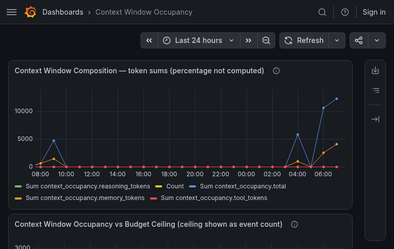

| # | Panel | Type | Rows | Verdict | Disposition |
|---|---|---|---:|---|---|
| 1 | Context Window Composition — token sums (percentage not computed) | timeseries | 125 | Renders, real data (title admits the percentage isn't computed) | rebuild-on-es — `context_occupancy.*` fields are ES-only, no PG equivalent named anywhere in the plan |
| 2 | Context Window Occupancy vs Budget Ceiling (ceiling shown as event count) | timeseries | 50 | Renders; title admits the ceiling is mis-shown as a count, not a threshold line | rebuild-on-es |
| 3 | Context Window — Per-Turn Detail | barchart | 10 | Renders with real data | rebuild-on-es |
| 4 | Context Window Usage Trend (detail) | timeseries | 25 | Renders with real data | rebuild-on-es |

### `cost_budget` (uid `fre1072-cost-budget`) — 6 panels — **T4 exemplar target**

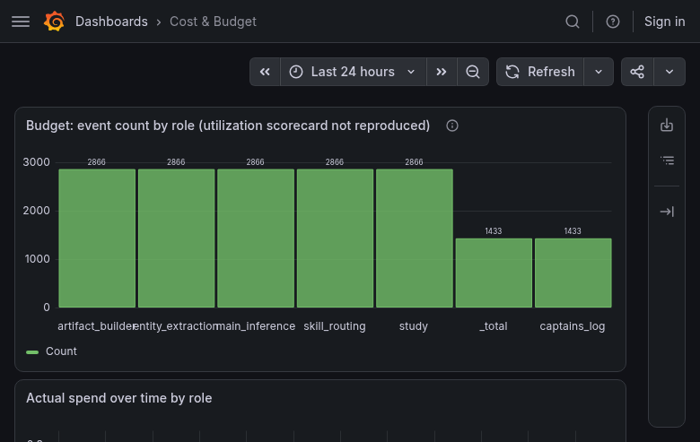

| # | Panel | Type | Rows | Verdict | Disposition |
|---|---|---|---:|---|---|
| 1 | Budget: event count by role (utilization scorecard not reproduced) | barchart | 7 | Renders; title admits it's an approximation, not the real utilization ratio | rebuild-on-pg — `budget_counters`/`budget_policies` join (T4) |
| 2 | Actual spend over time by role | timeseries | 100 | Renders correctly, real multi-series data | rebuild-on-pg — exact `SUM(cost_usd)` from `api_costs` replaces an ES approximation |
| 3 | Reserve/commit/refund lifecycle funnel | barchart | 2 | Renders, thin data (2 rows) | rebuild-on-pg — `budget_reservations` state counts (T4) |
| 4 | Top sessions by model spend | barchart | 2 | Renders; hardcoded `size: 10` contradicts nothing here but the panel undercounts activity vs. a proper `LIMIT` | rebuild-on-pg |
| 5 | Budget denials over time | timeseries | 0 | Renders empty — see §3, real staleness, correctly disclosed in its own description but the dashboard's `now-24h` window still shows nothing | rebuild-on-pg |
| 6 | Net settlement delta over time | timeseries | 25 | Renders with real data | rebuild-on-pg |

### `expansion_decomposition` (uid `fre1072-expansion-decomposition`) — 5 panels

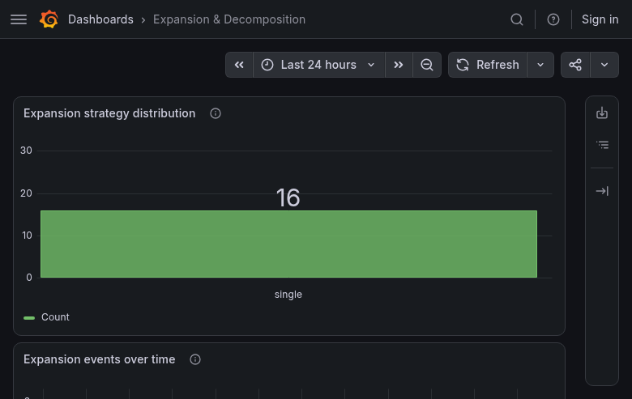

| # | Panel | Type | Rows | Verdict | Disposition |
|---|---|---|---:|---|---|
| 1 | Expansion strategy distribution | barchart | 1 | Renders, thin (1 row = mostly `single` strategy dominates) | rebuild-on-pg — `route_traces.decomposition_strategy` |
| 2 | Expansion events over time | timeseries | 25 | Renders with real data | rebuild-on-pg |
| 3 | Sub-agent spawn rate | timeseries | 25 | Renders with real data | rebuild-on-pg |
| 4 | Sub-agent success rate | barchart | 0 | Renders empty — see §3, rare event | rebuild-on-pg |
| 5 | Sub-agent duration by outcome | barchart | 0 | Renders empty — see §3 | rebuild-on-pg |

### `extraction_retry_health` (uid `fre1072-extraction-retry-health`) — 4 panels

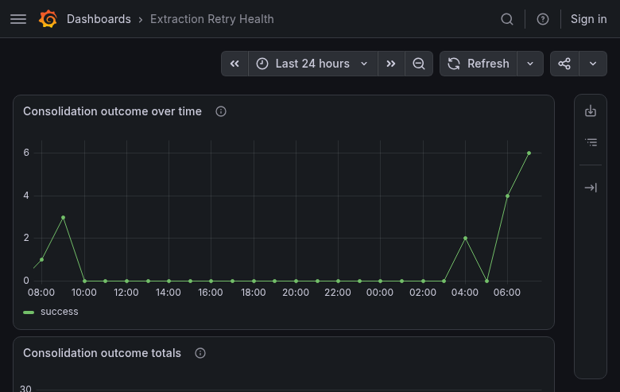

| # | Panel | Type | Rows | Verdict | Disposition |
|---|---|---|---:|---|---|
| 1 | Consolidation outcome over time | timeseries | 25 | Renders with real data | rebuild-on-pg — `consolidation_attempts` table (5,083 rows) |
| 2 | Consolidation outcome totals | barchart | 1 | Renders, thin | rebuild-on-pg |
| 3 | Top denial reason | barchart | 0 | Renders empty — see §3, rare in any 24h slice | rebuild-on-pg |
| 4 | Median attempts to success | timeseries | 25 | Renders with real data | rebuild-on-pg |

### `health_check` (uid `fre1072-health-check`) — 1 panel

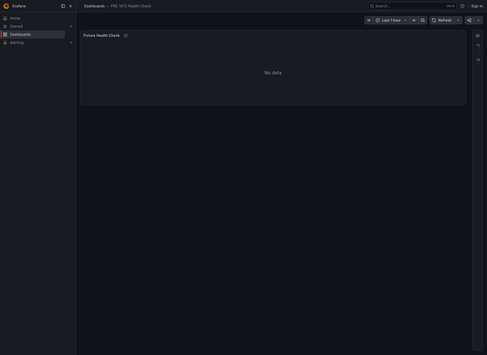

| # | Panel | Type | Rows | Verdict | Disposition |
|---|---|---|---:|---|---|
| 1 | Fixture Health Check | table | 0 | Renders empty, **correctly** — this is a CI/AC-5 fixture-verification panel, not a human-facing analytics panel; empty is its expected resting state absent a recent test injection | keep-as-is |

### `intent_classification` (uid `fre1072-intent-classification`) — 5 panels

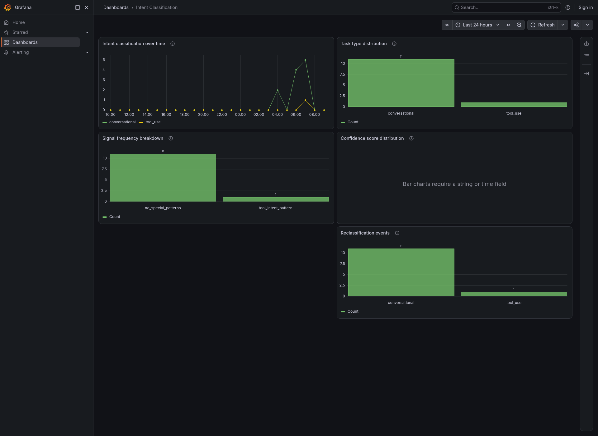

| # | Panel | Type | Rows | Verdict | Disposition |
|---|---|---|---:|---|---|
| 1 | Task type distribution | barchart | 3 | Renders with real data (refutes Prediction 1 for this dashboard — classification happens every turn) | rebuild-on-pg — `route_traces.task_type` (472/518 filled) |
| 2 | Intent classification over time | timeseries | 75 | Renders with real data | rebuild-on-pg |
| 3 | Confidence score distribution | barchart | 2 | Renders; description notes confidence is categorical (4 discrete values), a real design caveat worth carrying into the rebuild | rebuild-on-pg |
| 4 | Signal frequency breakdown | barchart | 3 | Renders with real data | rebuild-on-pg |
| 5 | Reclassification events | barchart | 3 | Renders, rare-but-present signal | rebuild-on-pg |

### `llm_performance` (uid `fre1072-llm-performance`) — 6 panels

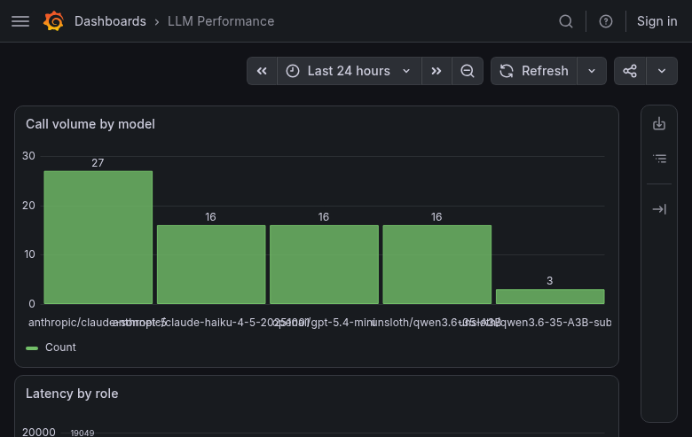

| # | Panel | Type | Rows | Verdict | Disposition |
|---|---|---|---:|---|---|
| 1 | Call volume by model | barchart | 5 | Renders with real data | rebuild-on-pg — `route_traces.model_role` + `api_costs` |
| 2 | Latency by role | barchart | 5 | Renders with real data | rebuild-on-pg |
| 3 | Latency over time by role | timeseries | 14 | Renders with real data | rebuild-on-pg |
| 4 | Prompt tokens by role | barchart | 5 | Renders with real data | rebuild-on-pg |
| 5 | Token usage over time | timeseries | 50 | Renders with real data | rebuild-on-pg |
| 6 | Model call errors over time | timeseries | 0 | Renders empty — see §3, real staleness (all 531 docs fall 2026-04-13…2026-06-01) | rebuild-on-pg — if `route_traces.error_type` carries an equivalent signal; otherwise flag as ES-only and disclose staleness honestly rather than reproduce a permanently-empty panel |

### `monitors_joinability_slm` (uid `fre1072-monitors-joinability-slm-health`) — 6 panels

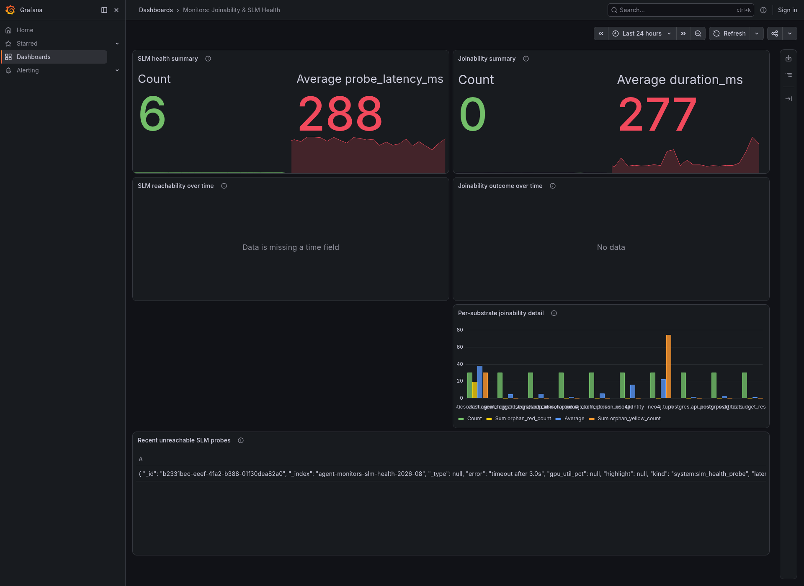

| # | Panel | Type | Rows | Verdict | Disposition |
|---|---|---|---:|---|---|
| 1 | Joinability summary | stat | 50 | Renders (`Count 0` / `Average duration_ms 201` as two tiles) — see Prediction 4, `lastNotNull` reduction semantics undisclosed | rebuild-on-es — dedicated `es-monitors-joinability*` index, not named in T4/T5's PG table |
| 2 | SLM health summary | stat | 50 | Renders (`Count 7` / `Average probe_latency_ms 160`) | rebuild-on-es |
| 3 | Joinability outcome over time | timeseries | 0 | Renders empty — see §3, no runs completed in the last 24h at audit time | rebuild-on-es |
| 4 | SLM reachability over time | timeseries | 26 | Renders with real data | rebuild-on-es |
| 5 | Per-substrate joinability detail | barchart | 10 | Renders with real data | rebuild-on-es |
| 6 | Recent unreachable SLM probes | table | 1 | Renders, `raw_document` dump — Prediction 3 | rebuild-on-es, with real column config replacing `raw_document` |

### `prompt-cost-cache` (uid `fre1072-prompt-cost-cache-attribution`) — 2 panels

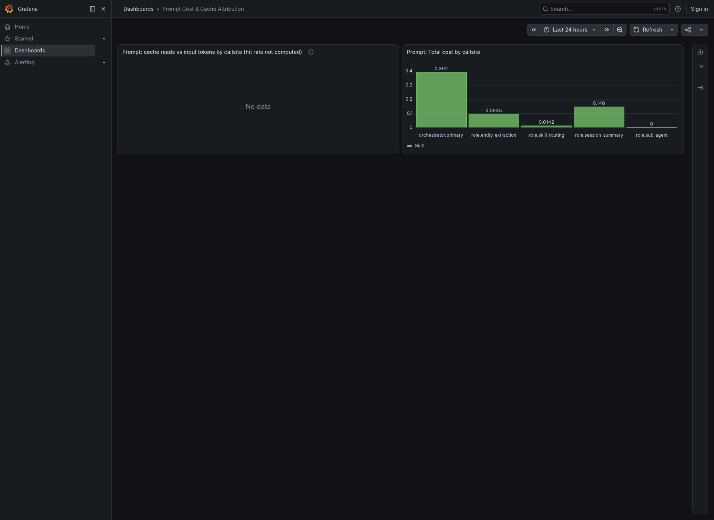

| # | Panel | Type | Rows | Verdict | Disposition |
|---|---|---|---:|---|---|
| 1 | Prompt: Total cost by callsite | barchart | 5 | Renders with real data | rebuild-on-pg — `api_costs` carries `cache_read_input_tokens`/`cache_creation_input_tokens` directly |
| 2 | Prompt: cache reads vs input tokens by callsite (hit rate not computed) | timeseries | 14 | **BUG-2** — renders "Data is missing a time field", not a chart | rebuild-on-pg |

### `request_timing` (uid `fre1072-request-timing-e2e`) — 4 panels

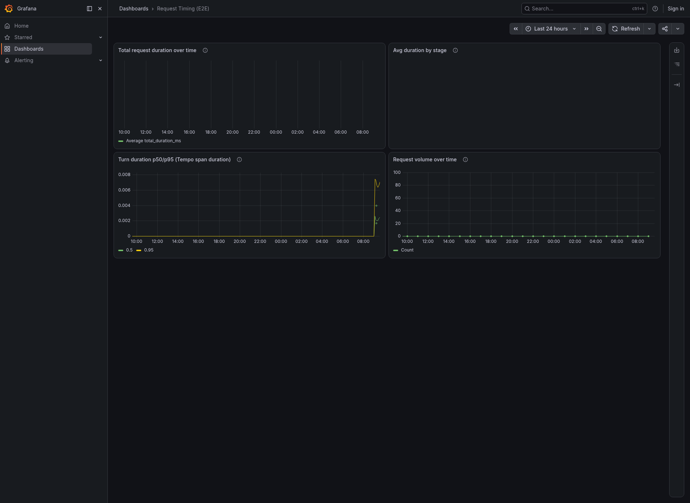

| # | Panel | Type | Rows | Verdict | Disposition |
|---|---|---|---:|---|---|
| 1 | Avg duration by stage | stat | 150 | Renders with real data — **BUG-3**, refutes the panel's own "STALE SIGNAL" description | rebuild-on-pg — `route_traces.latency_breakdown` JSONB (T5) |
| 2 | Total request duration over time | timeseries | 25 | Renders with real data — BUG-3 | rebuild-on-pg |
| 3 | Request volume over time | timeseries | 25 | Renders with real data — BUG-3 | rebuild-on-pg |
| 4 | Turn duration p50/p95 (Tempo span duration) | timeseries | 486 | Renders with real data, correctly Tempo-sourced (the one Tempo panel in the whole corpus doing its job) | keep-as-is — right datasource per the plan's §3 routing table; still needs `fieldConfig.unit: s` |

### `request_traces` (uid `fre1072-request-traces`) — 3 panels

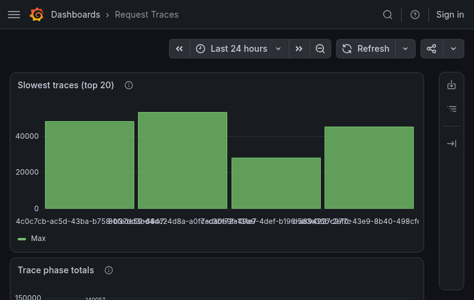

| # | Panel | Type | Rows | Verdict | Disposition |
|---|---|---|---:|---|---|
| 1 | Slowest traces (top 20) | barchart | 4 | Renders; title claims top 20, `terms.size` hardcoded to 10, and only 4 distinct trace_ids appear in this window | delete — superseded by `request_timing`'s PG rebuild + FRE-1067's span tree (T7) |
| 2 | Trace phase totals | barchart | 4 | **BUG-1** — hardcoded trace_id filter is a silent no-op; shows all `request_trace_step` data, not one trace | delete (T7) |
| 3 | Trace detail table | barchart | 10 | **BUG-1**, same mechanism; also mistitled ("table" but `type: barchart`) | delete (T7) |

### `self_improvement_funnel` (uid `fre1072-self-improvement-funnel`) — 2 panels

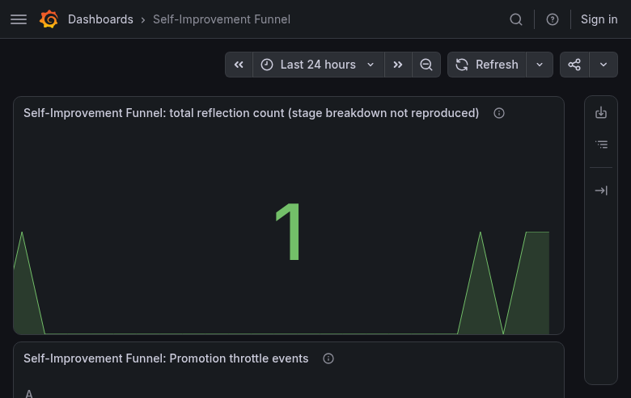

| # | Panel | Type | Rows | Verdict | Disposition |
|---|---|---|---:|---|---|
| 1 | Self-Improvement Funnel: total reflection count (stage breakdown not reproduced) | stat | 25 | Renders (`1`); title admits the stage breakdown is missing | rebuild-on-es — reflection data lives in `es-captains-reflections`, no PG table named |
| 2 | Self-Improvement Funnel: Promotion throttle events | table | 0 | Renders empty (throttle events are rare by design) — Prediction 3, `raw_document` | rebuild-on-es, real column config |

### `system_health` (uid `fre1072-system-health`) — 4 panels

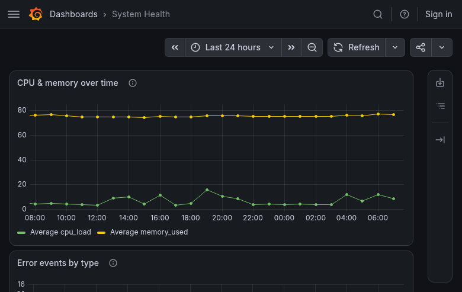

| # | Panel | Type | Rows | Verdict | Disposition |
|---|---|---|---:|---|---|
| 1 | CPU & memory over time | timeseries | 50 | Renders with real data (170,242 `sensor_poll` docs, live) | rebuild-on-es — host sensor metrics have no PG table named anywhere in the plan |
| 2 | Error events by type | timeseries | 250 | **BUG-1** — renders, but the underlying query does not filter as its own description claims; shows top-10 event types largely unrelated to errors | rebuild-on-pg — `route_traces.error_type`/`error_class` (T5) sidesteps the Lucene bug entirely by moving to SQL |
| 3 | Consolidation activity | timeseries | 0 | Renders empty — **newly found real staleness**, 38 days stale, undisclosed on the live dashboard (§3) | delete — redundant with `extraction_retry_health`'s PG rebuild of `consolidation_attempts`, and the ES event family this panel watches is itself stale |
| 4 | State transitions | timeseries | 75 | Renders with real data | rebuild-on-es |

### `task_analytics` (uid `fre1072-task-analytics`) — 5 panels

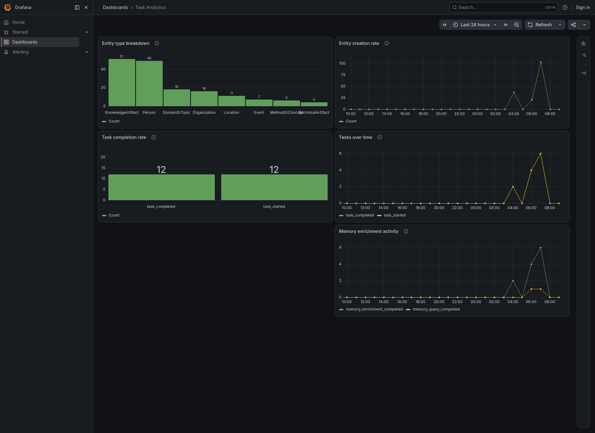

| # | Panel | Type | Rows | Verdict | Disposition |
|---|---|---|---:|---|---|
| 1 | Entity creation rate | timeseries | 25 | Renders with real data | rebuild-on-pg — `route_traces.tool_iteration_count`/`tools_used`/`skills_loaded` (T5) |
| 2 | Entity type breakdown | barchart | 7 | Renders with real data | rebuild-on-pg |
| 3 | Tasks over time | timeseries | 50 | Renders with real data | rebuild-on-pg |
| 4 | Task completion rate | barchart | 2 | Renders with real data (the 27% started-vs-completed gap the description names) | rebuild-on-pg |
| 5 | Memory enrichment activity | timeseries | 50 | Renders with real data | rebuild-on-pg |

### `traversal_gate` (uid `fre1072-traversal-ledger-gate-decisions`) — 6 panels

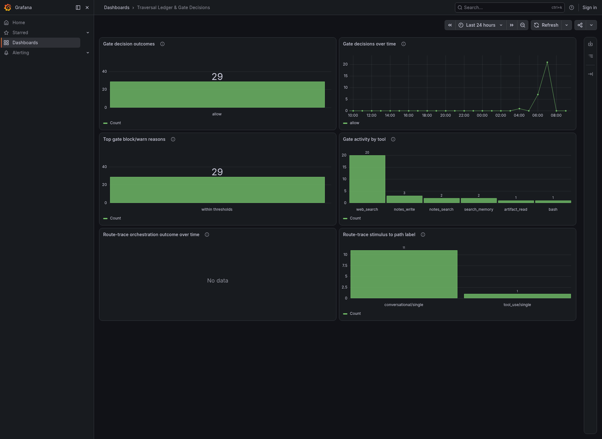

| # | Panel | Type | Rows | Verdict | Disposition |
|---|---|---|---:|---|---|
| 1 | Gate decisions over time | timeseries | 25 | Renders with real data | rebuild-on-es — `tool_loop_gate`/`route_trace_written` have no PG table named in T4/T5; flagged as an open scoping question, not assumed into `rebuild-on-pg` |
| 2 | Gate decision outcomes | barchart | 1 | Renders, thin | rebuild-on-es |
| 3 | Gate activity by tool | barchart | 8 | Renders with real data | rebuild-on-es |
| 4 | Top gate block/warn reasons | barchart | 1 | Renders, thin; description notes ~12.6% of docs are missing the `decision` field due to an ES field-count ceiling — a real, disclosed data-quality caveat | rebuild-on-es |
| 5 | Route-trace stimulus to path label | barchart | 3 | Renders with real data; same ~33% missing-field caveat disclosed | rebuild-on-es |
| 6 | Route-trace orchestration outcome over time | timeseries | 2 | Renders, thin | rebuild-on-es |

### `turn_session_artifact` (uid `fre1072-turn-session-artifact-analytics`) — 5 panels

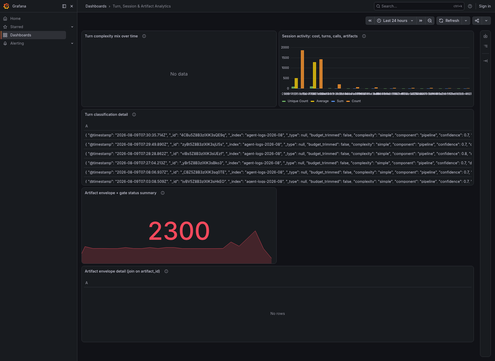

| # | Panel | Type | Rows | Verdict | Disposition |
|---|---|---|---:|---|---|
| 1 | Session activity: cost, turns, calls, artifacts | barchart | 10 | Renders with real data | rebuild-on-pg — `artifacts`(97) + `sessions`(1,282) + `session_model_selections` (T5) |
| 2 | Turn complexity mix over time | timeseries | 3 | **BUG-2** — renders "Data is missing a time field" | rebuild-on-pg |
| 3 | Turn classification detail | table | 16 | Renders, `raw_document` dump — Prediction 3 | rebuild-on-pg, real column config |
| 4 | Artifact envelope + gate status summary | stat | 25 | **Confirmed Prediction 5** — empty query string, shows 1,212–5,251 docs/hour of unrelated agent-logs traffic, not artifact/gate counts | rebuild-on-pg |
| 5 | Artifact envelope detail (join on artifact_id) | table | 0 | Renders empty — see §3, no envelope/gate events in the last 24h (consistent with only 97 artifacts all-time) | rebuild-on-pg, real column config |

---

## 6. Falsifiability record (AC-4)

| # | Prediction | Verdict | Evidence location |
|---|---|---|---|
| 1 | 9 dashboards' 90d/30d/1yr-claiming panels render empty at now-24h | **Partially refuted** — only 5/29 such panels are actually empty; the mechanism is real for 2 dashboards, absent for 7 | §2 Prediction 1 |
| 2 | 6 panels on `request_trace*` render empty (dead since 2026-06-07) | **Refuted for 3/6** — the event family is live (last doc 2026-08-08); the other 3 render non-empty for an unrelated reason (BUG-1) | §2 Prediction 2, §4 BUG-1/BUG-3 |
| 3 | All 5 `table` panels dump raw `_source` blobs | **Confirmed for 4/5**, refined for the 5th (`logs` metric, not `raw_document`, same effect) | §2 Prediction 3 |
| 4 | 4 `stat`-over-`date_histogram` panels show a series, not a stat | **Confirmed the mechanism, refuted the visual claim, and broadened the count to 5/5** — Grafana's `lastNotNull` reducer already produces a clean stat tile; the real defect is undisclosed single-bucket semantics | §2 Prediction 4 |
| 5 | `turn_session_artifact` panel 4 shows a large count of all agent-logs | **Confirmed exactly**, quantified at 1,212–5,251 docs/hour vs. 97 real artifacts | §2 Prediction 5 |

No prediction was dropped silently; every one is reported with its actual outcome, including the two
(1 and 2) that came back weaker or inverted from how they were originally framed. Three additional
defect classes not named by any prediction were found by the same method (BUG-1, BUG-2, BUG-3, §4) —
this is the audit doing its job past the hypotheses it was handed.
