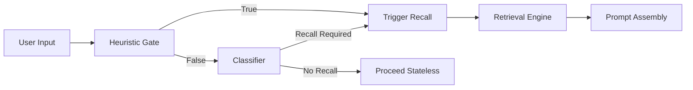

From a perplexity discussion regarding AI agent short term memory context management and adding relevant and/or historical content at every turn. 'aka hot to maintain a long running conversation with a chatbot or coding agent."
I would like to categorize the different types of conversation an agent may have:
- human <-> agent (chat)
- agent <-> agent
- agent <-> subagents

Perplexity returned the following:

This is a rich, practical topic. Let me give a comprehensive, well-structured answer.

***

Maintaining a long-running conversation requires actively managing what you put into the model's context window at each turn — because LLMs don't "remember" anything outside of it. Here's the full picture.

## The Core Problem: Context Rot

As conversations grow, quality degrades before you even hit the token limit — a phenomenon called **context rot**. The model starts over-weighting older irrelevant messages, loses focus on the current goal, and makes contradictory decisions. The field has converged on the idea that the solution is **context engineering**: deliberately constructing what goes into the window at every turn, rather than naively appending history.[1][2]

## Strategy 1: Start Fresh Often

The simplest and most underrated strategy is **session scoping** — starting a new conversation whenever you shift topics or tasks. Before closing a session:[1]

1. Ask the model to produce a structured summary of what was accomplished
2. List open decisions, constraints established, and next steps
3. Paste that summary as the system prompt or first message in the next session

This is what Claude Code does automatically with its `/compact` command, and what Cursor calls "summarization".[3]

## Strategy 2: Sliding Window with Anchored Summary

Rather than keeping the full raw history, you maintain a **rolling two-tier structure** at every turn:[4]

- **Anchor summary** — a persistent, compressed record of everything older than N turns
- **Recent verbatim turns** — the last 8–15 exchanges kept in full fidelity

When old turns fall off the verbatim window, you **extend the anchor** by summarizing only the evicted span and merging it in — you don't regenerate the whole summary from scratch. This avoids cumulative detail drift across compression cycles.[4]

```
[System Prompt]
[Anchor Summary — compressed history]
[Turn N-10 ... Turn N-1 — verbatim]
[Turn N — current input]
```

## Strategy 3: Context Compression

For coding agents or research agents generating lots of tool output, raw tool results balloon context fast. Techniques include:[5][6]

- **Semantic compression** — replace verbose tool output (e.g., a full file read) with a dense structured summary before injecting it into context
- **Selective injection** — only include tool results directly relevant to the current sub-task, not the full history of every tool call
- **Filesystem offloading** — write intermediate artifacts (file contents, search results, prior reasoning) to disk; inject only a reference or retrieval on demand[7]

JetBrains research found that simple masking/truncation strategies are often just as effective as full LLM-based summarization, at half the cost.[8]

## Strategy 4: Structured Context Document

Instead of a flat message history, maintain a **living context document** that you update each turn. This is particularly effective for long coding sessions:[9]

| Section | Content |
|---|---|
| **Goal** | The original task and any clarifications |
| **Constraints** | Tech stack, patterns, decisions locked in |
| **State** | What files exist, what's been done |
| **Open questions** | Unresolved decisions |
| **Recent actions** | Last 3–5 steps taken |

Prepend this document at every turn, keeping the raw message history short (last 5–10 turns only).

## Strategy 5: Proactive Checkpoints

For very long coding agent runs (30+ turns), explicitly insert **checkpoint turns** every 10–15 messages:[3]

1. Pause and ask the model: *"Summarize the current state of the codebase, what we've built, and what remains"*
2. Save this as your new context anchor
3. Open a fresh session with it

This prevents the silent failure mode where the agent gradually forgets early constraints and architectural decisions.

## Practical Rules of Thumb

- **< 15 turns**: raw history is fine[1]
- **15–40 turns**: apply sliding window + anchor summary
- **40+ turns or tool-heavy agents**: structured context document + filesystem offloading + session reset at milestones[7]
- **Coding agents specifically**: keep file contents **out** of context unless the agent is actively editing them — inject on demand[6]

The key mental model: think of the context window as **a scratchpad you curate**, not a tape recorder. Every turn is an opportunity to reconstruct it with exactly the right information — no more, no less.[2]

Sources
[1] Context Rot: Why AI Gets Worse the Longer You Chat (And How to ... https://www.producttalk.org/context-rot/
[2] Context Engineering - LangChain Blog https://blog.langchain.com/context-engineering-for-agents/
[3] Background Agent Design https://cto.new/blog/managing-long-contexts-in-agentic-coding-systems
[4] AI Agent Context Compression: Strategies for Long-Running Sessions https://zylos.ai/research/2026-02-28-ai-agent-context-compression-strategies
[5] LLM Chat History Summarization Guide October 2025 - Mem0 https://mem0.ai/blog/llm-chat-history-summarization-guide-2025
[6] How do you handle the context window overflow for long-running ... https://www.reddit.com/r/LocalLLaMA/comments/1ofkpnq/how_do_you_handle_the_context_window_overflow_for/
[7] Context Management for Deep Agents - LangChain Blog https://blog.langchain.com/context-management-for-deepagents/
[8] Cutting Through the Noise: Smarter Context Management for LLM ... https://blog.jetbrains.com/research/2025/12/efficient-context-management/
[9] Effective context engineering for AI agents - Anthropic https://www.anthropic.com/engineering/effective-context-engineering-for-ai-agents
[10] Best practices for cost-efficient, high-quality context management in ... https://community.openai.com/t/best-practices-for-cost-efficient-high-quality-context-management-in-long-ai-chats/1373996
[11] Context Window Management: Strategies for Long ... - Maxim AI https://www.getmaxim.ai/articles/context-window-management-strategies-for-long-context-ai-agents-and-chatbots/
[12] Architecting efficient context-aware multi-agent framework for ... https://developers.googleblog.com/architecting-efficient-context-aware-multi-agent-framework-for-production/
[13] Context window overflow: Breaking the barrier | AWS Security Blog https://aws.amazon.com/blogs/security/context-window-overflow-breaking-the-barrier/
[14] The Future of AI: Context Engineering in 2025 and Beyond https://dev.to/lofcz/the-future-of-ai-context-engineering-in-2025-and-beyond-5n9
[15] Building Smart Chat History Summarization in LarAgent with AI https://blog.laragent.ai/building-smart-chat-history-summarization-in-laragent-with-ai/


Followed up with : How do you apply these techniques without slowing down the multi-turn conversations of any type.

The core answer here is about **when** and **how** compression happens relative to the main conversation loop — the key is making it non-blocking. Here's the full breakdown:

## The Latency Problem

Every context management technique adds overhead *if you run it synchronously*, i.e., forcing the user or the downstream agent to wait for a compression step before the next turn can proceed. The solution is to decouple the compression pipeline from the hot path entirely.[1]

## Technique 1: Async Background Compression

The most impactful technique: run summarization **concurrently** with the model's reply generation, not before it. The sequence looks like this:[2]

```
Turn N arrives
  ├─► [Main path]  → inject current context → generate reply → stream to user
  └─► [Background] → detect threshold → compress old turns → update anchor
                                             ↑
                              ready before Turn N+2 needs it
```

The compression job fires as a background task the moment a threshold is crossed (e.g., token count > 60% of window). By the time the user reads the reply and types their next message, the new compressed anchor is already written. In Python this is a simple `asyncio.create_task()` or a thread pool call; in agent frameworks like LangChain's Deep Agents this is handled by middleware automatically.[3][2]

## Technique 2: Cheap Model for Compression

Use a **small, fast model** (e.g., `gpt-4o-mini`, `haiku`, or a local quantized 7B) exclusively for summarization, not the primary frontier model. This means:[2]

- Compression adds ~100–300ms at most, often in parallel
- Cost drops by 10–20× compared to using the main model
- The Acon framework showed that compressor models distilled down to 7B parameters preserve 95% of a large model's summarization accuracy[4]

## Technique 3: Trigger-Based Compression (Not Every Turn)

Don't compress on every turn — that's wasteful. Set **thresholds** so compression only fires when needed:[5][2]

| Trigger type | Example | Best for |
|---|---|---|
| **Token fraction** | compress when > 65% of window used | General chatbots |
| **Message count** | compress every 12 turns | Human-agent chat |
| **Tool output size** | compress if a single tool result > 4K tokens | Coding/research agents |
| **Time-based** | compress every 5 min of wall-clock time | Long-running background agents |

Between triggers, you pay zero overhead — the system just appends verbatim.

## Technique 4: KV Cache Preservation

A subtler but important technique for API-based systems: **keep your system prompt and anchor summary stable across turns** so the provider's KV cache stays hot. If you regenerate or shuffle the system prompt every turn, you lose cache hits and latency spikes. The rule is:[6]

- Prefix (system prompt + anchor) = **immutable per session** until a compression event
- Only the suffix (recent turns) changes each turn
- This alone can cut per-turn latency by 30–50% on cached providers[6]

## Technique 5: Filesystem Offloading Before Summarization

Before reaching summarization, try **offloading** first — it's cheaper and zero-latency. Large content like tool outputs, file reads, or search results get written to disk/memory store, and a short reference pointer replaces them in context:[3]

```
Instead of: [Full 8KB file content injected every turn]
Use:        [File: /workspace/api.py — retrieve on demand]
```

LangChain's Deep Agents falls through a priority stack: offload first → summarize only when offloading isn't enough. This means summarization (the costlier step) triggers far less often.[3]

## Agent-to-Agent Specifics

In multi-agent pipelines, context bloat is even more dangerous because each agent handoff can carry a full conversation dump. The correct pattern is **handoff compression**:[7]

- The outgoing agent produces a **structured handoff document** (goal, state, artifacts, open decisions) — not a raw message dump
- The receiving agent gets only the handoff doc + its own system prompt, not the full upstream history
- This keeps each agent's context window clean and prevents compounding cost across a multi-hop chain

This is what the Higress framework implements as "agent-transparent context compression" — it intercepts handoff boundaries and stores historical tool outputs in an external memory store, injecting only relevant excerpts into the downstream agent.[8]

## Practical Stack Summary

For a production system (which given your background is likely what matters):

1. **Redis or a vector store** for external memory  — fast key-value retrieval for offloaded tool results[1]
2. **Async task queue** (Celery, `asyncio`, or agent framework middleware) for non-blocking compression
3. **Small local model** (e.g., a 4-bit quantized Qwen2.5-3B on your M-series) as the compressor — keeps it free and sub-100ms
4. **Stable prefix pattern** — freeze system prompt + anchor so the LLM provider's KV cache stays warm
5. **Threshold triggers** on token count, not every turn

The net result is that the user or downstream agent **never waits for context management** — it happens in the gaps between turns, invisibly.[9]

Sources
[1] Engineering for AI Agents - Redis https://redis.io/blog/engineering-for-ai-agents/
[2] Managing Agent Context with LangChain: Summarization Middleware Explained https://www.youtube.com/watch?v=A1t53E4vtGo
[3] Context Management for Deep Agents - LangChain Blog https://blog.langchain.com/context-management-for-deepagents/
[4] Acon: Optimizing Context Compression for Long-horizon LLM Agents https://arxiv.org/html/2510.00615v1
[5] Context Compression - Agno https://docs.agno.com/compression/overview
[6] Towards Efficient Agents: A Co-Design of Inference Architecture and ... https://arxiv.org/html/2512.18337v1
[7] Architecting efficient context-aware multi-agent framework for production https://www.youtube.com/watch?v=tRY0IHgi7-Y
[8] Feature: Agent-Transparent Context Compression for Multi-Turn ... https://github.com/alibaba/higress/issues/3077
[9] AI Agent Context Compression: Strategies for Long-Running Sessions https://zylos.ai/research/2026-02-28-ai-agent-context-compression-strategies
[10] Breaking the AI Agent Loop with Async Tools - LinkedIn https://www.linkedin.com/posts/mikegchambers_ai-agents-python-activity-7429464532399566848-NnKd
[11] 7 Optimization Layers That AI Developer's must Apply to Build ... https://pub.towardsai.net/the-7-optimization-layers-that-separate-demos-from-ai-production-systems-d008f71706f9
[12] 5 Predictions for Enterprise Data in 2026: When Agentic AI Goes to ... https://promethium.ai/5-predictions-for-enterprise-data-in-2026-when-agentic-ai-goes-to-production/
[13] Context Engineering - Short-Term Memory Management with ... https://developers.openai.com/cookbook/examples/agents_sdk/session_memory/
[14] Top techniques to Manage Context Lengths in LLMs - Agenta https://agenta.ai/blog/top-6-techniques-to-manage-context-length-in-llms
[15] Agentic AI in 2026: How Autonomous Agents Transform Workflows https://www.panthsoftech.com/agentic-ai-in-2026-autonomous-agents-workflows/
[16] Context engineering in agents - Docs by LangChain https://docs.langchain.com/oss/python/langchain/context-engineering


I also had this conversation about Cognition with gpt-5.4

Me:  Are there any lightweight python classifiers that can analyze a test to determine if there is a memory recall?

Yes — if by “memory recall” you mean classifying a piece of text as referring back to prior context, there are several lightweight Python options.

Best lightweight choices

Option	Good for	Why it fits
scikit-learn + TF-IDF + LogisticRegression / SGDClassifier	Fastest, simplest baseline	Very light, easy to train, works well for short text classification with labeled examples. TfidfVectorizer + linear classifiers is a standard pattern in scikit-learn.  
fastText	Very fast training/inference, compact models	fastText is explicitly designed for lightweight text classification and can run on standard hardware; its Python module supports supervised text classification.  
SetFit	Small labeled dataset, better semantics than bag-of-words	SetFit is built for efficient few-shot text classification and is described as fast to train and run inference.  
Zero-shot transformers	No training data yet	Useful for prototyping labels like memory_recall vs not_memory_recall, but generally heavier than the three above. Hugging Face documents zero-shot classification as a transfer-learning approach for unseen classes.  

Practical recommendation

For your use case, I would start in this order:
	1.	scikit-learn baseline if you have labeled examples.
	2.	SetFit if you only have a small number of examples and want more semantic robustness.
	3.	fastText if speed and simplicity matter most.
	4.	zero-shot only for early exploration or fallback.

Important caveat

A classifier can only detect “memory recall” reliably if you define it clearly. In practice, you usually need one of these formulations:

Formulation	Example label
Binary text classification	“Does this utterance reference earlier conversation?”
Pair classification	“Does current text refer to this previous message/context block?”
Retrieval + classification	First fetch candidate prior memories, then classify whether the new text recalls one of them

If you want real robustness, pair classification or retrieval + classification is usually better than classifying the text alone, because “memory recall” is relational by nature.

Minimal baseline example

from sklearn.feature_extraction.text import TfidfVectorizer
from sklearn.linear_model import LogisticRegression
from sklearn.pipeline import Pipeline

# X_train = texts
# y_train = 1 for memory recall, 0 for not memory recall

clf = Pipeline([
    ("tfidf", TfidfVectorizer(ngram_range=(1, 2), min_df=2)),
    ("model", LogisticRegression(max_iter=200))
])

clf.fit(X_train, y_train)

pred = clf.predict([
    "As I mentioned earlier, the server issue started after the deploy."
])
print(pred)

My honest take

If your dataset is not huge and you want something lightweight but credible, SetFit is probably the sweet spot.
If you want smallest operational footprint, use TF-IDF + LogisticRegression first.

If you want, I can sketch a memory-recall detector architecture for your agent, including:
	•	single-text classifier vs pairwise classifier,
	•	training data schema,
	•	evaluation metrics,
	•	and a small Python prototype.

Me:  Define cognition:

**Cognition** is the set of mental processes by which an entity **acquires, processes, stores, and uses information** to understand the world and guide behavior.

---

## Core Components (Functional View)

| Component        | Function                                                                 |
|------------------|-------------------------------------------------------------------------|
| Perception       | Interpreting sensory input (vision, sound, etc.)                         |
| Attention        | Selecting relevant information                                           |
| Memory           | Encoding, storing, and retrieving information                            |
| Reasoning        | Drawing inferences and making decisions                                  |
| Learning         | Updating knowledge or behavior based on experience                       |
| Language         | Understanding and producing symbolic communication                       |
| Executive Control| Planning, inhibition, task switching, goal-directed behavior             |

---

## System-Level Perspective (Architecture Analogy)

Cognition can be modeled as an **information-processing pipeline**:

```
[Sensory Input]
      ↓
[Perception Layer]
      ↓
[Attention Filter]
      ↓
[Working Memory ↔ Long-Term Memory]
      ↓
[Reasoning / Decision Engine]
      ↓
[Action / Output]
```

Key properties:
- **Stateful** (memory-dependent)
- **Adaptive** (learning modifies future processing)
- **Context-sensitive** (interpretation depends on prior knowledge)

---

## In AI / Systems Terms

In artificial systems, cognition maps to:

| Human Cognition        | AI Equivalent                                   |
|-----------------------|-------------------------------------------------|
| Perception            | Input encoding (embeddings, feature extraction) |
| Memory                | Vector DBs, state stores, context windows       |
| Reasoning             | Inference (LLMs, symbolic engines)              |
| Learning              | Training / fine-tuning                          |
| Attention             | Attention mechanisms / retrieval filtering      |
| Decision-making       | Policy selection / orchestration logic          |

---

## Concise Definition

> Cognition is **goal-directed information processing** that enables an agent to perceive, understand, learn, and act.

Me: I mean “analyze this given text and determine if it is referring to something in the past. A memory, an earlier reference. “ why : because I am working on agent cognitive memory management - and I need a trigger to deterministically perform a historical search of previous conversations.   


You’re essentially trying to detect **“memory recall intent”** — i.e., whether the current utterance requires **retrieval from past conversational state** rather than being self-contained. That’s a well-defined classification problem, but the key is making it **deterministic enough to safely trigger retrieval** without overfiring.

---

## 1. Problem Framing (Precise)

Define a binary (or ternary) classifier:

| Label | Meaning |
|------|--------|
| `RECALL_REQUIRED` | Requires lookup in prior conversation/history |
| `RECALL_OPTIONAL` | May benefit from history but not required |
| `NO_RECALL` | Fully self-contained |

This avoids over-triggering expensive retrieval.

---

## 2. Signal Types (What Actually Indicates Memory Recall)

You want **explicit + implicit signals**, not just keywords.

### A. Strong Deterministic Signals (High Precision)
These should almost always trigger retrieval:

| Pattern Type | Examples |
|-------------|---------|
| Direct reference | “what did I say earlier”, “as we discussed”, “you mentioned” |
| Temporal anchors | “before”, “earlier”, “last time”, “previously” |
| Anaphora (unresolved) | “that issue”, “this approach”, “it we discussed” |
| Continuation verbs | “continue”, “resume”, “pick up where we left off” |

---

### B. Structural Signals (High Value, Often Missed)

These are more subtle and important for your use case:

| Signal | Description | Example |
|-------|------------|--------|
| Missing subject | Depends on prior context | “Can we refine it?” |
| Referential compression | Object not redefined | “Apply the same logic to fraud pipelines” |
| Partial restatement | Incomplete restatement | “The ingestion problem we saw yesterday” |
| Instruction chaining | Builds on prior step | “Now optimize it for latency” |

---

### C. Weak Signals (Use with caution)

- Pronouns: *it, that, this*
- Generic temporal words: *before, again*
- Domain reuse: same topic but no explicit reference

These alone should **not trigger recall**.

---

## 3. Deterministic Heuristic Layer (Fast + Reliable)

Before using any ML, implement a **rule-based gate**:

```python
RECALL_PATTERNS = [
    r"\b(as we discussed|as mentioned|you said|we said)\b",
    r"\b(previously|earlier|before|last time)\b",
    r"\b(continue|resume|pick up where we left off)\b",
    r"\b(that|this|it)\b.*\b(we discussed|we saw|you mentioned)\b"
]

def heuristic_recall_trigger(text):
    for pattern in RECALL_PATTERNS:
        if re.search(pattern, text.lower()):
            return True
    return False
```

This gives you **high precision, low recall** — exactly what you want for a safe trigger.

---

## 4. Lightweight Classifier Layer (Your Main Engine)

Then add a **small classifier** to catch implicit cases.

### Option A — Embedding Similarity Delta (Very effective)
Compute:
- similarity between current input and **recent conversation turns**
- if similarity is high but **input is incomplete**, trigger recall

```text
IF similarity(current, past_window) > T1
AND semantic completeness score < T2
→ RECALL_REQUIRED
```

---

### Option B — Mini Classifier (Recommended)

Use something lightweight:

- `scikit-learn` (LogReg / SVM with TF-IDF)
- or `sentence-transformers` + linear head

Features:
- presence of temporal words
- pronoun density
- sentence completeness (length, noun presence)
- embedding similarity to past turns

---

## 5. LLM-as-Judge (Controlled, Deterministic Prompt)

For higher accuracy, use a **strict schema-based LLM classifier**:

**Prompt:**
```text
Classify whether the user input requires retrieving past conversation context.

Rules:
- Only answer TRUE if the input cannot be understood without past context.
- If the input is fully self-contained, answer FALSE.

Input: "{text}"

Output JSON:
{
  "recall_required": true|false,
  "confidence": 0-1,
  "reason": "short explanation"
}
```

Use:
- low temperature (0–0.2)
- small fast model (e.g., Mistral-small / Phi)

---

## 6. Recommended Architecture (Your Context)

This fits cleanly into your orchestrator:



---

## 7. Key Design Insight (Critical)

Do **NOT** treat this as just “keyword detection”.

The real problem is:

> **Is the input semantically incomplete without historical state?**

That’s the core invariant your system should enforce.

---

## 8. Practical Threshold Strategy

| Layer | Goal | Behavior |
|------|------|----------|
| Heuristic | Precision | Only obvious recall |
| Classifier | Recall | Catch implicit references |
| LLM Judge (optional) | Arbitration | Resolve edge cases |

---

## 9. Advanced (Where This Gets Interesting)

Given your agent architecture, you can go further:

### A. “Context Gap Score”
Measure:
```text
gap = required_entities - provided_entities
```
If gap > threshold → recall

---

### B. Intent-Aware Recall
Only trigger recall for certain intents:
- troubleshooting
- refinement
- continuation
- comparison

Not for:
- general knowledge queries

---

### C. Memory Addressing (Future)
Instead of binary recall:
- `RECENT_CONTEXT`
- `SESSION_MEMORY`
- `PERSISTENT_CORPUS`

---

## Bottom Line

You don’t need a heavy model.

A **3-layer system** will be robust and production-safe:

1. **Regex heuristics** → high precision triggers  
2. **Lightweight classifier** → implicit detection  
3. **(Optional) LLM judge** → resolve ambiguity  
