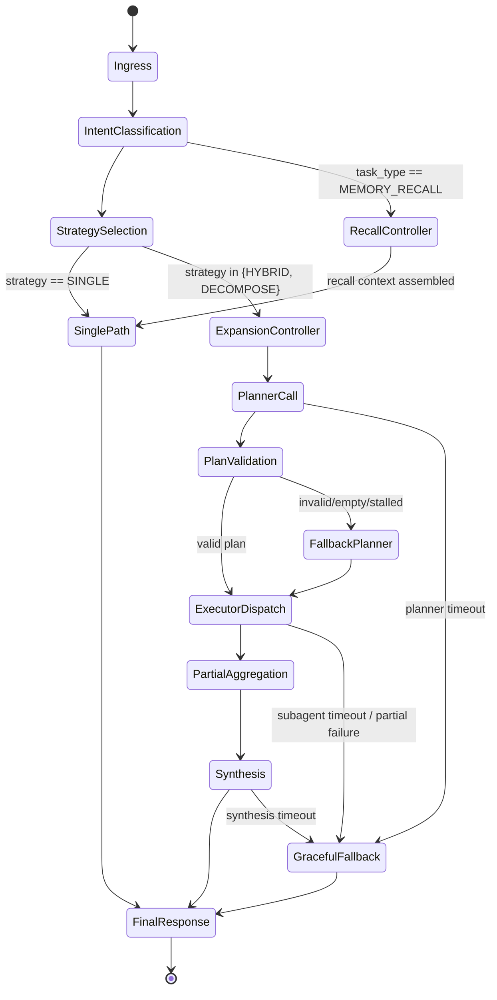

Below is the remediation plan I would use as the working design doc.

## Remediation Plan

### 1. Executive diagnosis

The brief points to one primary systems issue: the gateway is making the right decision often enough, but the runtime is not enforcing that decision. In CP-16 and CP-17, the gateway classifies the turn as `HYBRID` or `DECOMPOSE`, yet the agent can still choose a direct-answer path. That is the gateway→agent gap called out in the brief, and the 4-run trend shows it is non-deterministic across identical prompt classes.  Brief[^1]

The target fix is therefore architectural, not prompt-only:

- **Workflow decisions that affect correctness must live in deterministic code**
- **The model should own plan content and synthesis, not branch compliance**
- **Recall-like queries need a dedicated retrieval/controller path, not plain conversational fallback**

This direction aligns with current agent guidance: use **workflows** for predetermined control flow, use **agents** where flexible tool use or reasoning adds value, and use **structured outputs/function tools** when the model must bridge into application behavior.  Anthropic[^2]

---

## 2. Target outcomes

The remediation is successful when the system achieves all of the following:

1. **Strategy compliance**
   - `HYBRID` and `DECOMPOSE` no longer silently skip expansion
   - “strategy mismatch rate” becomes near-zero

2. **Timeout resilience**
   - CP-17-like requests degrade gracefully
   - planner stalls do not consume the full wall-clock budget

3. **Recall robustness**
   - implicit backward-reference prompts like CP-19 route to `memory_recall`
   - answer correctness is validated separately from classification correctness

4. **Observability**
   - every failure can be localized to:
     - classifier
     - planner
     - plan parser / schema validator
     - executor
     - synthesizer
     - recall controller

---

## 3. Architecture decisions

### 3.1 Decision summary

For the open questions in the brief, my answers are:

| Question | Recommended answer |
|---|---|
| **Q1 – where should expansion enforcement live?** | **B + C**: enforce via structured tool/plan contract, with executor gate as safety net |
| **Q2 – how to stop DECOMPOSE timeouts surfacing to users?** | Introduce phase-bounded planner/executor/synthesizer flow with graceful degradation |
| **Q3 – should classifier use context?** | **Hybrid**: keep raw-message heuristics primary, add constrained recall cues + small session-fact peek |
| **Q4 – is telemetry the right assertion layer?** | Yes for workflow compliance; add semantic answer assertions as a separate layer |

These choices directly answer the brief’s open questions around enforcement, timeout handling, implicit recall, and telemetry versus quality.  Brief[^1]

### 3.2 Why this is the right shape

LangGraph’s own distinction is useful here: **workflows** are predetermined code paths; **agents** dynamically decide tool use and process. Your current issue comes from placing a predetermined control decision into the dynamic part of the stack. Anthropic’s production guidance also recommends simple, composable patterns over excessive autonomy, and OpenAI’s structured outputs/function-calling guidance explicitly positions schema-constrained outputs for connecting model decisions to application actions.  Anthropic[^2]

---

## 4. Proposed target state machine

This is the high-level state machine I would implement.



### Key principle

Once the gateway sets `strategy ∈ {HYBRID, DECOMPOSE}`, the runtime must enter `ExpansionController`. The model does **not** decide whether expansion happens. It only contributes the plan or subtask content.

---

## 5. Detailed remediation design

### 5.1 Planner / executor split

Replace the current “prompt hint” approach with an explicit two-step execution contract.

#### Current behavior
- gateway sets `ctx.expansion_strategy`
- primary agent sees it in the prompt
- model may or may not expand

#### Proposed behavior
- gateway sets `ctx.expansion_strategy`
- runtime routes into `ExpansionController`
- planner must emit structured subtasks
- executor deterministically spawns subagents
- synthesizer composes results

### 5.2 Required plan schema

Use structured output or a tool contract.

Example schema:

```json
{
  "strategy": "HYBRID",
  "tasks": [
    {
      "name": "compare_performance",
      "goal": "Compare Redis, Memcached, and Hazelcast on raw performance at 10k rps",
      "constraints": ["Keep to deployment-relevant considerations", "Mention trade-offs"],
      "expected_output": "Short comparison with concrete recommendation signal"
    },
    {
      "name": "compare_memory_management",
      "goal": "Compare memory usage and behavior under load",
      "constraints": ["Focus on architecture and operational implications"],
      "expected_output": "Operationally meaningful summary"
    },
    {
      "name": "compare_operational_complexity",
      "goal": "Compare operational complexity, scaling, and failure handling",
      "constraints": ["Assume microservices environment"],
      "expected_output": "Operational comparison"
    }
  ]
}
```

This can be produced via:
- **function/tool calling**, or
- **strict JSON schema structured output**

That is exactly the use case official structured-output guidance is designed for: making the model produce machine-validated outputs or call explicit tools before the application proceeds.  OpenAI Developers[^3]

### 5.3 Tool contract

If your model stack supports it cleanly, I would prefer a tool-style contract such as:

```python
spawn_sub_agents(tasks: list[SubTask]) -> ExpansionHandle
```

or a two-tool split:

```python
plan_subtasks(query, strategy, max_tasks, required_dimensions) -> Plan
spawn_sub_agents(plan: Plan) -> ExpansionHandle
```

This makes expansion:
- explicit
- observable
- measurable
- retryable

That addresses the brief’s concern about absent `hybrid_expansion_start` telemetry and silent mismatch between gateway strategy and execution path.  Brief[^1]

---

## 6. Deterministic fallback planner

If the planner output is malformed, empty, too shallow, or too slow, the runtime should not revert to unconstrained direct answering. It should invoke a deterministic fallback planner.

### Fallback planner rules

#### For `HYBRID`
- cap subtasks at 2–3
- derive tasks from explicit named dimensions or entities
- preserve a synthesis step

#### For `DECOMPOSE`
- derive one task per explicit evaluation axis
- add one recommendation task
- optionally add one consolidation task if needed

### Example: CP-17 fallback
Prompt shape implies:

1. compare raw performance
2. compare memory management
3. compare operational complexity
4. synthesize recommendation for 10k rps microservices

Even if the model fails to generate the plan, code can.

### Why this matters
CP-17 currently times out after the model appears to enter an expensive serial path rather than a bounded decomposition path. The brief explicitly hypothesizes deeper pre-planning and different timeout behavior for `DECOMPOSE`. A deterministic fallback planner is the cleanest mitigation.  Brief[^1]

---

## 7. Timeout and degradation policy

### 7.1 Phase budgets

Do not use one undifferentiated 180s execution envelope.

Use phase budgets:

| Phase | Suggested budget |
|---|---:|
| Intent + strategy | 50–200 ms |
| Planner | 5–12 s |
| Plan validation | <250 ms |
| Fallback planner | <500 ms |
| Subagent execution | 15–45 s per worker, global cap 60–90 s |
| Synthesis | 10–25 s |
| Graceful fallback assembly | <1 s |

### 7.2 Hard rules

- If planner exceeds budget → invoke fallback planner
- If some subagents fail → synthesize partial result
- If all subagents fail → concise direct answer with “analysis compressed due to execution constraints”
- If synthesizer exceeds budget → emit condensed synthesis from partial aggregation
- Never return raw planner timeout to the user unless total request envelope is exhausted and no partial result exists

### 7.3 User-visible behavior

Instead of:
- “LLM timeout”

Return:
- concise recommendation
- explicit note that the answer was produced under degraded execution
- optional internal trace tag for observability

This follows the same general harness principle Anthropic discusses for long-running agents: durable progress tracking, bounded phases, and graceful handling when agent work exceeds expectations.  Anthropic[^4]

---

## 8. Recall controller for CP-19 class failures

The brief frames CP-19 as a classifier gap rather than a memory gap, and I agree with that as the first-order diagnosis. But I would still add a lightweight recall controller so the system does not depend purely on the base chat path noticing older context.  Brief[^1]

### 8.1 Trigger cues

If the message contains cues like:
- `again`
- `going back`
- `back to the beginning`
- `earlier`
- `what did we decide`
- `what was our`
- `remind me what`

then the classifier should increase probability of `memory_recall`.

### 8.2 Two-stage classifier

#### Stage A — deterministic lexical classifier
Keep current regex/heuristic system fast and primary.

#### Stage B — constrained ambiguity booster
If the message has:
- interrogative form
- temporal/back-reference cue
- noun phrase suggesting a prior decision or fact

then boost toward `memory_recall`.

### 8.3 Small session-fact peek
Do **not** make the whole classifier a history-aware LLM stage. Instead:
- search a tiny session-facts cache or recent-turn summary
- only use it when ambiguity booster fires
- pass back a confidence flag and evidence snippet

This preserves deterministic speed while fixing the most obvious implicit recall misses.

### 8.4 Recall controller output
For a `memory_recall` turn, assemble:

```json
{
  "recall_candidates": [
    {
      "fact": "Primary database is PostgreSQL",
      "source_turn": 2,
      "confidence": 0.93
    }
  ]
}
```

Then inject that into the answering context.

---

## 9. Revised assertions and evaluation harness

The current harness asserts on telemetry event presence like `hybrid_expansion_start`. The brief asks whether that is the right proxy, since CP-16 produced a decent answer without expansion. The right answer is: **telemetry is the correct assertion layer for workflow compliance**, but it must be complemented by semantic answer assertions.  Brief[^1]

### 9.1 New layered assertion model

#### Layer 1 — gateway correctness
- `intent_classified.task_type`
- `complexity`
- `expansion_strategy`

#### Layer 2 — workflow correctness
- planner invoked when strategy != `SINGLE`
- valid plan or fallback plan exists
- expansion started
- expansion completed or partial-complete
- fallback engaged when expected

#### Layer 3 — answer correctness
- named entities/dimensions covered
- expected recommendation produced
- recall fact present when applicable
- no obviously contradictory statements

#### Layer 4 — efficiency and reliability
- latency budget compliance
- timeout incidence
- retries
- fallback rate
- strategy mismatch rate

### 9.2 Revised assertions by path

#### CP-16 revised assertions
Keep:
- `expansion_strategy == HYBRID`

Add:
- `planner_started == true`
- `plan_valid OR fallback_plan_used == true`
- `hybrid_expansion_start == true`
- response covers all requested comparison axes

#### CP-17 revised assertions
Keep:
- `expansion_strategy == DECOMPOSE`

Add:
- `planner_completed_within_budget == true`
- `plan_valid OR fallback_plan_used == true`
- `hybrid_expansion_start == true`
- `user_visible_timeout == false`
- response includes recommendation among Redis / Memcached / Hazelcast

#### CP-19 revised assertions
Keep:
- `intent_classified.task_type == memory_recall`

Add:
- recall-controller invoked
- answer contains `PostgreSQL`
- answer references prior discussion or prior decision framing
- no “I don’t know” unless recall search is truly empty

### 9.3 Adversarial eval variants to add

#### CP-16 family
10 paraphrases of the same analytical structure

#### CP-17 family
vary:
- number of systems
- number of dimensions
- explicit recommendation wording
- shorter/longer prompt wording

#### CP-19 family
test:
- `again`
- `earlier`
- `back to the beginning`
- `what did we decide`
- `remind me`
- `what was our X again`

This will tell you whether failures are lexical, orchestration, latency, or synthesis.

---

## 10. Telemetry schema additions

Add explicit, typed events so every failure becomes localizable.

### 10.1 New event set

```json
{
  "event": "planner_started",
  "request_id": "...",
  "strategy": "HYBRID",
  "task_type": "analysis",
  "timestamp": "..."
}
```

```json
{
  "event": "planner_completed",
  "request_id": "...",
  "duration_ms": 4120,
  "plan_task_count": 3,
  "parse_success": true,
  "fallback_used": false
}
```

```json
{
  "event": "planner_failed",
  "request_id": "...",
  "reason": "schema_validation_failed | timeout | empty_plan | malformed_json"
}
```

```json
{
  "event": "fallback_planner_used",
  "request_id": "...",
  "reason": "planner_timeout"
}
```

```json
{
  "event": "expansion_dispatch_started",
  "request_id": "...",
  "task_count": 3
}
```

```json
{
  "event": "subagent_completed",
  "request_id": "...",
  "task_name": "compare_performance",
  "duration_ms": 8800,
  "status": "success | partial | timeout | failed"
}
```

```json
{
  "event": "synthesis_started",
  "request_id": "...",
  "completed_subtasks": 2,
  "failed_subtasks": 1
}
```

```json
{
  "event": "graceful_degradation_triggered",
  "request_id": "...",
  "phase": "planner | executor | synthesis",
  "reason": "timeout | partial_failure"
}
```

```json
{
  "event": "recall_controller_invoked",
  "request_id": "...",
  "trigger": "again + noun_phrase",
  "candidate_count": 1
}
```

### 10.2 New derived metrics

Track these as first-class dashboard metrics:

- **strategy mismatch rate**
  - `% of HYBRID/DECOMPOSE requests with no expansion dispatch`
- **planner fallback rate**
- **planner schema failure rate**
- **partial synthesis rate**
- **user-visible timeout rate**
- **implicit recall miss rate**
- **answer-correct / workflow-incorrect rate**
- **workflow-correct / answer-incorrect rate**

Those last two are especially valuable because they separate architectural failures from model-content failures.

---

## 11. Pseudocode for planner / executor split

### 11.1 Main request handler

```python
def handle_request(ctx: RequestContext) -> Response:
    intent = classify_intent(ctx.message)
    ctx.intent = intent

    if intent.task_type == "memory_recall":
        recall_bundle = recall_controller(ctx)
        ctx.recall_bundle = recall_bundle
        return run_single_answer(ctx)

    strategy = select_expansion_strategy(ctx)
    ctx.expansion_strategy = strategy

    if strategy == "SINGLE":
        return run_single_answer(ctx)

    return run_expansion_workflow(ctx)
```

### 11.2 Expansion workflow

```python
def run_expansion_workflow(ctx: RequestContext) -> Response:
    emit("planner_started", strategy=ctx.expansion_strategy)

    plan = try_llm_planner(ctx, timeout_s=10)

    if not plan.valid:
        emit("planner_failed", reason=plan.failure_reason)
        plan = deterministic_fallback_planner(ctx)
        emit("fallback_planner_used", reason=plan.source_reason)

    emit(
        "planner_completed",
        duration_ms=plan.duration_ms,
        plan_task_count=len(plan.tasks),
        parse_success=plan.valid,
        fallback_used=plan.is_fallback,
    )

    emit("expansion_dispatch_started", task_count=len(plan.tasks))

    results = run_subagents_parallel(
        tasks=plan.tasks,
        per_task_timeout_s=30,
        global_timeout_s=75,
    )

    aggregated = aggregate_subagent_results(results)

    if aggregated.all_failed:
        emit("graceful_degradation_triggered", phase="executor", reason="all_subagents_failed")
        return degraded_direct_answer(ctx, aggregated)

    emit(
        "synthesis_started",
        completed_subtasks=aggregated.success_count,
        failed_subtasks=aggregated.failure_count,
    )

    synthesis = try_synthesize(ctx, aggregated, timeout_s=20)

    if synthesis.timed_out:
        emit("graceful_degradation_triggered", phase="synthesis", reason="timeout")
        return degraded_synthesis_answer(ctx, aggregated)

    return synthesis.response
```

### 11.3 Recall controller

```python
def recall_controller(ctx: RequestContext) -> RecallBundle:
    trigger = detect_recall_trigger(ctx.message)
    emit("recall_controller_invoked", trigger=trigger)

    candidates = lookup_session_facts(
        message=ctx.message,
        max_candidates=3,
        window_turns=20
    )

    return RecallBundle(
        trigger=trigger,
        candidates=candidates,
        confidence=max((c.confidence for c in candidates), default=0.0),
    )
```

---

## 12. Implementation roadmap

### Phase 1 — instrumentation and eval hardening
Do first.

- add planner / fallback / recall telemetry
- add strategy mismatch metric
- revise CP-16 / CP-17 / CP-19 assertions
- add adversarial eval variants

**Goal:** make failure localization precise before changing control flow.

### Phase 2 — enforce expansion in runtime
- introduce `ExpansionController`
- add structured plan schema
- add executor gate
- add deterministic fallback planner

**Goal:** eliminate silent skip behavior in CP-16 / CP-17 class failures.

### Phase 3 — timeout and degradation controls
- phase budgets
- partial synthesis
- non-user-visible timeout handling
- degraded-but-useful responses

**Goal:** eliminate raw timeout as a normal user-facing outcome.

### Phase 4 — recall controller
- implicit recall cue library
- ambiguity booster
- session fact retrieval
- recall answer assertions

**Goal:** fix CP-19 class failures without overcomplicating Stage 4.

### Phase 5 — tuning and policy refinement
- optimize task count caps
- tune fallback thresholds
- track cost / latency trade-offs
- decide whether `HYBRID` vs `DECOMPOSE` should share the same planner or use specialized planners

---

## 13. Risk analysis

### Risk 1 — over-enforcement creates unnecessary expansion
Mitigation:
- cap task count
- allow `HYBRID` to use light decomposition
- add cost/latency metrics

### Risk 2 — structured plan still fails often
Mitigation:
- deterministic fallback planner
- schema validator with clear failure reasons
- planner retry only once

### Risk 3 — classifier becomes too “smart” and unstable
Mitigation:
- keep lexical classifier primary
- use constrained booster only for specific ambiguity patterns
- never replace the whole classifier with a free-form LLM stage unless evals prove it is needed

### Risk 4 — evals start passing while answer quality drops
Mitigation:
- separate workflow assertions from semantic assertions
- include human or LLM-judge sampling for quality regression checks

---

## 14. Concrete “next 10” actions

1. Add `planner_started`, `planner_completed`, `planner_failed`
2. Add `fallback_planner_used`
3. Add `expansion_dispatch_started`
4. Add `graceful_degradation_triggered`
5. Add `recall_controller_invoked`
6. Introduce `strategy mismatch rate`
7. Implement structured plan schema
8. Implement deterministic fallback planner
9. Add phase-bounded timeout policy
10. Revise CP-16 / CP-17 / CP-19 harness assertions

---

## 15. Final recommendation

I would treat CP-16, CP-17, and CP-19 as manifestations of one broader design issue:

> **Too many correctness-critical control decisions still depend on latent model behavior instead of deterministic orchestration.**

The remediation is to move:
- expansion compliance into runtime code,
- timeout handling into explicit phase governance,
- and recall rescue into a lightweight controller.

That preserves the strengths of the current system:
- gateway intelligence,
- agent synthesis,
- flexible reasoning,

while removing the weakest part:
- silent, non-deterministic branch behavior.

If you want, I can turn this next into a **true implementation artifact**: a one-page ADR, a task breakdown for engineering, or a markdown design spec ready to drop into your repo.

## References

[^1]: evaluation-run-04-second-opinion-brief.md
[^2]: https://www.anthropic.com/research/building-effective-agents
[^3]: https://developers.openai.com/api/docs/guides/structured-outputs/
[^4]: https://www.anthropic.com/engineering/effective-harnesses-for-long-running-agents
