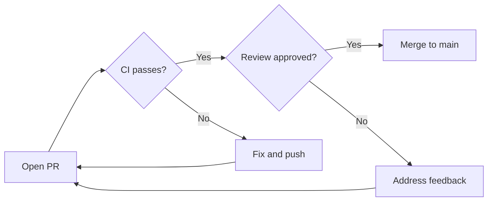
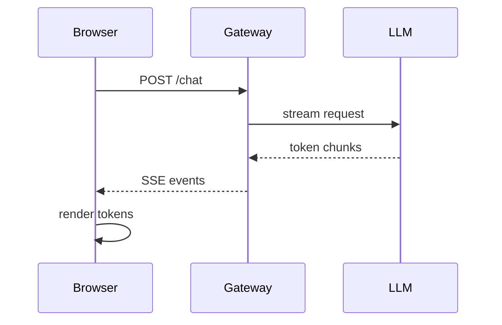
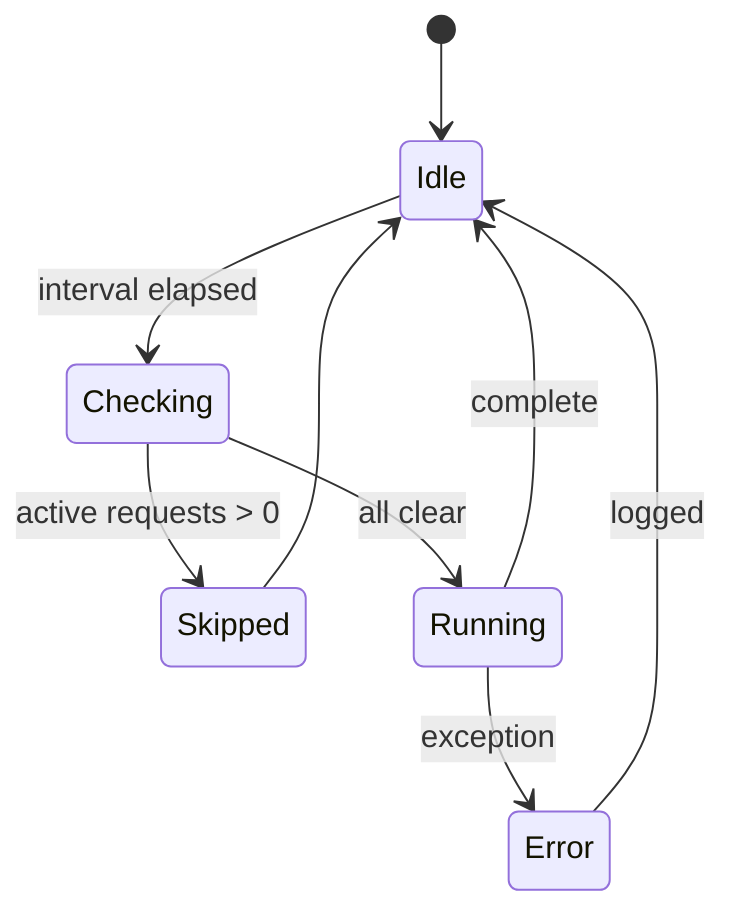
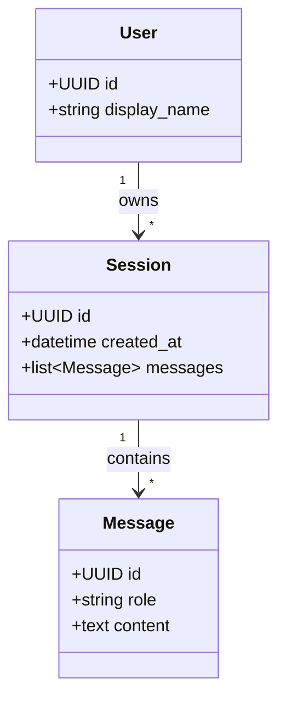
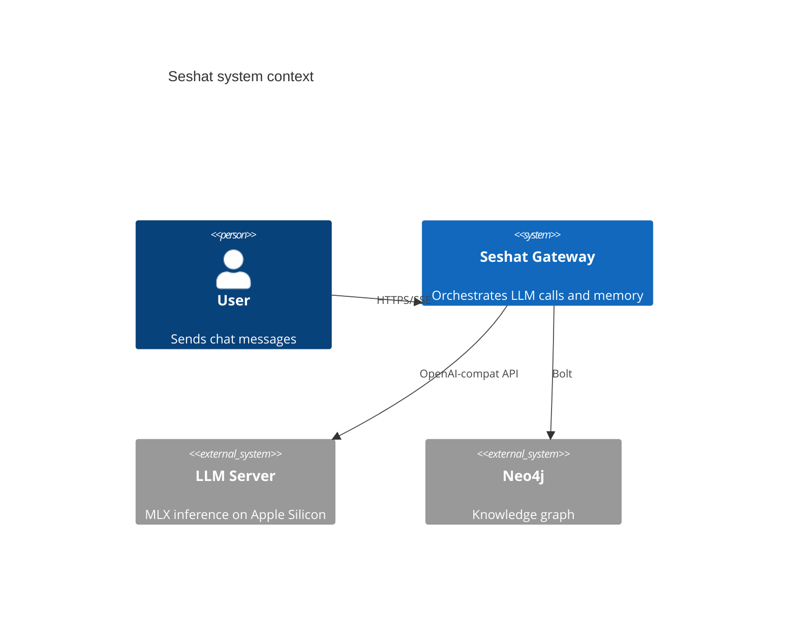
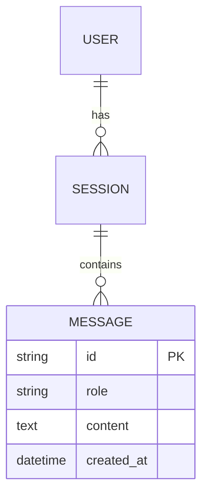

# SKILL: Mermaid Diagrams

> **Use this skill to** (a) decide when a diagram beats prose, (b) pick the right type, (c) get v11 syntax exactly right, (d) **validate the fence with `mmdc` before sending it to the user**.

---

## When to Use a Diagram vs Prose

**Diagram if:**
- Three or more entities with non-linear relationships
- Temporal ordering or message sequence is the point
- A state machine has three or more states
- A decision tree branches into multiple paths
- Architecture explanation benefits from spatial layout

**Prose if:**
- Linear narrative or a single entity
- The diagram adds chrome without adding information
- A bulleted list is shorter and equally clear

---

## Diagram Type Selection

| Intent | Type | First-line header |
|---|---|---|
| Flow / decision / process / pipeline | flowchart | `flowchart TD` or `flowchart LR` |
| Actors exchanging messages over time | sequence | `sequenceDiagram` |
| States and transitions | state | `stateDiagram-v2` |
| Entities + relationships (DB/domain schema) | ER | `erDiagram` |
| OO model / class hierarchy / domain model | class | `classDiagram` |
| Software architecture (system/container/component) | C4 | `C4Context` / `C4Container` / `C4Component` |
| Git branching strategy | git | `gitGraph` |
| Timeline / project plan | gantt | `gantt` |
| Proportions of a whole | pie | `pie` |
| Hierarchical brainstorm | mindmap | `mindmap` |

**Layout hints for `flowchart`:**
- `TD` (top-down): tree structures, ≤6 nodes
- `LR` (left-right): chains, pipelines, request flows
- `BT` / `RL` are valid but uncommon — prefer `TD`/`LR` unless you have a specific reason (e.g. bottom-up dependency tree)

**When to use C4 vs flowchart for architecture:**
- C4 for multi-level architectural views (system → containers → components)
- Flowchart for data/request flow within one level

---

## Core Syntax

All mermaid diagrams follow this pattern: a fenced code block with the language tag `mermaid`, whose first line is the diagram-type keyword, followed by the diagram body. Example structure (literal backticks not shown):

    fenced block with language `mermaid`
        first line: diagram type keyword
        following lines: diagram content

Key principles:
- The **first non-empty line** is the diagram-type keyword — mandatory, no exceptions
- Use `%%` for comments: `%% this is a comment`
- Indentation and line breaks improve readability but aren't required
- Unknown keywords and typos break diagrams silently or with a parse error

---

## Syntax Invariants

These are the rules most commonly broken. Violating any produces a parse error in mermaid v11.

### 1. Diagram-type header is mandatory on line 1

Without it: `No diagram type detected`.

```
flowchart TD
    A --> B    ✅

    A --> B    ❌  (missing header)
```

### 2. Node IDs vs labels in `flowchart`

A node ID is a bare token (no spaces, no punctuation). Put the display label in square brackets:

```
flowchart TD
    A[User clicks Buy] --> B{Authenticated?}
    B -->|Yes| C[Dashboard]
    B -->|No| D[Login page]
```

Never write `User clicks Buy --> B` — that tries to use a label as an ID.

### 3. Arrow syntax is type-specific — never mix

| Type | Valid arrows |
|---|---|
| `flowchart` | `-->` `-.->` `==>` `--text-->` `-->|label|` |
| `sequenceDiagram` | `->>` `-->>` `-x` `--x` `-)` `--)` |
| `stateDiagram-v2` | `-->` only |
| `erDiagram` | cardinality glyphs (see §8 below) |

### 4. Reserved words cannot be bare node IDs

In `flowchart`, these are reserved: `end`, `class`, `subgraph`, `direction`, `default`, `style`, `linkStyle`. Bracket them or rename:

```
A --> B[end state]   ✅
A --> end            ❌  (parse error)
```

### 5. `subgraph` must close with `end`

```
flowchart TD
    subgraph Pipeline
        A --> B
    end
    B --> C
```

Missing `end` leaves the parser in an open block.

### 6. Curly braces have meaning — use them deliberately

In `flowchart`, `{...}` is the **decision/rhombus node shape**: `B{Authenticated?}` is a valid diamond node. `{}` is *not* generally broken — it's reserved syntax.

What can break:
- `{}` inside a `[ ]` rectangle label can confuse the parser depending on contents — e.g. `A[Result {data}]` may parse `{data}` as start of a new node. Either rephrase the label or escape: `A["Result {data}"]` (quoted label).
- `{}` in `%%` comments is usually fine but has been reported to break in some v11 builds — when in doubt, paraphrase the comment.

Quoted labels (`A["any string here"]`) are the safest form when the label contains punctuation, brackets, or special characters.

### 7. `sequenceDiagram` participants with spaces

Declare them explicitly when names contain spaces:

```
sequenceDiagram
    participant GitHub Actions
    participant Deploy Server
    GitHub Actions ->> Deploy Server: push artifacts
```

### 8. `erDiagram` cardinality glyphs

Use exactly these — don't invent variants:

| Relationship | Glyph |
|---|---|
| One to many | `||--o{` |
| One to one | `||--||` |
| Many to many | `}o--o{` |
| Zero or one | `|o--o|` |

### 9. `stateDiagram-v2` specifics

- `[*]` is the start/end state
- Transitions use `-->` with optional label after `:`
- Nested states: `state X { ... }`

---

## Pre-emit Checklist (mental)

Before closing the fence, verify:

1. First line has the diagram-type header
2. Every arrow uses the syntax for *that* diagram type
3. Every label with spaces or punctuation is inside `[ ]` (flowchart) or declared via `participant` (sequence)
4. All `subgraph` blocks have matching `end` lines
5. Decision-shape `{...}` is only used as a `flowchart` node shape, not inside `[...]` rectangles

---

## Validation (automated)

The gateway container has `mmdc` (`@mermaid-js/mermaid-cli`) installed. **Validate any non-trivial diagram before showing it to the user.** A trivial diagram is ≤5 nodes of a type you've successfully produced earlier in this turn.

### Pattern

Write the diagram body to a temp file (no fence), run `mmdc`, check the output file:

```bash
cat > /tmp/m.mmd <<'EOF'
flowchart LR
    A[Open PR] --> B{CI passes?}
    B -->|Yes| C[Merge]
    B -->|No| D[Fix]
EOF
mmdc -i /tmp/m.mmd -o /tmp/m.svg 2>&1
test -s /tmp/m.svg && echo "VALID" || echo "INVALID"
```

Interpretation:

- **`VALID`** (the SVG was written and is non-empty) — syntax parses. Emit the fence to the user.
- **`INVALID`** (no SVG, or empty file) — mmdc emits a `Parse error on line X` block to stdout/stderr with the exact location and the expected tokens. Read it, fix, re-validate.

**Note:** `mmdc` exits 0 even on parse failure (the binary's exit semantics are loose), so do not rely on `$?` alone — check the output file.

### Cost-aware policy

Each `mmdc` call takes ~2 seconds (Chromium spin-up). Use the cost budget:

- ✅ **Validate** diagrams ≥6 nodes, any new diagram type in the turn, anything with unfamiliar syntax (cardinality glyphs, C4 directives, subgraphs)
- ❌ **Skip validation** for trivial fences you've already seen succeed earlier in the same turn — repeated calls just burn 2s for no information gain

### Repair loop

If validation fails:

1. Read the error from stderr. Typical forms: `Parse error on line 3: ... Expecting 'X', got 'Y'`.
2. Match the error against the Syntax Invariants section above. The most common failures: missing diagram-type header (§1), label not bracketed (§2), wrong arrow for the type (§3), reserved word as bare ID (§4).
3. Rewrite the diagram and re-validate. Cap at **3 repair attempts** — if you can't get it to parse after three, fall back to the source-only form: emit the raw `mermaid` fence as a `text` code block (so it's at least readable) and explain in prose what the diagram was supposed to show.

---

## Seshat PWA Conventions

The PWA renders mermaid fences with a custom dark theme (slate palette, blue-500 accent). To keep diagrams native to the app:

- **Keep diagrams ≤30 nodes** — larger diagrams overflow the chat column.
- **Do not use `%%{init: ...}%%` directives** — the PWA injects its own theme. An `init` directive overrides it.
- **Do not use frontmatter config blocks** (the `---\nconfig:\n---` syntax) — same reason.
- **Do not embed click handlers** (`click NodeId href "..."`) — strict security mode strips them silently.

---

## Worked Examples

### Flowchart — PR merge flow



### Sequence diagram — SSE streaming



### State diagram — consolidation lifecycle



### Class diagram — domain model



### C4 — system context



### ER diagram — session schema



---

## Failure Recovery

If the user reports a diagram didn't render:

1. Ask them to paste the error shown in the source-view fallback in the PWA (the rose-tinted annotation above the raw code).
2. Compare the error against the Syntax Invariants section above — most failures are one of: missing header, mixed arrow types, bare reserved word, or `{}` in a label.
3. Re-emit the corrected fence in a fresh message — don't try to patch the previous one in place.

---

## Further Reference

External resources (use for syntax lookup, not as import targets):
- [Mermaid Live Editor](https://mermaid.live) — paste a diagram and see if it parses before sending
- Mermaid v11 docs: [mermaid.js.org](https://mermaid.js.org/)
